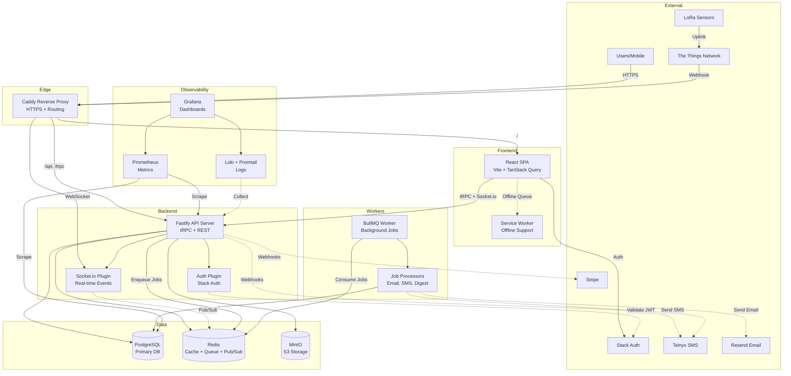

# System Architecture

**Project**: FreshStaged (Temperature Monitoring SaaS)
**Architecture Pattern**: Monolithic Layered Architecture with Event-Driven Processing
**Last Updated**: 2026-02-01

## High-Level Architecture

## Architectural Patterns

### Monolithic Layered Architecture with Microservices-ready Design
**Evidence**: Single backend deployment (Fastify) and frontend (React SPA), but separation via Docker containers and tRPC API contract suggests preparation for future decomposition
**Description**: Currently monolithic with clean separation between frontend, backend, and worker processes. Uses containerization and service-oriented plugin architecture that enables future microservices migration.

### Event-Driven Architecture
**Evidence**: Socket.io for real-time updates, BullMQ job queues, webhook integrations (TTN, Stripe, Telnyx), Redis pub/sub adapter for Socket.io
**Description**: Asynchronous event processing for IoT data ingestion, alert escalation, and notification delivery. Real-time dashboard updates via WebSocket events.

### Multi-Tenant SaaS with RBAC
**Evidence**: Organizations table, hierarchical data model (Organization→Site→Area→Unit), user_roles table with app_role enum, Stack Auth integration
**Description**: Complete tenant isolation with organization-scoped data access. Role-based permissions (owner, admin, manager, staff, viewer) enforce authorization boundaries.

### Plugin Architecture
**Evidence**: Fastify plugins for auth, socket, queue, email, error handling registered in app.ts
**Description**: Modular plugin-based backend extensibility using Fastify's plugin system. Each concern (auth, websockets, background jobs) is encapsulated as a reusable plugin.

### API Gateway Pattern
**Evidence**: Caddy reverse proxy in compose.production.yaml handling HTTPS termination, routing to frontend/backend/monitoring services
**Description**: Centralized entry point via Caddy for all external traffic. Handles TLS, request routing, and load balancing to internal services.

### CQRS (Command Query Responsibility Segregation)
**Evidence**: tRPC router for queries, REST endpoints for commands (webhooks, mutations), separate read (sensor_readings) and write (alert processing) paths
**Description**: Read operations via tRPC, write operations via REST webhooks and background jobs. Optimized for high-volume sensor data ingestion and real-time queries.

## System Layers

### Presentation Layer
**Purpose**: User interface and client-side state management
**Components**: React SPA (Vite), TanStack Query, React Router, shadcn/ui components, Socket.io client
**Dependencies**: Application Layer (tRPC), Real-time Layer (WebSocket)

### Application Layer
**Purpose**: Business logic orchestration and API routing
**Components**: Fastify app.ts, tRPC routers, REST route handlers, Middleware (auth, rate limiting), Plugins
**Dependencies**: Domain Layer, Infrastructure Layer

### Domain Layer
**Purpose**: Core business entities and rules
**Components**: Drizzle schema definitions, Services (alert-rules, unit-state, escalation), Validation schemas (Zod)
**Dependencies**: Infrastructure Layer (data access)

### Infrastructure Layer
**Purpose**: External integrations and data persistence
**Components**: PostgreSQL (Drizzle ORM), Redis (BullMQ, Socket.io adapter), MinIO (S3 storage), TTN API client, Stack Auth, Stripe SDK, Telnyx SDK, Resend email
**Dependencies**: None

### Background Processing Layer
**Purpose**: Asynchronous job execution
**Components**: BullMQ workers, Job processors (digest, escalation, cleanup), Email rendering (React Email)
**Dependencies**: Domain Layer, Infrastructure Layer

### Observability Layer
**Purpose**: Monitoring, logging, and metrics
**Components**: Prometheus, Loki, Grafana, Promtail, Uptime Kuma, Blackbox Exporter, Pino logger
**Dependencies**: All layers (instrumentation)

## Key Data Flows

### IoT Sensor Data Ingestion
1. TTN LoRa sensor transmits temperature reading
2. TTN network server forwards to `/api/webhooks/ttn`
3. Backend validates payload and stores to `sensor_readings` table
4. Unit state processor evaluates alert rules
5. If threshold violated, create alert and enqueue escalation job
6. Socket.io emits real-time update to connected dashboard clients

**Interaction Type**: Asynchronous webhook → event-driven processing

### User Authentication & Authorization
1. User logs in via Stack Auth (frontend)
2. Stack Auth returns JWT access token
3. Frontend sends API requests with `x-stack-access-token` header
4. Backend auth plugin validates token via Stack Auth API
5. Middleware enriches `request.user` with organization and role
6. Route handlers enforce RBAC via `requireRole` middleware

**Interaction Type**: Synchronous JWT validation with middleware chain

### Alert Escalation & Notification
1. Alert created and escalation job enqueued (BullMQ)
2. Worker picks up job from Redis queue
3. Digest builder service fetches escalation contacts by priority
4. Email job enqueued (Resend) and/or SMS job enqueued (Telnyx)
5. Notification deliveries tracked in `notification_deliveries` table
6. Webhook callbacks update delivery status (sent/delivered/failed)

**Interaction Type**: Asynchronous job queue with external API calls

### Real-time Dashboard Updates
1. Frontend connects to Socket.io on page load
2. Backend authenticates socket connection via Stack Auth token
3. Client joins organization-specific room
4. Backend emits events (`unitUpdate`, `alertCreated`) to room
5. Frontend TanStack Query cache invalidated on event
6. UI components re-render with fresh data

**Interaction Type**: Bidirectional WebSocket with room-based pub/sub

## External Integrations

### Stack Auth
**Purpose**: Authentication and user management
**Integration Type**: REST API + JWT validation
**Details**: Frontend SDK for login/signup, backend validates tokens via API. Handles user sessions, multi-org access, and token refresh.

### The Things Network (TTN)
**Purpose**: LoRaWAN IoT sensor integration
**Integration Type**: Webhook ingestion + REST API
**Details**: Receives uplink messages via webhook, manages devices/gateways via TTN API. Supports LoRa sensor registration and downlink commands.

### PostgreSQL
**Purpose**: Primary relational database
**Integration Type**: Drizzle ORM with connection pooling
**Details**: Stores all operational data (organizations, sensors, readings, alerts). Uses Drizzle ORM for type-safe queries and migrations. PgBouncer for connection pooling in production.

**Partitioning Strategy** (REC-002):
- **sensor_readings table**: Monthly RANGE partitioning on `recorded_at` column
- **Naming**: `sensor_readings_y<YYYY>m<MM>` (e.g., `sensor_readings_y2026m02`)
- **Retention**: 24-month automated deletion via BullMQ jobs
- **Future buffer**: 3 months ahead (automated creation)
- **Performance**: 50%+ faster time-range queries (partition pruning), 70%+ faster VACUUM operations
- **Lifecycle**: Automated via `partition:create` (weekly) and `partition:retention` (monthly) BullMQ jobs
- **Monitoring**: Grafana dashboard tracks partition health, future buffer, default partition usage
- **See**: ADR-009, partition-management runbook

### Redis
**Purpose**: Cache, job queue, and pub/sub
**Integration Type**: ioredis client + BullMQ + Socket.io adapter
**Details**: BullMQ for background jobs (email, SMS, digest generation). Socket.io Redis adapter for multi-instance WebSocket scaling.

### MinIO
**Purpose**: S3-compatible object storage
**Integration Type**: AWS SDK S3 client
**Details**: Stores uploaded assets (photos, calibration certificates). Generates presigned URLs for secure browser uploads. Self-hosted alternative to AWS S3.

### Stripe
**Purpose**: Subscription billing and payments
**Integration Type**: Stripe SDK + webhook events
**Details**: Handles subscription lifecycle (trial, active, canceled). Webhook integration for payment events. Subscription metadata stored in subscriptions table.

### Telnyx
**Purpose**: SMS notifications
**Integration Type**: Telnyx SDK + webhook status updates
**Details**: Sends alert notifications via SMS. Tracks delivery status via webhooks. Configurable per-organization SMS settings.

### Resend
**Purpose**: Transactional email delivery
**Integration Type**: Resend SDK + React Email templates
**Details**: Sends alert emails, digests, and system notifications. Uses React Email for templating. Delivery tracking via Resend API.

### Prometheus + Grafana
**Purpose**: Metrics and monitoring
**Integration Type**: Metrics exporters + Grafana dashboards
**Details**: Prometheus scrapes metrics from node-exporter, blackbox-exporter, and application. Grafana visualizes system health, uptime, and performance.

### Loki + Promtail
**Purpose**: Centralized log aggregation
**Integration Type**: Log shipper + query API
**Details**: Promtail collects logs from containers and host. Loki stores and indexes logs. Grafana queries Loki for log exploration and alerting.

## Security Architecture

### Authentication
**Method**: JWT tokens via Stack Auth
**Flow**: Frontend authenticates with Stack Auth → receives JWT → includes in API requests → backend validates token

### Authorization
**Model**: Role-Based Access Control (RBAC)
**Implementation**: Middleware validates user role (owner, admin, manager, staff, viewer) before executing route handlers

### Data Protection
**Encryption**: HTTPS via Caddy (TLS termination), database credentials in environment variables
**Sensitive Data**: Passwords never stored (handled by Stack Auth), API keys in secure env vars

## Performance Considerations

### Scalability
**Horizontal Scaling**: Docker Compose replicas for backend and worker processes. Redis adapter enables multi-instance Socket.io.
**Caching**: Redis for session data and BullMQ job state. TanStack Query for frontend data caching.
**Database Pooling**: PgBouncer for PostgreSQL connection management.

### Monitoring
**Metrics**: Prometheus tracks request rates, error rates, job queue depths, database connections
**Logging**: Pino structured logging with Loki aggregation
**Alerting**: Grafana alerts for high error rates, queue backlogs, database issues

## Deployment Architecture

### Environments
**Development**: Docker Compose with hot reload, local PostgreSQL/Redis
**Production**: Docker Compose with production overrides, Caddy HTTPS, health checks

### Infrastructure
**Hosting**: Self-hosted on VPS or cloud VMs (DigitalOcean, AWS)
**Database**: PostgreSQL with PgBouncer connection pooling
**Networking**: Caddy reverse proxy, internal Docker network

### CI/CD
**Build**: Multi-stage Dockerfiles (deps → build → production)
**Health Checks**: All services include health check endpoints
**Graceful Shutdown**: SIGTERM/SIGINT handlers for clean shutdowns
