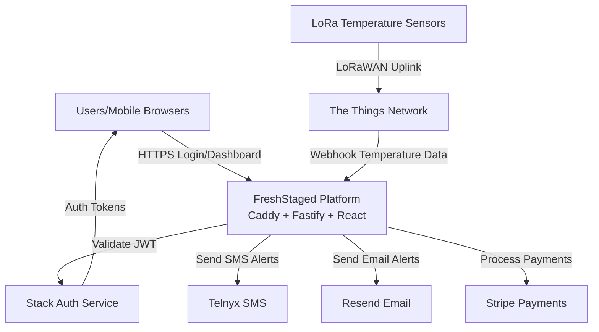
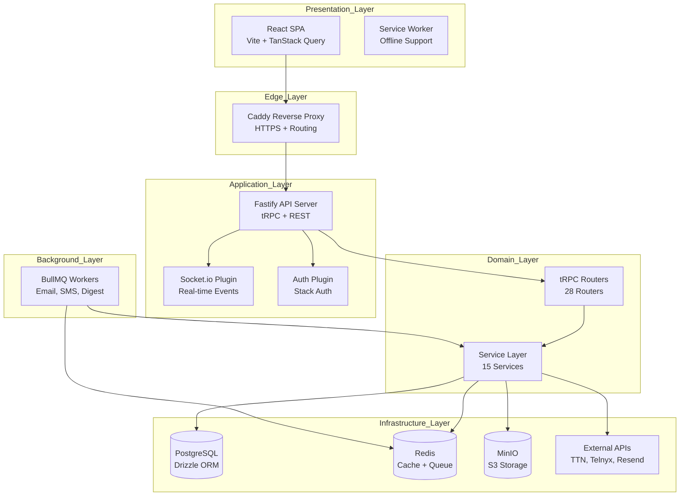
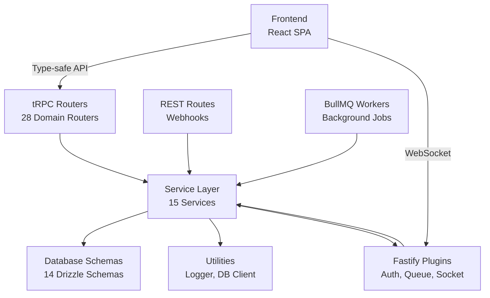
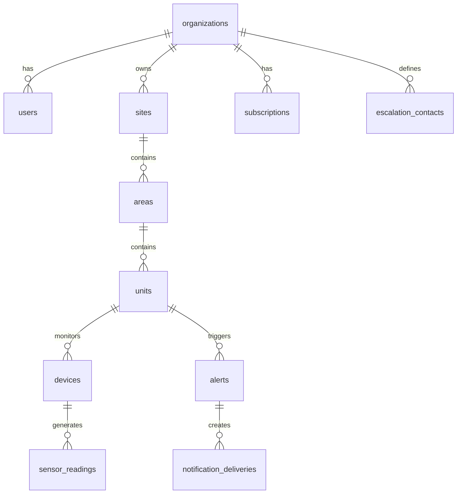
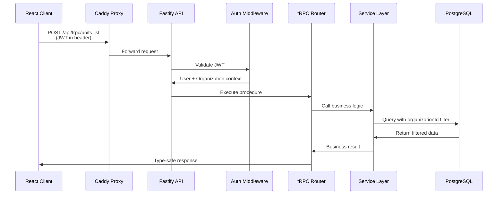
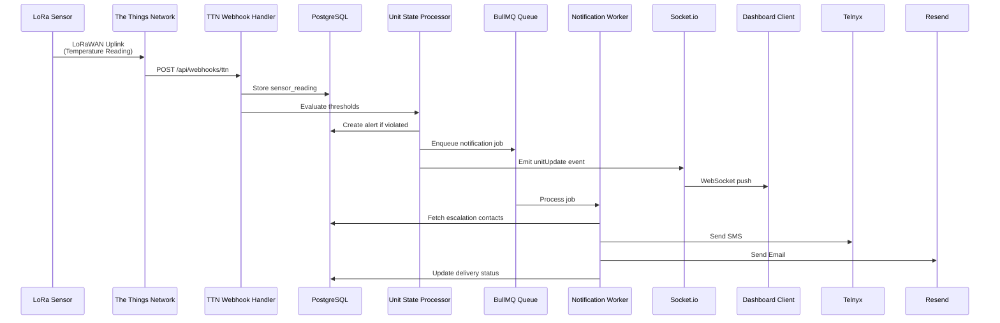
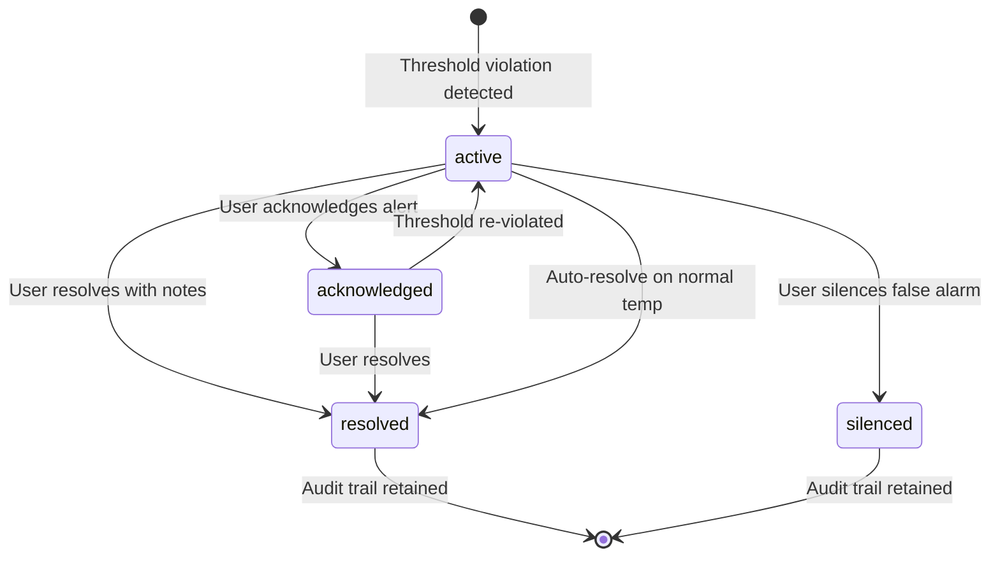
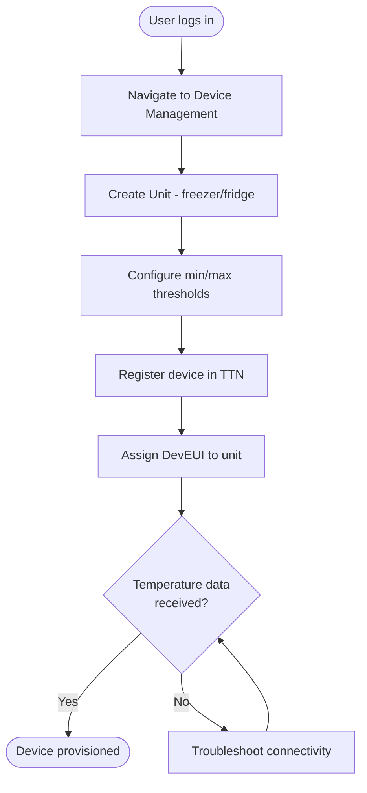
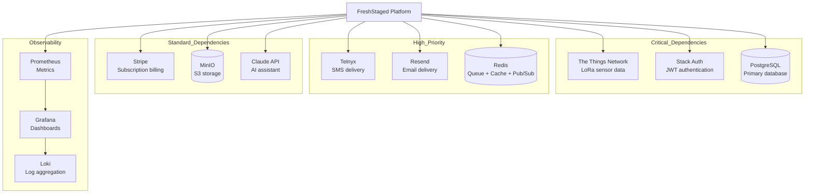

# FreshStaged — Bird's-Eye View

## 1) Summary

FreshStaged is a multi-tenant IoT temperature monitoring SaaS platform for cold chain compliance. It ingests real-time temperature data from LoRaWAN sensors via The Things Network, enforces threshold-based alerting with SMS/Email escalation, and provides real-time dashboard updates via WebSocket. Built for organizations managing temperature-sensitive products (food service, healthcare, retail), the platform combines continuous monitoring, intelligent alerting, and compliance reporting to prevent product spoilage and ensure regulatory compliance.

- Domain: `IoT Cold Chain Monitoring & Compliance` • Tech stack: `Fastify, tRPC, React, PostgreSQL, Redis, BullMQ, Socket.io` • Repos: `fresh-staged`

## 2) System Context

External actors include end users (facility managers, compliance officers, operations staff), LoRa sensors transmitting via The Things Network, Stack Auth for authentication, and notification services (Telnyx SMS, Resend Email). The platform sits behind a Caddy reverse proxy, integrates with Stripe for billing, and uses external monitoring tools (Prometheus, Grafana, Loki) for observability.

## 3) Architecture Overview (components & layers)

The system uses a monolithic layered architecture with event-driven processing. The presentation layer (React SPA) communicates with the application layer (Fastify API) via tRPC and WebSocket. The application layer orchestrates business logic through a domain services layer that interacts with the infrastructure layer (PostgreSQL, Redis, external APIs). Background workers process asynchronous jobs (notifications, digests) via BullMQ queues.

## 4) Module & Package Relationships

The backend follows a strict layered dependency pattern. tRPC routers and REST route handlers depend on the service layer, which encapsulates business logic and enforces multi-tenant isolation. Services use Drizzle ORM schemas for database operations and interact with external APIs via plugin abstractions. Background workers invoke service layer methods for async job processing.

## 5) Data Model (key entities)

The data model centers on a hierarchical multi-tenant structure where organizations own sites, sites contain areas, areas contain units (monitored appliances), and units have devices (sensors) that generate temperature events. Alerts are created from threshold violations and trigger notification deliveries to escalation contacts.

## 6) API Surface (public endpoints → owning components)

The API surface consists of type-safe tRPC procedures for queries and mutations, REST webhooks for external integrations, and WebSocket events for real-time updates. Authentication is enforced via Stack Auth JWT validation middleware, with RBAC checking user roles before procedure execution.

- `POST /api/trpc/organizations.create` → tRPC Router → Organization Service
- `GET /api/trpc/units.list` → tRPC Router → Unit Service
- `POST /api/trpc/alerts.resolve` → tRPC Router → Alert Service
- `POST /api/webhooks/ttn` → REST Handler → Device Service
- `POST /api/webhooks/stripe` → REST Handler → Subscription Service
- `WS /socket.io` → Socket.io Plugin → Real-time Events

## 7) End-to-End Data Flow (hot path)

The critical path handles sensor data ingestion from LoRa devices. TTN receives sensor uplinks and posts to the webhook endpoint, which validates payloads and stores readings in PostgreSQL. The unit state processor evaluates alert rules, creates alerts for threshold violations, and enqueues notification jobs. Workers send SMS/Email notifications, and Socket.io emits real-time events to dashboard clients.

## 8) State Model (critical domain entity)

Alerts transition through states based on user actions and system events. New alerts are created in `active` state when thresholds are violated. Users can acknowledge alerts (transitions to `acknowledged`), resolve them with notes (transitions to `resolved`), or silence false alarms (transitions to `silenced`). Auto-resolution occurs when temperature returns to normal range.

## 9) User Flows (top 1-2 tasks)

The primary user task is provisioning a new device to monitor a location. Users navigate to device management, create a unit (monitored appliance), configure temperature thresholds, register the device with TTN DevEUI, assign it to the unit, and verify sensor data is flowing.

## 10) Key Components & Responsibilities

The system is organized into focused components with clear responsibilities. The tRPC layer provides type-safe API contracts, the service layer enforces business rules and multi-tenant isolation, Fastify plugins handle infrastructure concerns, and BullMQ workers process async operations.

- `backend/src/trpc/` — Type-safe API layer; merges 28 domain routers into unified AppRouter
- `backend/src/services/` — Business logic layer; enforces organizationId isolation and hierarchy validation
- `backend/src/db/schema/` — Drizzle ORM schemas; defines database structure with 14 table definitions
- `backend/src/plugins/` — Fastify infrastructure plugins; auth, queue, socket, email integrations
- `backend/src/workers/` — BullMQ job processors; SMS, email, digest generation, stripe metering
- `backend/src/middleware/` — Request chain handlers; JWT validation, RBAC, organization context
- `supabase/functions/` — Serverless edge functions; 54 webhook handlers for TTN, Stripe, Telnyx
- `src/` — React frontend; 407 files with pages, components, features, tRPC client

## 11) Integrations & External Systems

The platform integrates with nine external systems for authentication, IoT connectivity, notifications, payments, and monitoring. Critical dependencies include TTN for sensor data, Stack Auth for user identity, and PostgreSQL for persistence. High-priority dependencies include Telnyx/Resend for alerting and Redis for background jobs.

## 12) Assumptions & Gaps

The knowledge base provides comprehensive coverage of system architecture, domain model, and implementation patterns. Key assumptions include single-region deployment, English-only UI, and off-the-shelf TTN-compatible sensors. Missing details include specific hosting infrastructure, CI/CD pipelines, and detailed user journey steps beyond device provisioning.

- TBD: `Specific hosting provider and infrastructure details (DigitalOcean, AWS, or self-hosted VPS)`
- TBD: `CI/CD pipeline automation (GitHub Actions, GitLab CI, or manual deployment)`
- TBD: `Detailed user journey flows beyond device provisioning (alert resolution, report generation)`
- TBD: `Specific tRPC procedure request/response examples for API reference`
- TBD: `Testing strategy details (unit test coverage, integration test patterns, E2E test framework)`
- Next reads: `backend/src/trpc/router.ts` for complete AppRouter definition, `backend/tests/` for testing patterns
- Risks to verify: `Multi-tenant isolation enforcement in all query paths`, `BullMQ job concurrency tuning for production loads`, `WebSocket scaling beyond 1000 concurrent connections`
