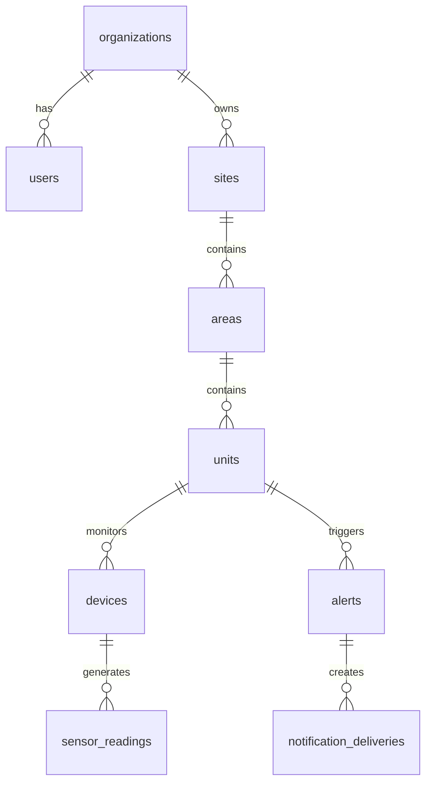
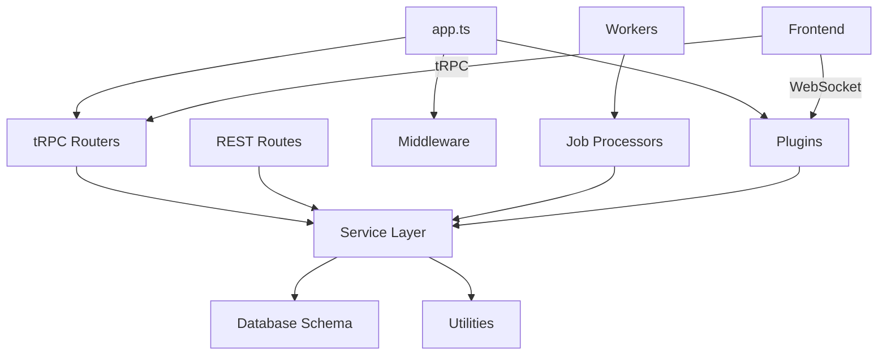

# Module & Component Breakdown

**Project**: FreshStaged (Temperature Monitoring SaaS)
**Analysis Date**: 2026-02-01
**Modules Analyzed**: 18 major modules

## Core Modules

### Backend Core (`backend/src/`)
**Purpose**: API server initialization and configuration
**Complexity**: Medium
**Key Components**:
- **app.ts**: Fastify application builder with plugins, middleware, routes
- **index.ts**: Server startup and lifecycle management

**Responsibilities**:
- Configure CORS, helmet, rate limiting, multipart uploads
- Register Fastify plugins (auth, queue, socket, email)
- Register tRPC router and REST routes
- Setup error handling and Pino logging

### tRPC Layer (`backend/src/trpc/`)
**Purpose**: Type-safe API layer with domain routers
**Complexity**: Low
**Dependencies**: @trpc/server, backend/routers

**Key Components**:
- **router.ts**: Central AppRouter merging all domain routers
- **context.ts**: Request context creation (user, organization)
- **standalone.ts**: Standalone tRPC HTTP adapter

**Public Interface**:
```typescript
export type AppRouter = typeof appRouter;
// Exported for frontend tRPC client
```

### Domain Routers (`backend/src/routers/`)
**Purpose**: Domain-specific tRPC procedures for business logic
**Complexity**: Medium
**Module Count**: 28 routers

**Key Routers**:
- **organizations.router.ts**: Organization CRUD and member management
- **sites.router.ts**: Site hierarchy operations
- **units.router.ts**: Unit (freezer/fridge) management
- **alerts.router.ts**: Alert lifecycle and resolution
- **auth.router.ts**: Authentication and session management

**Pattern**: Each router delegates to corresponding service layer

### Services Layer (`backend/src/services/`)
**Purpose**: Business logic implementation
**Complexity**: High
**Module Count**: 15 services

**Key Services**:
- **organization.service.ts**: Organization operations with RBAC
- **alert.service.ts**: Alert management and workflow
- **user.service.ts**: User profile and permissions
- **device.service.ts**: Device provisioning and state management
- **dashboard.service.ts**: Dashboard metrics aggregation

**Responsibilities**:
- Enforce multi-tenant isolation (organizationId scoping)
- Validate hierarchy access (Organization→Site→Area→Unit)
- Execute database transactions with Drizzle ORM
- Throw domain-specific errors

### Database Schema (`backend/src/db/schema/`)
**Purpose**: Drizzle ORM table definitions
**Complexity**: Medium
**Module Count**: 14 schema files

**Key Schemas**:
- **tenancy.ts**: Organizations, users, roles
- **hierarchy.ts**: Sites, areas, units (physical locations)
- **alerts.ts**: Alerts, escalation rules, notification deliveries
- **devices.ts**: Sensors, device types, provisioning
- **telemetry.ts**: Time-series temperature readings (sensor_readings, manual_temperature_logs, door_events)

**Partitioning** (REC-002):
- **sensor_readings**: PostgreSQL native RANGE partitioning on `recorded_at` (monthly boundaries)
- **Implementation**: Custom migration script (Drizzle ORM does not support PARTITION BY in schema definitions)
- **Automation**: BullMQ jobs manage partition lifecycle (creation, retention enforcement)
- **Transparency**: PostgreSQL routes queries automatically; application code unchanged
- **See**: `telemetry.ts` comments (lines 18-50), ADR-009, partition.service.ts

**Relationships**:


### Middleware (`backend/src/middleware/`)
**Purpose**: Request authentication and authorization
**Complexity**: Low

**Key Middleware**:
- **auth.js**: JWT token validation via Stack Auth
- **rbac.js**: Role-based access control enforcement
- **org-context.js**: Organization context enrichment

**Pattern**: Middleware chain pattern (auth → RBAC → org context → route handler)

### Plugins (`backend/src/plugins/`)
**Purpose**: Fastify infrastructure plugins
**Complexity**: Medium

**Key Plugins**:
- **auth.plugin.ts**: Stack Auth integration
- **queue.plugin.ts**: BullMQ job queue setup
- **socket.plugin.ts**: Socket.io WebSocket server
- **email.plugin.ts**: Email service integration

**Pattern**: Fastify plugin system with decorators (`fastify.decorateRequest`, `fastify.queueService`)

### Workers (`backend/src/workers/`)
**Purpose**: BullMQ background job processing
**Complexity**: Medium

**Key Workers**:
- **sms-notification.processor.ts**: SMS delivery via Telnyx
- **email-digest.processor.ts**: Email digest generation
- **stripe-meter.processor.ts**: Usage reporting to Stripe

**Configuration**:
- Concurrency: 5 for SMS, 2 for email, 5 for meters
- Retry: 3-5 attempts with exponential backoff
- Redis connection with maxRetriesPerRequest: null

### Supabase Edge Functions (`supabase/functions/`)
**Purpose**: Serverless webhooks and edge compute
**Complexity**: Medium
**Module Count**: 54 functions

**Key Functions**:
- **ttn-webhook**: LoRa sensor data ingestion from TTN
- **stripe-webhook**: Payment event processing
- **telnyx-webhook**: SMS delivery status updates
- **ttn-provision-***: Device provisioning helpers

**Pattern**: Deno edge functions with Supabase service role key

## Support Modules

### Frontend (`src/`)
**Purpose**: React SPA with real-time updates
**Complexity**: High
**Module Count**: 407 files

**Key Areas**:
- **pages/**: React Router page components
- **components/**: Reusable UI (shadcn/ui)
- **features/**: Feature-specific components
- **hooks/**: Custom React hooks
- **lib/**: tRPC client, Socket.io client

### Utilities (`backend/src/utils/`)
**Purpose**: Shared helper functions
**Complexity**: Low

**Key Utilities**:
- **logger.ts**: Pino structured logging
- **db.ts**: Drizzle database client
- **env.ts**: Environment variable parsing
- **email.ts**: Email template rendering

## Module Dependencies

### Internal Dependencies



**Key Relationships**:
- Routers call service layer for business logic
- Services use Drizzle ORM schemas for database operations
- App registers middleware for auth and RBAC
- Workers invoke processors for job execution
- Frontend communicates via tRPC and Socket.io

### External Dependencies

| Dependency | Version | Purpose | Used By |
|------------|---------|---------|---------|
| fastify | ^5.7.1 | Web framework | backend/core |
| @trpc/server | ^11.8.1 | Type-safe API | backend/trpc |
| drizzle-orm | ^0.38.0 | TypeScript ORM | backend/db |
| bullmq | ^5.67.0 | Job queue | backend/workers |
| socket.io | ^4.8.3 | WebSocket | backend/plugins |
| zod | ^4.3.6 | Schema validation | backend/schemas |
| stripe | ^20.2.0 | Payments | supabase/functions |
| react | ^18.3.1 | Frontend UI | frontend |
| @tanstack/react-query | ^5.83.0 | Data fetching | frontend/lib |

## Module Metrics

| Module | Files | LOC | Components | Complexity | Dependencies |
|--------|-------|-----|------------|------------|--------------|
| backend | 170 | 31,733 | 28 | Medium-High | 20 ext |
| backend/routers | 28 | 5,600 | 28 | Medium | 2 int, 2 ext |
| backend/services | 15 | 3,000 | 15 | High | 1 int, 2 ext |
| backend/db/schema | 14 | 3,500 | 14 | Medium | 1 ext |
| supabase/functions | 54 | 12,000 | 54 | Medium | 3 ext |
| frontend | 407 | 45,000 | 200+ | High | 5 int, 15 ext |

## Component Responsibilities

### Backend Core
**Primary**: Initialize and configure Fastify web server
**Secondary**:
- Register middleware and plugins
- Setup CORS and security headers
- Configure rate limiting and logging
**Behavior**: Singleton factory pattern for app creation

### tRPC Layer
**Primary**: Provide type-safe API layer with tRPC
**Secondary**:
- Merge domain routers into unified AppRouter
- Generate TypeScript types for frontend
- Handle tRPC context and error handling
**Behavior**: Router composition pattern

### Services Layer
**Primary**: Implement business logic for domain operations
**Secondary**:
- Enforce multi-tenant isolation
- Validate hierarchy access
- Execute database transactions
**Behavior**: Service layer pattern with Drizzle ORM

### Workers
**Primary**: Process background jobs asynchronously
**Secondary**:
- Send SMS notifications via Telnyx
- Generate email digests via Resend
- Report usage metrics to Stripe
**Behavior**: Separate process with BullMQ job processing

### Supabase Functions
**Primary**: Handle external webhooks and edge compute
**Secondary**:
- Ingest TTN sensor data
- Process Stripe payment events
- Handle SMS delivery status from Telnyx
**Behavior**: Serverless Deno functions on Supabase edge

### Middleware
**Primary**: Authenticate and authorize requests
**Secondary**:
- Verify JWT tokens from Stack Auth
- Enforce role-based access control
- Validate organization context
**Behavior**: Middleware chain pattern

## Module Boundaries

### Backend
**Public API**:
- HTTP: `/api/*`, `/trpc/*`, `/health`, `/admin/*`
- WebSocket: Socket.io events
- Types: AppRouter (exported for frontend)

**Contracts**: tRPC procedures require authentication via Stack Auth JWT; REST webhooks use per-org secrets or Stripe signatures

### Supabase Functions
**Public API**:
- HTTP: `/ttn-webhook`, `/stripe-webhook`, `/telnyx-webhook`, `/ttn-provision-*`

**Contracts**: Webhooks validate secrets; edge functions use Supabase service role key

### Frontend
**Public API**:
- Imports: `@trpc/client`, `socket.io-client`
- Types: AppRouter from backend

**Contracts**: Frontend communicates via tRPC and WebSocket; Stack Auth handles authentication

## Cross-Module Patterns

### Layered Architecture
**Description**: Routes/Routers → Services → Database Schema
**Modules**: backend/routes, backend/routers, backend/services, backend/db/schema
**Benefits**: Clear separation of concerns; business logic isolated in services; database access centralized

### Plugin Architecture
**Description**: Fastify plugins for infrastructure concerns (auth, queue, socket, email)
**Modules**: backend/plugins, backend/core
**Benefits**: Modular initialization; lifecycle management; dependency injection

### Multi-Tenant Isolation
**Description**: All services enforce organizationId scoping via hierarchy joins
**Modules**: backend/services, backend/middleware, backend/db/schema
**Benefits**: Data isolation between organizations; prevents cross-tenant data leaks

### Event-Driven Background Jobs
**Description**: Queue jobs for async work (SMS, email, metrics)
**Modules**: backend/plugins/queue, backend/workers, backend/jobs
**Benefits**: Decoupled execution; retry logic; horizontal scaling

### Type-Safe API with tRPC
**Description**: End-to-end TypeScript type safety from backend to frontend
**Modules**: backend/trpc, frontend/lib
**Benefits**: Compile-time API contract validation; reduced runtime errors; excellent DX

### Webhook Integration
**Description**: External services (TTN, Stripe, Telnyx) push data via webhooks
**Modules**: supabase/functions, backend/routes
**Benefits**: Real-time data ingestion; serverless edge compute; event-driven updates
