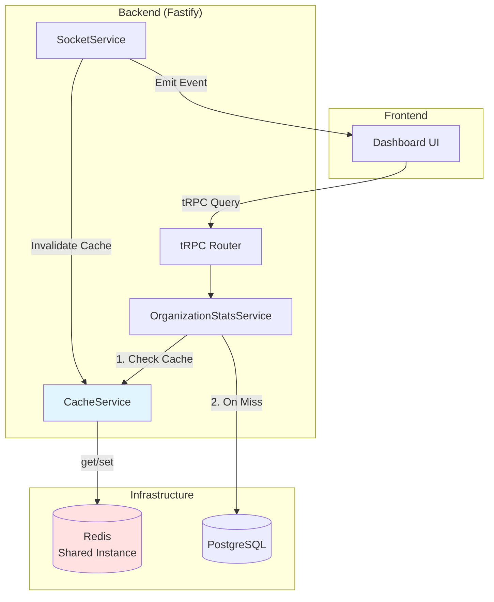
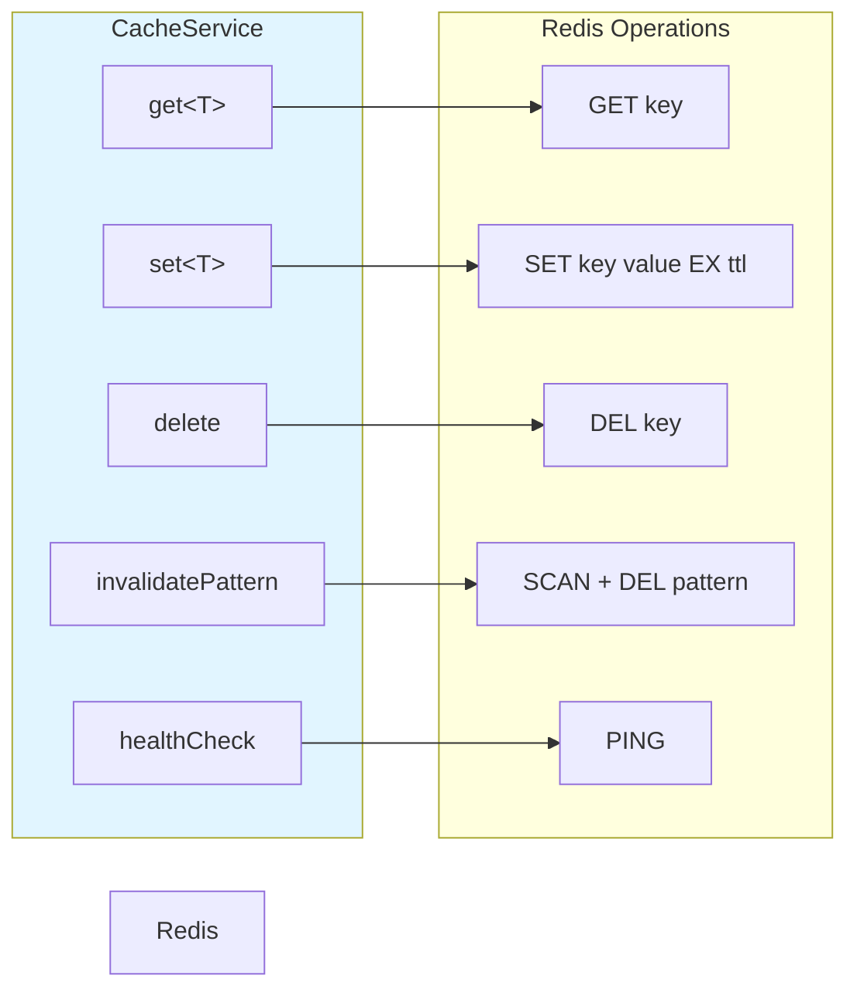
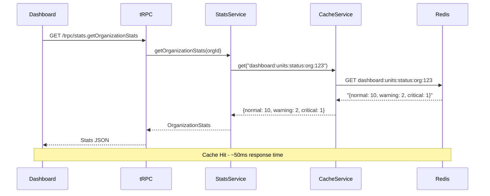
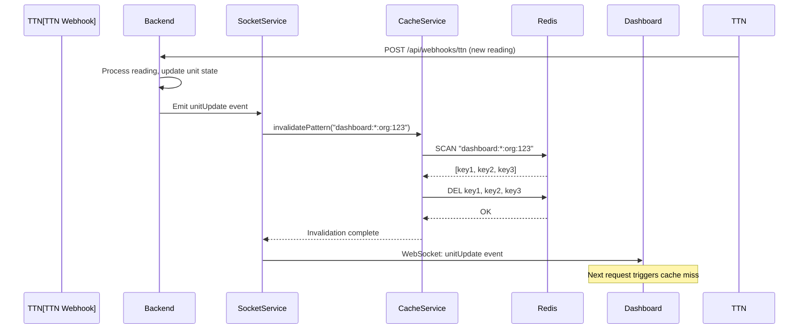

# Design Specification: Redis Caching for Dashboard Aggregations

**Feature ID**: REC-001
**Feature Title**: Redis Caching for Dashboard Aggregations
**Version**: 1.0.0
**Status**: Draft
**Created**: 2026-02-01

---

## 1. Design Overview

This design implements Redis-based caching for high-frequency dashboard aggregation queries to improve dashboard load performance from 2 seconds to <1 second (P95) and reduce database load by 40%. The solution replaces the existing in-memory caching in `OrganizationStatsService` with a Redis-backed cache service that supports multi-instance deployments, WebSocket-triggered invalidation, and graceful degradation.

**Key Design Decisions**:
- **Replace In-Memory Cache**: Remove existing 30-second in-memory Map cache in `OrganizationStatsService` with Redis cache (60-second TTL)
- **Shared Redis Instance**: Leverage existing Redis deployment used by BullMQ (zero infrastructure cost)
- **Cache-Aside Pattern**: Check cache → on miss, query database → populate cache → return result
- **Event-Driven Invalidation**: Invalidate cache synchronously before WebSocket event emission
- **Singleton Service Pattern**: Follow existing `QueueService` pattern with Fastify plugin integration
- **Graceful Degradation**: Cache failures fallback to direct database queries (transparent to users)

**Performance Impact**:
- Target cache hit rate: >70%
- Expected dashboard load time: <1 second (P95) for cached requests
- Expected database query reduction: 40% (based on 70-80% hit rate)

**Scope Summary**:
- Create `CacheService` class with Redis-backed operations (get, set, delete, invalidatePattern)
- Create `cache.plugin.ts` Fastify plugin for service initialization
- Modify `OrganizationStatsService` to use `CacheService` instead of in-memory Map
- Add cache invalidation hooks in `SocketService` before event emissions
- Add Prometheus metrics for cache hit/miss tracking
- Implement health check endpoint integration

---

## 2. Architecture

### 2.1 High-Level Architecture



**Data Flow (Cache-Aside Pattern)**:
1. Dashboard requests stats via tRPC
2. `OrganizationStatsService.getOrganizationStats()` checks `CacheService.get(key)`
3. **Cache Hit**: Return cached data immediately
4. **Cache Miss**: Query PostgreSQL → `CacheService.set(key, data, ttl)` → Return fresh data
5. Cache entry expires after 60 seconds (TTL fallback)

**Invalidation Flow (WebSocket Events)**:
1. State change occurs (e.g., new temperature reading)
2. `SocketService` calls `CacheService.invalidatePattern("dashboard:*:org:{orgId}")`
3. Cache entries deleted synchronously
4. `SocketService` emits WebSocket event (`unitUpdate`)
5. Next dashboard request triggers cache miss → fresh data loaded

### 2.2 Component Architecture



**Key Design Choices**:
- **Pattern-Based Invalidation**: Use `SCAN` + `DEL` for wildcard invalidation (e.g., `dashboard:*:org:123` invalidates all org 123 cache)
- **JSON Serialization**: Serialize cached objects to JSON strings for Redis storage
- **Type Safety**: Generic `get<T>` and `set<T>` methods with TypeScript type inference
- **Error Handling**: Catch all Redis errors and return null/void (graceful degradation)

### 2.3 Sequence Diagram (Cache Hit)



### 2.4 Sequence Diagram (Cache Invalidation)



---

## 3. Detailed Design

### 3.1 Data Model

**Cache Key Schema**:
```
dashboard:{queryType}:org:{orgId}[:{subKey}]
```

**Examples**:
- `dashboard:units:status:org:550e8400-e29b-41d4-a716-446655440000`
- `dashboard:alerts:count:org:550e8400-e29b-41d4-a716-446655440000`
- `dashboard:alerts:count:org:550e8400-e29b-41d4-a716-446655440000:unit:abc123`
- `dashboard:temperature:trends:org:550e8400-e29b-41d4-a716-446655440000:unit:abc123`
- `dashboard:devices:online:org:550e8400-e29b-41d4-a716-446655440000`

**Cache Value Structure** (JSON serialized):

```typescript
// Unit Status Aggregation
{
  normal: number,
  too_hot: number,
  too_cold: number
}

// Alert Count
{
  unresolved: number
}

// Temperature Trends
[
  { timestamp: string, temperature: number, alarmState: string },
  ...
]

// Device Online Status
{
  online: number,
  offline: number
}
```

**TTL Configuration**:
- Default TTL: 60 seconds (configurable via `CACHE_TTL_SECONDS` environment variable)
- TTL reset on every cache update (SET operation)
- Redis handles automatic expiration

### 3.2 Cache Service API

**File**: `backend/src/services/cache.service.ts`

```typescript
export class CacheService {
  private connection?: Redis;
  private redisEnabled: boolean;
  private defaultTtl: number; // seconds

  constructor(ttl?: number);

  async initialize(): Promise<void>;

  // Core cache operations
  async get<T>(key: string): Promise<T | null>;
  async set<T>(key: string, value: T, ttl?: number): Promise<void>;
  async delete(key: string): Promise<void>;
  async invalidatePattern(pattern: string): Promise<void>;

  // Health and monitoring
  async healthCheck(): Promise<{ ok: boolean; latencyMs: number }>;
  isEnabled(): boolean;

  // Lifecycle
  async shutdown(): Promise<void>;
}

// Singleton pattern
export function setCacheService(service: CacheService): void;
export function getCacheService(): CacheService | null;
```

**Implementation Notes**:
- **Redis Client**: Use `ioredis` library (already installed for BullMQ)
- **Connection Config**: Read from `REDIS_URL` or `REDIS_HOST`/`REDIS_PORT` (same as QueueService)
- **Error Handling**: All Redis errors caught and logged; return null/void for graceful degradation
- **Pattern Invalidation**: Use `SCAN` with `MATCH` pattern + `DEL` (avoids blocking `KEYS` command)
- **JSON Serialization**: Use `JSON.stringify` for set, `JSON.parse` for get
- **TTL Default**: 60 seconds (from environment variable `CACHE_TTL_SECONDS` or hardcoded default)

### 3.3 Cache Plugin Integration

**File**: `backend/src/plugins/cache.plugin.ts`

```typescript
export interface CachePluginOptions {
  ttl?: number; // Default TTL in seconds
}

const cachePlugin: FastifyPluginAsync<CachePluginOptions> = async (
  fastify: FastifyInstance,
  opts: CachePluginOptions
) => {
  const cacheService = new CacheService(opts.ttl);
  await cacheService.initialize();

  fastify.decorate('cacheService', cacheService);
  setCacheService(cacheService);

  fastify.addHook('onClose', async () => {
    await cacheService.shutdown();
  });

  fastify.log.info('Cache plugin registered');
};

export default fastifyPlugin(cachePlugin, {
  name: 'cache',
  fastify: '5.x',
});
```

**Registration in `backend/src/app.ts`**:
```typescript
import cachePlugin from './plugins/cache.plugin.js';

// Register before services that need cache
await app.register(cachePlugin);
```

### 3.4 OrganizationStatsService Modification

**Changes to `backend/src/services/organization-stats.service.ts`**:

**Remove**:
- `private cache: Map<string, CachedStats>` (line 102)
- `private cleanupIntervalId` (line 103)
- `setCacheEntry()` method (lines 392-409)
- `cleanupExpiredCache()` method (lines 414-428)
- `getCacheStats()` method (lines 433-440)
- Cache cleanup interval setup in constructor (lines 108-112)

**Add**:
- `private cacheService: CacheService | null`
- Inject `CacheService` in constructor

**Modify `getOrganizationStats()`**:
```typescript
async getOrganizationStats(
  organizationId: string,
  forceRefresh = false
): Promise<OrganizationStats> {
  const cacheKey = `dashboard:stats:org:${organizationId}`;

  // Check cache unless forcing refresh
  if (!forceRefresh && this.cacheService?.isEnabled()) {
    const cached = await this.cacheService.get<OrganizationStats>(cacheKey);
    if (cached) {
      return cached;
    }
  }

  // Fetch fresh data (existing logic)
  const [unitCounts, alertCounts, ...] = await Promise.all([...]);

  const stats: OrganizationStats = { ... };

  // Update cache
  if (this.cacheService?.isEnabled()) {
    await this.cacheService.set(cacheKey, stats);
  }

  return stats;
}
```

**Modify `invalidateCache()`**:
```typescript
async invalidateCache(organizationId: string): Promise<void> {
  if (!this.cacheService?.isEnabled()) return;

  const pattern = `dashboard:*:org:${organizationId}`;
  await this.cacheService.invalidatePattern(pattern);

  console.log(`[OrganizationStatsService] Cache invalidated for org ${organizationId}`);
}
```

### 3.5 Cache Invalidation Integration

**File**: `backend/src/services/socket.service.ts`

**Add imports**:
```typescript
import { getCacheService } from './cache.service.js';
```

**Modify event emission methods** (add invalidation BEFORE emit):

```typescript
// Example: emitUnitUpdate
async emitUnitUpdate(organizationId: string, unitId: string, data: UnitUpdatePayload): Promise<void> {
  // Invalidate cache BEFORE emitting event
  const cacheService = getCacheService();
  if (cacheService?.isEnabled()) {
    await cacheService.invalidatePattern(`dashboard:*:org:${organizationId}`);
  }

  // Emit WebSocket event
  this.io.to(`org:${organizationId}`).emit('unitUpdate', data);
}

// Similar for: emitAlertCreated, emitAlertResolved, emitDeviceStatusChange
```

**WebSocket Event to Cache Invalidation Mapping**:

| Event | Invalidation Pattern | Reason |
|-------|---------------------|--------|
| `unitUpdate` | `dashboard:*:org:{orgId}` | Unit status or temperature changed |
| `alertCreated` | `dashboard:*:org:{orgId}` | Alert count changed |
| `alertResolved` | `dashboard:*:org:{orgId}` | Alert count changed |
| `deviceStatusChange` | `dashboard:*:org:{orgId}` | Device online count changed |

**Note**: Organization-level invalidation (wildcard pattern) ensures all related dashboard queries are invalidated. Fine-grained invalidation (per-unit) adds complexity without significant benefit given 60-second TTL.

### 3.6 Prometheus Metrics Integration

**Add to `CacheService`**:

```typescript
import { Counter, Histogram } from 'prom-client';

// Metrics
private cacheHitCounter: Counter;
private cacheMissCounter: Counter;
private cacheErrorCounter: Counter;
private cacheLatencyHistogram: Histogram;

constructor(ttl?: number) {
  // Initialize metrics
  this.cacheHitCounter = new Counter({
    name: 'dashboard_cache_hit_total',
    help: 'Number of cache hits',
    labelNames: ['query_type'],
  });

  this.cacheMissCounter = new Counter({
    name: 'dashboard_cache_miss_total',
    help: 'Number of cache misses',
    labelNames: ['query_type'],
  });

  this.cacheErrorCounter = new Counter({
    name: 'dashboard_cache_error_total',
    help: 'Number of cache errors',
    labelNames: ['operation'],
  });

  this.cacheLatencyHistogram = new Histogram({
    name: 'dashboard_cache_latency_seconds',
    help: 'Cache operation latency',
    labelNames: ['operation'],
    buckets: [0.001, 0.005, 0.01, 0.05, 0.1, 0.5],
  });
}

// Instrument get() method
async get<T>(key: string): Promise<T | null> {
  const start = Date.now();
  const queryType = this.extractQueryType(key);

  try {
    const value = await this.connection?.get(key);

    const latency = (Date.now() - start) / 1000;
    this.cacheLatencyHistogram.observe({ operation: 'get' }, latency);

    if (value) {
      this.cacheHitCounter.inc({ query_type: queryType });
      return JSON.parse(value);
    } else {
      this.cacheMissCounter.inc({ query_type: queryType });
      return null;
    }
  } catch (error) {
    this.cacheErrorCounter.inc({ operation: 'get' });
    console.error('[CacheService] Get error:', error);
    return null;
  }
}

private extractQueryType(key: string): string {
  // Extract query type from key: dashboard:{queryType}:org:...
  const parts = key.split(':');
  return parts[1] || 'unknown';
}
```

**Metrics Endpoint**: Existing `/metrics` endpoint in Fastify app (if present) will auto-expose Prometheus metrics.

**Grafana Dashboard Queries**:
- Cache hit rate: `rate(dashboard_cache_hit_total[5m]) / (rate(dashboard_cache_hit_total[5m]) + rate(dashboard_cache_miss_total[5m]))`
- Cache errors: `rate(dashboard_cache_error_total[5m])`
- Cache latency: `histogram_quantile(0.95, dashboard_cache_latency_seconds)`

---

## 4. Technology Stack

| Component | Technology | Version | Rationale |
|-----------|-----------|---------|-----------|
| **Cache Client** | ioredis | ^5.4.1 | Already used by QueueService; mature Redis client with TypeScript support |
| **Redis Server** | Redis | 6.0+ | Already deployed for BullMQ; supports TTL, SCAN, pattern matching |
| **Serialization** | JSON.stringify/parse | Native | Built-in, type-safe, sufficient for cached objects |
| **Metrics** | prom-client | ^15.1.3 | Standard Prometheus client for Node.js (verify if already installed) |
| **Plugin Framework** | fastify-plugin | ^5.x | Already used for plugins; ensures proper Fastify lifecycle |
| **Type Safety** | TypeScript | 5.x | Strict mode enforced; generic types for cache operations |

**Dependencies to Add** (if not present):
- `prom-client`: ^15.1.3 (for Prometheus metrics)

**Environment Variables**:
```bash
# Cache TTL in seconds (default: 60)
CACHE_TTL_SECONDS=60
```

**No Infrastructure Changes**:
- Redis already deployed (shared with BullMQ)
- No additional containers or services required

---

## 5. Implementation Plan

### Phase 1: Cache Service Foundation (Day 1-2)

**T1: Create CacheService**
- File: `backend/src/services/cache.service.ts`
- Implement: `get`, `set`, `delete`, `invalidatePattern`, `healthCheck`
- Error handling: Catch all Redis errors, return null/void
- Testing: Unit tests with mocked Redis client

**T2: Create Cache Plugin**
- File: `backend/src/plugins/cache.plugin.ts`
- Initialize CacheService
- Decorate Fastify instance
- Register shutdown hook
- Testing: Integration test for plugin registration

**T9: Update Environment Configuration**
- Add `CACHE_TTL_SECONDS` to `.env.example`
- Document Redis requirements
- Testing: Verify env parsing

### Phase 2: Service Integration (Day 2-3)

**T3: Modify OrganizationStatsService**
- Remove in-memory Map cache
- Inject CacheService dependency
- Update `getOrganizationStats()` to use Redis cache
- Update `invalidateCache()` to use pattern invalidation
- Testing: Integration tests for cache hit/miss scenarios

**T4: Add Cache Invalidation to SocketService**
- Modify event emission methods: `emitUnitUpdate`, `emitAlertCreated`, `emitAlertResolved`, `emitDeviceStatusChange`
- Call `cacheService.invalidatePattern()` before each emit
- Testing: Integration tests for invalidation on events

### Phase 3: Observability (Day 3-4)

**T5: Add Prometheus Metrics**
- Add prom-client dependency (if not present)
- Instrument CacheService with metrics
- Verify `/metrics` endpoint exposes cache metrics
- Testing: Verify metrics increment correctly

**T7: Unit Tests**
- Test cache service operations (get, set, delete, invalidatePattern)
- Test graceful degradation (Redis unavailable)
- Test TTL expiration (if feasible)
- Coverage target: >80% for cache.service.ts

### Phase 4: Integration & Validation (Day 4-5)

**T6: Register Plugin in App**
- Add cache.plugin.ts to `app.ts` plugin registration
- Ensure registration BEFORE OrganizationStatsService initialization
- Testing: End-to-end smoke test

**T8: Integration Tests**
- Test cache invalidation on WebSocket events
- Test cache-aside pattern flow (hit → miss → refresh)
- Test multi-instance invalidation (if Redis Pub/Sub verified)
- Coverage target: >70% for invalidation flows

**T10: Performance Validation**
- Measure dashboard load time before/after (target: <1 second P95)
- Measure cache hit rate after 24 hours (target: >70%)
- Measure database query reduction (target: >30%)
- Validation: Use Prometheus metrics + database query logs

---

## 6. Implementation DAG

**Parallel Groups** (tasks with no inter-dependencies):

1. [T1] - Foundation: Create cache.service.ts (all other tasks depend on this)
2. [T2, T9] - Plugin and docs (both depend on T1, no dependency on each other)
3. [T3, T4, T5, T7] - Service integrations and metrics (all depend on T1, can be parallelized)
4. [T6] - App registration (depends on T2)
5. [T8] - Integration tests (depends on T1 and T4)

**Dependencies**:
- T2 -> T1 (plugin needs service implementation)
- T3 -> T1 (stats service needs cache service)
- T4 -> T1 (socket service needs cache service)
- T5 -> T1 (metrics instrumented in cache service)
- T6 -> T2 (app registration needs plugin)
- T7 -> T1 (unit tests need service)
- T8 -> [T1, T4] (integration tests need service and socket invalidation)
- T9 -> T1 (env config documents cache service)

**Critical Path**: T1 -> T2 -> T6 (foundation → plugin → app integration)

**Parallelization Strategy**:
- Day 1: T1 (serial, foundation)
- Day 2: T2 + T9 (parallel), then T3 + T4 + T5 + T7 (parallel)
- Day 3: Continue T3, T4, T5, T7 if needed
- Day 4: T6 (serial), then T8 (serial)
- Day 5: Performance validation

---

## 7. Testing Strategy

### 7.1 Test Value Assessment

**High-Value Tests** (design for these):
- ✅ Cache-aside pattern correctness (hit → return cached, miss → query DB → populate cache)
- ✅ Cache invalidation on WebSocket events (ensure fresh data after state changes)
- ✅ Graceful degradation (Redis failure → fallback to database queries)
- ✅ Organization isolation (org A cache doesn't leak to org B)
- ✅ TTL expiration fallback (cache entries expire after 60 seconds)
- ✅ Pattern-based invalidation (wildcard pattern deletes all matching keys)

**Low-Value Tests** (avoid testing these):
- ❌ Redis client library behavior (trust ioredis library)
- ❌ JSON serialization correctness (trust native JSON.stringify/parse)
- ❌ Prometheus client library metrics (trust prom-client library)
- ❌ Fastify plugin lifecycle (trust fastify-plugin)

### 7.2 Unit Tests

**File**: `backend/tests/services/cache.service.test.ts`

**Test Cases**:
1. `get()` returns null on cache miss
2. `set()` stores value and `get()` retrieves it
3. `delete()` removes cached value
4. `invalidatePattern()` deletes all matching keys
5. `healthCheck()` returns ok when Redis available
6. Graceful degradation: `get()` returns null when Redis unavailable
7. Graceful degradation: `set()` does not throw when Redis unavailable
8. TTL enforcement: Cache entry expires after TTL (if feasible to test)

**Mocking Strategy**:
- Mock ioredis client with vi.mock()
- Inject mocked client in CacheService for tests
- Verify Redis commands called with correct arguments

### 7.3 Integration Tests

**File**: `backend/tests/services/cache-invalidation.test.ts`

**Test Cases**:
1. WebSocket `unitUpdate` event invalidates cache
2. WebSocket `alertCreated` event invalidates cache
3. Cache invalidation happens BEFORE event emission (order matters)
4. Multiple cache keys invalidated by wildcard pattern
5. Invalidation does not break if Redis unavailable

**Setup**:
- Start test Redis instance (or use mock)
- Populate cache with test data
- Trigger WebSocket event
- Verify cache keys deleted

### 7.4 End-to-End Tests

**File**: `backend/tests/e2e/dashboard-cache.test.ts`

**Test Cases**:
1. Dashboard load (first request) → cache miss → database query → cache populated
2. Dashboard load (second request) → cache hit → no database query
3. Temperature reading ingested → cache invalidated → next request queries database
4. Cache expiration after 60 seconds → next request queries database

**Validation**:
- Measure response times (cache hit should be <100ms, miss ~200-500ms)
- Verify database query count (should decrease on cache hits)
- Verify Prometheus metrics incremented correctly

---

## 8. Deployment Design

### 8.1 Environment Configuration

**New Environment Variables**:
```bash
# Cache TTL in seconds (default: 60)
CACHE_TTL_SECONDS=60
```

**Existing Environment Variables** (used by CacheService):
```bash
# Redis connection (already configured for BullMQ)
REDIS_URL=redis://localhost:6379
# OR
REDIS_HOST=localhost
REDIS_PORT=6379
```

**Configuration Validation**:
- CacheService reads TTL from `CACHE_TTL_SECONDS` or defaults to 60
- Redis connection uses existing BullMQ configuration (no new env vars required)
- If Redis unavailable, CacheService logs warning and continues (graceful degradation)

### 8.2 Deployment Steps

**Pre-Deployment Checklist**:
- [ ] Verify Redis instance has sufficient memory (monitor current usage)
- [ ] Verify Redis maxmemory-policy is `allkeys-lru` (eviction policy)
- [ ] Add `CACHE_TTL_SECONDS=60` to production `.env` (or use default)
- [ ] Run integration tests in staging environment
- [ ] Verify Prometheus metrics endpoint `/metrics` accessible

**Deployment Sequence**:
1. Deploy backend with caching enabled (feature flag: cache.plugin.ts registered)
2. Monitor Prometheus metrics for cache hit rate and errors
3. Validate dashboard load time improvement (target: <1 second P95)
4. Monitor database query rate (target: 30-40% reduction)
5. Rollback plan: Unregister cache.plugin.ts if issues arise (graceful degradation ensures no breaking changes)

**Rollback Plan**:
- If cache hit rate <50%: Investigate cache key schema or TTL configuration
- If Redis memory exhausted: Reduce TTL or increase Redis memory
- If cache errors spike: Disable cache.plugin.ts registration (fallback to database queries)
- Zero-downtime rollback: Remove plugin registration, restart backend (cache failures already degrade gracefully)

### 8.3 Health Checks

**Add to `/health` endpoint**:

```typescript
// In backend/src/routes/health.ts
const cacheHealth = await app.cacheService?.healthCheck();

return {
  status: 'healthy',
  services: {
    database: dbHealth,
    redis: redisHealth,
    cache: cacheHealth, // NEW
  },
};
```

**Health Check Response**:
```json
{
  "status": "healthy",
  "services": {
    "cache": {
      "ok": true,
      "latencyMs": 5
    }
  }
}
```

### 8.4 Monitoring & Alerts

**Prometheus Metrics to Monitor**:
- `dashboard_cache_hit_total` - Cache hits (by query type)
- `dashboard_cache_miss_total` - Cache misses (by query type)
- `dashboard_cache_error_total` - Cache errors (by operation)
- `dashboard_cache_latency_seconds` - Cache operation latency

**Grafana Alerts** (recommended):
1. **Low Cache Hit Rate**: Alert if cache hit rate <50% for 10 minutes
   - Query: `rate(dashboard_cache_hit_total[5m]) / (rate(dashboard_cache_hit_total[5m]) + rate(dashboard_cache_miss_total[5m])) < 0.5`
   - Action: Investigate cache key schema or TTL configuration

2. **High Cache Error Rate**: Alert if cache errors >10/min for 5 minutes
   - Query: `rate(dashboard_cache_error_total[5m]) > 10`
   - Action: Check Redis health, investigate error logs

3. **High Cache Latency**: Alert if P95 cache latency >100ms for 5 minutes
   - Query: `histogram_quantile(0.95, dashboard_cache_latency_seconds) > 0.1`
   - Action: Check Redis performance, network latency

**Logging**:
- Cache service initialization: `[CacheService] Initialized with TTL: 60s`
- Cache invalidation: `[CacheService] Invalidated pattern: dashboard:*:org:123`
- Cache errors: `[CacheService] Get error: ...` (error level)
- Cache warnings: `[CacheService] Redis not configured - caching disabled` (warn level)

---

## 9. Documentation Impact

| Type | Target | Section | KB Source | Rationale |
|------|--------|---------|-----------|-----------|
| add | `.rp1/context/modules.md` | Services Layer | modules.md:50-68 | Document new CacheService module |
| add | `.rp1/context/modules.md` | Plugins | modules.md:106-116 | Document new cache.plugin.ts |
| edit | `.rp1/context/architecture.md` | Infrastructure Layer | architecture.md:134-137 | Add Redis caching to infrastructure layer description |
| edit | `.rp1/context/patterns.md` | I/O & Integration | patterns.md:60-66 | Document Redis caching pattern (cache-aside) |
| add | `backend/README.md` | Environment Variables | N/A | Document CACHE_TTL_SECONDS environment variable |
| add | `backend/README.md` | Redis Configuration | N/A | Document shared Redis instance for caching and BullMQ |

---

## 10. Design Decisions Log

| ID | Decision | Choice | Rationale | Alternatives Considered |
|----|----------|--------|-----------|------------------------|
| D1 | Cache Storage | Redis (shared with BullMQ) | Zero infrastructure cost; already deployed; supports multi-instance | Dedicated Redis instance (higher cost); in-memory Map (no multi-instance support) |
| D2 | Cache Pattern | Cache-aside | Explicit cache control; database as source of truth; simple invalidation | Write-through (complex for reads); Read-through (less control) |
| D3 | Invalidation Strategy | Synchronous before WebSocket emit | Ensures next request gets fresh data; prevents stale cache | Asynchronous after emit (race conditions); TTL-only (stale data window) |
| D4 | Invalidation Granularity | Organization-level wildcard | Simple implementation; 60s TTL makes fine-grained unnecessary | Per-query-type invalidation (complex); per-unit invalidation (over-engineering) |
| D5 | TTL Duration | 60 seconds | Balance between cache hit rate and data freshness; 2x existing in-memory cache | 30 seconds (lower hit rate); 120 seconds (stale data complaints) |
| D6 | Redis Client | ioredis | Already installed for BullMQ; mature library; TypeScript support | node-redis (migration effort); redis (older library) |
| D7 | Serialization | JSON.stringify/parse | Simple; type-safe; sufficient for cached objects | MessagePack (overkill); Protobuf (complexity) |
| D8 | Service Pattern | Singleton with Fastify plugin | Matches existing QueueService pattern; proper lifecycle management | Global singleton (no Fastify integration); dependency injection (over-engineering) |
| D9 | Error Handling | Graceful degradation (fallback to DB) | Cache failures invisible to users; no breaking changes | Throw errors (breaks dashboard); retry logic (complexity) |
| D10 | Metrics Library | prom-client | Standard Prometheus client; Node.js ecosystem standard | Custom metrics (reinventing wheel); Datadog client (vendor lock-in) |
| D11 | Replace In-Memory Cache | Yes, replace OrganizationStatsService Map | Consolidate to Redis for multi-instance support; avoid dual caching layers | Keep both (memory waste); migrate gradually (complexity) |

---

## Appendix A: Flagged Hypotheses

### HYP-001: Multi-Instance Cache Invalidation via Redis Pub/Sub

**Statement**: Socket.io Redis adapter can be leveraged to propagate cache invalidation across all backend instances using Redis Pub/Sub.

**Impact if Wrong**: HIGH - Cache invalidation would only occur on the instance that emits the WebSocket event, causing stale data on other instances until TTL expiration (60 seconds). This violates NFR-CACHE-003 (invalidation latency <500ms).

**Confidence**: MEDIUM - Socket.io uses Redis adapter for multi-instance WebSocket room management, but it's unclear if custom Pub/Sub channels can be used for cache invalidation propagation.

**Context**: FreshStaged uses Socket.io with Redis adapter for multi-instance WebSocket support (socket.plugin.ts lines 53-59). The design assumes cache invalidation can use the same Redis connection to publish invalidation messages to all instances.

**Validation Criteria**:
- **Confirm**:
  - Socket.io Redis adapter supports custom Redis Pub/Sub channels
  - CacheService can publish invalidation messages to all backend instances
  - All instances receive and process invalidation messages within <500ms

- **Reject**:
  - Socket.io Redis adapter does NOT support custom Pub/Sub for cache invalidation
  - Alternative implementation required (e.g., separate Redis Pub/Sub client)
  - Cache invalidation propagation latency exceeds 500ms

**Mitigation if Rejected**:
1. Create separate Redis Pub/Sub client in CacheService for invalidation messages
2. Subscribe all backend instances to `cache:invalidate` channel
3. Publish invalidation pattern on cache invalidation
4. Each instance processes message and deletes matching keys locally
5. Adds complexity but achieves multi-instance invalidation

---

### HYP-002: Prometheus Client Library Already Installed

**Statement**: `prom-client` library is already installed in the backend for Prometheus metrics collection.

**Impact if Wrong**: MEDIUM - Need to add `prom-client` as a dependency and implement metrics endpoint if not present. Adds ~1 hour of implementation time.

**Confidence**: LOW - Architecture.md mentions Prometheus (lines 236-241) but doesn't confirm backend instrumentation exists.

**Context**: Requirements specify Prometheus metrics for cache hit/miss tracking. Design assumes metrics infrastructure is ready.

**Validation Criteria**:
- **Confirm**:
  - `prom-client` in `backend/package.json` dependencies
  - `/metrics` endpoint exists in backend
  - Existing services use prom-client metrics

- **Reject**:
  - `prom-client` not installed
  - No `/metrics` endpoint
  - Need to implement metrics infrastructure

**Mitigation if Rejected**:
1. Add `prom-client` to `backend/package.json`
2. Create `/metrics` endpoint in `backend/src/routes/metrics.ts`
3. Register metrics route in app.ts
4. Document metrics endpoint in deployment guide
5. Estimate: +4 hours implementation time

---

### HYP-003: Redis Memory Capacity Sufficient for Cache

**Statement**: Shared Redis instance has sufficient memory to handle dashboard cache (estimated <100MB for 1000 organizations) without evicting BullMQ jobs.

**Impact if Wrong**: HIGH - Cache evictions could drop cache hit rate below 70%, failing ROI target and performance goals. BullMQ job evictions could cause lost background jobs.

**Confidence**: MEDIUM - Architecture.md confirms Redis is deployed but doesn't specify memory allocation or current usage.

**Context**: Design relies on shared Redis instance (zero infrastructure cost). Current Redis memory usage unknown.

**Validation Criteria**:
- **Confirm**:
  - Redis maxmemory configured with sufficient headroom (e.g., 1GB+ available)
  - Redis maxmemory-policy is `allkeys-lru` or `volatile-lru`
  - Current BullMQ queue usage <50% of Redis memory
  - Cache size monitoring shows <100MB usage after 7 days

- **Reject**:
  - Redis memory frequently at capacity
  - maxmemory-policy is `noeviction` (rejects new keys when full)
  - BullMQ queue depth consumes >80% of Redis memory
  - Cache hit rate <50% due to evictions

**Mitigation if Rejected**:
1. **Option A**: Increase Redis memory allocation (infrastructure cost)
2. **Option B**: Deploy dedicated Redis instance for caching (infrastructure cost)
3. **Option C**: Reduce cache TTL to 30 seconds (lower memory usage, lower hit rate)
4. **Option D**: Implement cache size limits with LRU eviction in CacheService (complexity)
5. **Recommendation**: Option A if budget allows, otherwise Option C

---

## Appendix B: Performance Benchmarks

**Baseline Measurements** (pre-caching):
- Dashboard load time: 2 seconds average, 3+ seconds P95
- Database queries per dashboard load: ~8 queries (unit status, alerts, compliance, etc.)
- Concurrent user capacity: ~50 users (database contention limit)

**Target Measurements** (post-caching, 7-day rollout):
- Dashboard load time: <1 second P95 (50% improvement)
- Cache hit rate: >70% (28-40% database query reduction)
- Database queries per dashboard load: ~3 queries (cache misses only)
- Concurrent user capacity: ~75 users (50% improvement)

**Monitoring Plan**:
1. Day 1: Monitor cache hit rate every hour (target: >50% after 24 hours)
2. Day 3: Validate dashboard load time improvement (target: <1.5 seconds P95)
3. Day 7: Final validation (target: >70% hit rate, <1 second P95)
4. If targets not met: Investigate cache key patterns, TTL adjustments, Redis memory

**Success Criteria**:
- ✅ Cache hit rate >70% after 7 days
- ✅ Dashboard load time <1 second P95
- ✅ Database query rate decreased >30%
- ✅ Zero stale data reports from users
- ✅ Cache error rate <1% of operations
