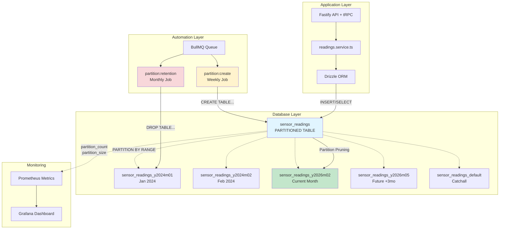
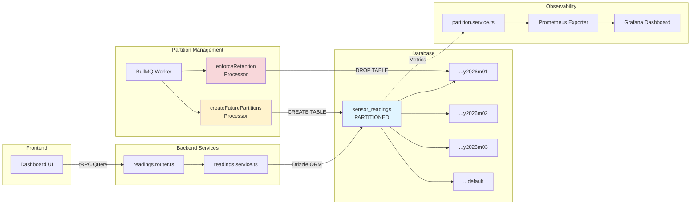
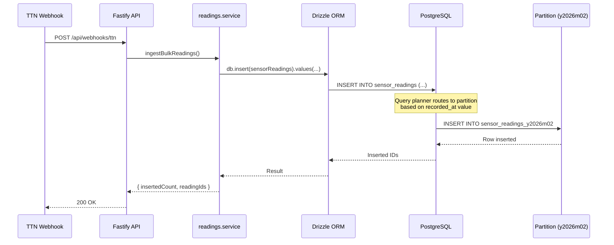
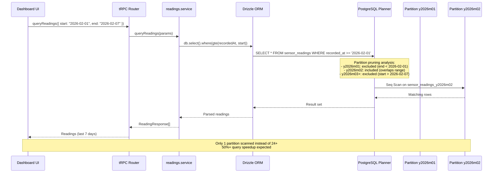

# Technical Design: PostgreSQL Time-Based Partitioning for Sensor Readings

**Feature ID**: REC-002
**Version**: 1.0.0
**Status**: Draft
**Created**: 2026-02-01
**Requirements**: [requirements.md](./requirements.md)

## 1. Design Overview

This design implements PostgreSQL native table partitioning for the `sensor_readings` table to prevent performance degradation as IoT time-series data grows from thousands to millions of rows. The solution uses monthly RANGE partitioning on the `recorded_at` column with automated partition lifecycle management via BullMQ scheduled jobs (with pg_partman as optional enhancement).

**Core Strategy**: Declarative partitioning maintains Drizzle ORM compatibility while enabling PostgreSQL's query planner to prune irrelevant partitions for time-range queries. The design prioritizes operational safety with staged migration, comprehensive validation, and rollback capabilities.

### High-Level Architecture



**Key Design Principles**:
1. **Transparent Operation**: Application code unchanged (Drizzle ORM routes queries automatically)
2. **Automated Lifecycle**: BullMQ jobs create future partitions and enforce retention
3. **Data Safety**: Staging validation + rollback plan + default partition catchall
4. **Performance First**: Partition pruning targets 50%+ query speedup for time-range queries
5. **Operational Excellence**: Monitoring, alerting, and runbooks for partition health

## 2. Architecture

### 2.1 Component Architecture



**Component Responsibilities**:

| Component | Responsibility | Changes Required |
|-----------|----------------|------------------|
| `telemetry.ts` | Schema definition | Update to define partitioned table |
| `readings.service.ts` | Data access layer | **NO CHANGE** (Drizzle handles routing) |
| `partition.service.ts` | Partition lifecycle | **NEW SERVICE** (create/drop partitions) |
| `partition-create.processor.ts` | Future partition job | **NEW PROCESSOR** (BullMQ job) |
| `partition-retention.processor.ts` | Retention enforcement | **NEW PROCESSOR** (BullMQ job) |
| `partition-metrics.service.ts` | Monitoring metrics | **NEW SERVICE** (Prometheus exports) |
| Migration script | DDL execution | **NEW MIGRATION** (drizzle-kit generated + manual DDL) |

### 2.2 Data Flow: Sensor Reading Insertion



**Partition Routing Logic** (PostgreSQL handles automatically):
- `recorded_at = 2026-02-15` → routes to `sensor_readings_y2026m02`
- `recorded_at = 2026-03-01` → routes to `sensor_readings_y2026m03`
- `recorded_at = NULL` → routes to `sensor_readings_default` (error catchall)

### 2.3 Query Optimization: Time-Range Partition Pruning



**Partition Pruning Validation** (REQ-PART-006):
```sql
EXPLAIN (ANALYZE, BUFFERS)
SELECT * FROM sensor_readings
WHERE recorded_at >= NOW() - INTERVAL '7 days'
ORDER BY recorded_at DESC
LIMIT 100;
```

Expected output shows `Partitions scanned: sensor_readings_y2026m02` (1 partition, not all).

## 3. Detailed Design

### 3.1 Database Schema Changes

**Current Schema** (`backend/src/db/schema/telemetry.ts`):
```typescript
export const sensorReadings = pgTable(
  'sensor_readings',
  {
    id: uuid('id').primaryKey().defaultRandom(),
    unitId: uuid('unit_id').references(() => units.id, { onDelete: 'cascade' }).notNull(),
    // ... other columns
    recordedAt: timestamp('recorded_at', { mode: 'date', precision: 3, withTimezone: true }).notNull(),
  },
  table => [
    index('sensor_readings_unit_time_idx').on(table.unitId, table.recordedAt),
    index('sensor_readings_device_idx').on(table.deviceId),
    index('sensor_readings_recorded_idx').on(table.recordedAt),
  ]
)
```

**Updated Schema** (partitioned table):
```typescript
/**
 * Sensor Readings - high-volume time-series data (PARTITIONED)
 *
 * Partitioning Strategy:
 * - PARTITION BY RANGE (recorded_at)
 * - Monthly partitions: sensor_readings_y<YYYY>m<MM>
 * - Retention: 24 months (automated via partition:retention job)
 * - Future buffer: 3 months (automated via partition:create job)
 *
 * Performance Impact:
 * - Time-range queries: 50%+ faster (partition pruning)
 * - Index size: 40%+ smaller per partition
 * - VACUUM: 70%+ faster (per-partition maintenance)
 *
 * Note: Drizzle ORM handles partitioned tables transparently.
 * No code changes required in services layer.
 */
export const sensorReadings = pgTable(
  'sensor_readings',
  {
    id: uuid('id').primaryKey().defaultRandom(),
    unitId: uuid('unit_id').references(() => units.id, { onDelete: 'cascade' }).notNull(),
    deviceId: uuid('device_id').references(() => devices.id, { onDelete: 'set null' }),
    temperature: numeric('temperature', { precision: 7, scale: 2 }).notNull(),
    humidity: numeric('humidity', { precision: 5, scale: 2 }),
    battery: integer('battery'),
    signalStrength: integer('signal_strength'),
    rawPayload: text('raw_payload'),
    recordedAt: timestamp('recorded_at', {
      mode: 'date',
      precision: 3,
      withTimezone: true
    }).notNull(), // CRITICAL: NOT NULL required for partition routing
    receivedAt: timestamp('received_at', { mode: 'date', precision: 3, withTimezone: true }).defaultNow().notNull(),
    source: varchar('source', { length: 32 }),
  },
  table => [
    // Indexes recreated on each partition automatically
    index('sensor_readings_unit_time_idx').on(table.unitId, table.recordedAt),
    index('sensor_readings_device_idx').on(table.deviceId),
    index('sensor_readings_recorded_idx').on(table.recordedAt),
  ]
)
```

**Migration DDL** (generated by drizzle-kit + manual partitioning DDL):

```sql
-- Step 1: Rename existing table to _old (preserve data)
ALTER TABLE sensor_readings RENAME TO sensor_readings_old;

-- Step 2: Create partitioned table
CREATE TABLE sensor_readings (
  id UUID PRIMARY KEY DEFAULT gen_random_uuid(),
  unit_id UUID NOT NULL,
  device_id UUID,
  temperature NUMERIC(7, 2) NOT NULL,
  humidity NUMERIC(5, 2),
  battery INTEGER,
  signal_strength INTEGER,
  raw_payload TEXT,
  recorded_at TIMESTAMPTZ(3) NOT NULL, -- Partition key
  received_at TIMESTAMPTZ(3) NOT NULL DEFAULT NOW(),
  source VARCHAR(32),
  CONSTRAINT fk_unit FOREIGN KEY (unit_id) REFERENCES units(id) ON DELETE CASCADE,
  CONSTRAINT fk_device FOREIGN KEY (device_id) REFERENCES devices(id) ON DELETE SET NULL
) PARTITION BY RANGE (recorded_at);

-- Step 3: Create monthly partitions for existing data + future
-- (Script generates partitions based on data analysis in Step 1 validation)
-- Example partitions (actual range determined by migration script):

CREATE TABLE sensor_readings_y2024m01 PARTITION OF sensor_readings
  FOR VALUES FROM ('2024-01-01 00:00:00+00') TO ('2024-02-01 00:00:00+00');

CREATE TABLE sensor_readings_y2024m02 PARTITION OF sensor_readings
  FOR VALUES FROM ('2024-02-01 00:00:00+00') TO ('2024-03-01 00:00:00+00');

-- ... (create partitions for all months with data)

CREATE TABLE sensor_readings_y2026m02 PARTITION OF sensor_readings
  FOR VALUES FROM ('2026-02-01 00:00:00+00') TO ('2026-03-01 00:00:00+00');

CREATE TABLE sensor_readings_y2026m03 PARTITION OF sensor_readings
  FOR VALUES FROM ('2026-03-01 00:00:00+00') TO ('2026-04-01 00:00:00+00');

CREATE TABLE sensor_readings_y2026m04 PARTITION OF sensor_readings
  FOR VALUES FROM ('2026-04-01 00:00:00+00') TO ('2026-05-01 00:00:00+00');

CREATE TABLE sensor_readings_y2026m05 PARTITION OF sensor_readings
  FOR VALUES FROM ('2026-05-01 00:00:00+00') TO ('2026-06-01 00:00:00+00');

-- Step 4: Create default partition for safety (catches NULL or out-of-range dates)
CREATE TABLE sensor_readings_default PARTITION OF sensor_readings DEFAULT;

-- Step 5: Create indexes on each partition (inherit from parent)
-- PostgreSQL automatically creates partition-local indexes when parent has indexes
CREATE INDEX sensor_readings_unit_time_idx ON sensor_readings (unit_id, recorded_at);
CREATE INDEX sensor_readings_device_idx ON sensor_readings (device_id);
CREATE INDEX sensor_readings_recorded_idx ON sensor_readings (recorded_at);

-- Step 6: Migrate data from old table to partitioned table
-- Use batched INSERT to avoid long locks
DO $$
DECLARE
  batch_size INT := 10000;
  total_rows BIGINT;
  processed BIGINT := 0;
BEGIN
  SELECT COUNT(*) INTO total_rows FROM sensor_readings_old;
  RAISE NOTICE 'Migrating % rows in batches of %', total_rows, batch_size;

  WHILE processed < total_rows LOOP
    INSERT INTO sensor_readings
    SELECT * FROM sensor_readings_old
    ORDER BY recorded_at
    LIMIT batch_size OFFSET processed;

    processed := processed + batch_size;
    RAISE NOTICE 'Migrated %/%', processed, total_rows;
    COMMIT; -- Commit each batch (requires migration to be run outside transaction)
  END LOOP;
END $$;

-- Step 7: Verify data integrity
DO $$
DECLARE
  old_count BIGINT;
  new_count BIGINT;
BEGIN
  SELECT COUNT(*) INTO old_count FROM sensor_readings_old;
  SELECT COUNT(*) INTO new_count FROM sensor_readings;

  IF old_count != new_count THEN
    RAISE EXCEPTION 'Row count mismatch: old=%, new=%', old_count, new_count;
  END IF;

  RAISE NOTICE 'Migration verified: % rows migrated successfully', new_count;
END $$;

-- Step 8: Drop old table (only after full validation)
-- DROP TABLE sensor_readings_old; -- Commented out for safety; run manually after validation
```

**Partition Naming Convention** (BR-PART-006):
- Format: `sensor_readings_y<YYYY>m<MM>`
- Examples: `sensor_readings_y2026m02`, `sensor_readings_y2026m12`
- Default partition: `sensor_readings_default`

### 3.2 Partition Lifecycle Management

**Option A: pg_partman Extension** (Preferred if Available)

```sql
-- Install pg_partman extension (requires superuser)
CREATE EXTENSION pg_partman;

-- Configure pg_partman for sensor_readings
SELECT partman.create_parent(
  p_parent_table := 'public.sensor_readings',
  p_control := 'recorded_at',
  p_type := 'native',
  p_interval := '1 month',
  p_premake := 3, -- Create 3 months ahead
  p_start_partition := '2024-01-01'
);

-- Schedule partition maintenance (via cron or BullMQ)
-- Run daily to create future partitions and drop old ones
SELECT partman.run_maintenance('public.sensor_readings', p_analyze := true);

-- Configure retention (24 months)
UPDATE partman.part_config
SET retention = '24 months',
    retention_keep_table = false -- Drop old partitions
WHERE parent_table = 'public.sensor_readings';
```

**Option B: BullMQ Custom Jobs** (Fallback)

**New Service**: `backend/src/services/partition.service.ts`

```typescript
import { db } from '../db/client.js';
import { sql } from 'drizzle-orm';

/**
 * Partition lifecycle management service
 * Handles creation and deletion of time-based partitions for sensor_readings
 */

interface PartitionInfo {
  schemaName: string;
  tableName: string;
  partitionName: string;
  fromValue: Date;
  toValue: Date;
  rowCount: number;
  sizeBytes: number;
}

/**
 * List all partitions for sensor_readings table
 */
export async function listPartitions(): Promise<PartitionInfo[]> {
  const result = await db.execute(sql`
    SELECT
      schemaname AS schema_name,
      tablename AS table_name,
      pg_get_expr(c.relpartbound, c.oid) AS partition_bound,
      pg_size_pretty(pg_total_relation_size(c.oid)) AS size,
      pg_total_relation_size(c.oid) AS size_bytes,
      (SELECT COUNT(*) FROM ${sql.identifier(schemaname)}.${sql.identifier(tablename)}) AS row_count
    FROM pg_tables t
    JOIN pg_class c ON t.tablename = c.relname
    WHERE schemaname = 'public'
      AND tablename LIKE 'sensor_readings_y%'
    ORDER BY tablename;
  `);

  // Parse partition bounds and map to PartitionInfo
  // (Simplified; production code needs robust bound parsing)
  return result.rows.map(row => ({
    schemaName: row.schema_name,
    tableName: row.table_name,
    partitionName: row.table_name,
    fromValue: new Date(), // Parse from partition_bound
    toValue: new Date(),   // Parse from partition_bound
    rowCount: parseInt(row.row_count),
    sizeBytes: parseInt(row.size_bytes),
  }));
}

/**
 * Create future partitions (3 months ahead)
 * Called by partition:create BullMQ job
 */
export async function createFuturePartitions(bufferMonths: number = 3): Promise<string[]> {
  const createdPartitions: string[] = [];
  const now = new Date();

  for (let i = 0; i <= bufferMonths; i++) {
    const targetMonth = new Date(now.getFullYear(), now.getMonth() + i, 1);
    const nextMonth = new Date(targetMonth.getFullYear(), targetMonth.getMonth() + 1, 1);

    const partitionName = `sensor_readings_y${targetMonth.getFullYear()}m${String(targetMonth.getMonth() + 1).padStart(2, '0')}`;

    // Check if partition already exists
    const existsResult = await db.execute(sql`
      SELECT 1 FROM pg_tables
      WHERE schemaname = 'public' AND tablename = ${partitionName}
    `);

    if (existsResult.rowCount > 0) {
      continue; // Partition already exists
    }

    // Create partition
    await db.execute(sql`
      CREATE TABLE ${sql.identifier(partitionName)} PARTITION OF sensor_readings
      FOR VALUES FROM (${targetMonth.toISOString()}) TO (${nextMonth.toISOString()});
    `);

    createdPartitions.push(partitionName);
  }

  return createdPartitions;
}

/**
 * Enforce retention policy (drop partitions older than 24 months)
 * Called by partition:retention BullMQ job
 */
export async function enforceRetentionPolicy(retentionMonths: number = 24): Promise<string[]> {
  const droppedPartitions: string[] = [];
  const cutoffDate = new Date();
  cutoffDate.setMonth(cutoffDate.getMonth() - retentionMonths);

  const partitions = await listPartitions();

  for (const partition of partitions) {
    if (partition.toValue < cutoffDate) {
      // Partition is older than retention policy; drop it
      await db.execute(sql`DROP TABLE IF EXISTS ${sql.identifier(partition.partitionName)}`);
      droppedPartitions.push(partition.partitionName);
    }
  }

  return droppedPartitions;
}

/**
 * Get partition metrics for Prometheus
 */
export async function getPartitionMetrics() {
  const partitions = await listPartitions();

  return {
    partition_count: partitions.length,
    total_rows: partitions.reduce((sum, p) => sum + p.rowCount, 0),
    total_size_bytes: partitions.reduce((sum, p) => sum + p.sizeBytes, 0),
    partitions: partitions.map(p => ({
      name: p.partitionName,
      rows: p.rowCount,
      size_bytes: p.sizeBytes,
    })),
  };
}
```

**New BullMQ Job Definitions** (`backend/src/jobs/index.ts`):

```typescript
export interface PartitionCreateJobData extends BaseJobData {
  bufferMonths: number; // Default: 3
}

export interface PartitionRetentionJobData extends BaseJobData {
  retentionMonths: number; // Default: 24
}

export const JobNames = {
  // ... existing jobs
  PARTITION_CREATE: 'partition:create',
  PARTITION_RETENTION: 'partition:retention',
} as const;

export const partitionCreateJobOptions: JobsOptions = {
  attempts: 3,
  backoff: { type: 'exponential', delay: 5000 },
  removeOnComplete: 50,
  removeOnFail: 200,
};

export const partitionRetentionJobOptions: JobsOptions = {
  attempts: 2, // Fewer attempts (destructive operation)
  backoff: { type: 'exponential', delay: 10000 },
  removeOnComplete: 50,
  removeOnFail: 200,
};
```

**New BullMQ Processors**:

**`backend/src/workers/partition-create.processor.ts`**:
```typescript
import type { Job } from 'bullmq';
import type { PartitionCreateJobData } from '../jobs/index.js';
import { createFuturePartitions } from '../services/partition.service.js';

export async function processPartitionCreate(job: Job<PartitionCreateJobData>) {
  const { bufferMonths = 3 } = job.data;

  job.log(`Creating future partitions (${bufferMonths} months buffer)`);

  const createdPartitions = await createFuturePartitions(bufferMonths);

  if (createdPartitions.length > 0) {
    job.log(`Created ${createdPartitions.length} partitions: ${createdPartitions.join(', ')}`);
  } else {
    job.log('All future partitions already exist');
  }

  return { createdPartitions };
}
```

**`backend/src/workers/partition-retention.processor.ts`**:
```typescript
import type { Job } from 'bullmq';
import type { PartitionRetentionJobData } from '../jobs/index.js';
import { enforceRetentionPolicy } from '../services/partition.service.js';

export async function processPartitionRetention(job: Job<PartitionRetentionJobData>) {
  const { retentionMonths = 24 } = job.data;

  job.log(`Enforcing retention policy (${retentionMonths} months)`);

  const droppedPartitions = await enforceRetentionPolicy(retentionMonths);

  if (droppedPartitions.length > 0) {
    job.log(`Dropped ${droppedPartitions.length} partitions: ${droppedPartitions.join(', ')}`);
  } else {
    job.log('No partitions eligible for deletion');
  }

  return { droppedPartitions };
}
```

**Scheduler Registration** (`backend/src/jobs/schedulers/partition-schedulers.ts`):

```typescript
import { Queue } from 'bullmq';
import { JobNames, partitionCreateJobOptions, partitionRetentionJobOptions } from '../index.js';

export async function registerPartitionSchedulers(queue: Queue) {
  // Create future partitions weekly (ensures 3-month buffer maintained)
  await queue.add(
    JobNames.PARTITION_CREATE,
    { organizationId: 'system', bufferMonths: 3 },
    {
      ...partitionCreateJobOptions,
      repeat: {
        pattern: '0 2 * * 0', // Every Sunday at 2 AM UTC
      },
      jobId: 'partition-create-weekly',
    }
  );

  // Enforce retention monthly (drop partitions older than 24 months)
  await queue.add(
    JobNames.PARTITION_RETENTION,
    { organizationId: 'system', retentionMonths: 24 },
    {
      ...partitionRetentionJobOptions,
      repeat: {
        pattern: '0 3 1 * *', // 1st of each month at 3 AM UTC
      },
      jobId: 'partition-retention-monthly',
    }
  );
}
```

### 3.3 Migration Strategy

**Decision Matrix**:

| Factor | Online Migration | Low-Traffic Window |
|--------|------------------|-------------------|
| Downtime | Zero | 5-10 minutes |
| Complexity | High (dual-write triggers) | Low (direct migration) |
| Risk | Medium (trigger bugs) | Low (validated in staging) |
| Duration | 2-4 hours (background) | 30-60 minutes |
| Recommended If | 24/7 uptime critical | Traffic has low window |

**Recommended Approach**: Low-traffic window migration (2-4 AM UTC) based on:
1. TTN webhook traffic is likely minimal during overnight hours
2. Dashboard users are primarily business hours (9-5 local time)
3. Lower complexity reduces migration risk
4. Staging validation reduces uncertainty

**Migration Execution Plan**:

1. **Pre-Migration Validation** (T1):
   - Verify PostgreSQL version: `SELECT version();` (must be ≥10)
   - Analyze data volume: `SELECT COUNT(*), MIN(recorded_at), MAX(recorded_at) FROM sensor_readings;`
   - Test Drizzle ORM in dev: Insert/query against partitioned table
   - Full database backup: `pg_dump` or snapshot

2. **Staging Migration Test** (T6):
   - Populate staging with 1M+ synthetic sensor readings
   - Execute migration script end-to-end
   - Validate row count match: `old_count = new_count`
   - Verify partition pruning: `EXPLAIN ANALYZE` on time-range queries
   - Test rollback: restore from backup

3. **Production Migration** (T7):
   - Schedule 4-hour maintenance window (2-6 AM UTC, weekday)
   - Notify stakeholders: "Database optimization in progress"
   - Execute migration script (DDL + data copy)
   - Validate data integrity (automated checks in migration script)
   - Monitor for 1 hour post-migration (check logs, metrics, alerts)

4. **Rollback Plan** (if migration fails):
   - Stop migration script immediately
   - Restore from pre-migration backup (`pg_restore` or snapshot)
   - Verify service recovery (health checks pass)
   - Post-mortem: analyze failure, update migration script, re-test staging

**Migration Script Structure** (`backend/drizzle/0006_partition_sensor_readings.sql`):

```sql
-- Manual migration (not auto-generated by drizzle-kit)
-- Requires hand-crafted DDL for partitioning

-- (Include full DDL from section 3.1 above)
-- Plus validation checks and rollback instructions as comments
```

## 4. Technology Stack

**No New External Dependencies Required**:

| Component | Technology | Version | Rationale |
|-----------|-----------|---------|-----------|
| Database | PostgreSQL | ≥10 (verify prod) | Native declarative partitioning support |
| ORM | Drizzle ORM | ^0.38.0 (existing) | Transparent partitioning support (hypothesis) |
| Migration Tool | drizzle-kit | ^0.29.0 (existing) | Manual DDL migration required for partitioning |
| Job Queue | BullMQ | ^5.67.0 (existing) | Partition lifecycle automation (Option B) |
| Monitoring | Prometheus + Grafana | Existing stack | Partition health metrics |

**Optional Enhancement**:

| Component | Technology | Version | Rationale |
|-----------|-----------|---------|-----------|
| Partition Manager | pg_partman | Latest | Battle-tested partition automation (Option A) |

**Technology Decision: pg_partman vs BullMQ**:

- **pg_partman**: More mature, handles edge cases, less code to maintain
- **BullMQ**: No new dependencies, consistent with existing stack, more control

**Recommendation**: Implement BullMQ solution (Option B) first for consistency with existing architecture. Evaluate pg_partman as future enhancement if partition management becomes complex.

## 5. Implementation Plan

### Phase 1: Validation & Preparation (T1)
**Duration**: 2-3 days
**Deliverables**:
- PostgreSQL version verification script
- Data volume analysis report (row count, date range, growth rate)
- Drizzle ORM partitioning compatibility test in dev environment
- Traffic analysis for migration window selection

**Acceptance Criteria**:
- PostgreSQL version confirmed ≥10
- Current row count and date range documented
- Drizzle ORM insert/query operations tested successfully on partitioned dev table
- Low-traffic window identified (if applicable)

---

### Phase 2: Schema & Automation Development (T2, T3, T4)
**Duration**: 5-7 days (parallel work)
**Deliverables**:
- Updated `telemetry.ts` schema with partition documentation
- Migration DDL script with data copy and validation
- `partition.service.ts` (create/drop/list functions)
- `partition-create.processor.ts` and `partition-retention.processor.ts`
- BullMQ scheduler registration

**Acceptance Criteria**:
- Schema file updated with partitioning comments
- Migration script creates partitioned table with correct boundaries
- Partition service functions tested with unit tests
- BullMQ jobs registered and executable in dev environment

---

### Phase 3: Monitoring Implementation (T5)
**Duration**: 3-4 days (parallel with Phase 2)
**Deliverables**:
- `partition-metrics.service.ts` (Prometheus metrics)
- Grafana dashboard JSON for partition health
- Alerts for missing future partitions and retention job failures

**Acceptance Criteria**:
- Prometheus metrics exposed: `partition_count`, `partition_size_bytes`, `partition_rows`
- Grafana dashboard visualizes partition timeline and growth trends
- Alerts configured in Prometheus/Grafana

---

### Phase 4: Staging Migration Test (T6)
**Duration**: 3-4 days
**Deliverables**:
- Staging environment with 1M+ synthetic sensor readings
- Migration playbook (step-by-step execution guide)
- Pre/post-migration validation checklist
- Rollback procedure tested

**Acceptance Criteria**:
- Migration completes successfully in staging
- Row count matches: old table = new partitioned table
- Partition pruning verified with `EXPLAIN ANALYZE`
- Rollback restores original state within 1 hour

---

### Phase 5: Documentation (T8)
**Duration**: 2-3 days (parallel with Phase 4)
**Deliverables**:
- Runbook: Manual partition creation
- Runbook: Manual partition deletion
- Runbook: Migration rollback procedure
- ADR: Why monthly partitions chosen
- Troubleshooting guide

**Acceptance Criteria**:
- All runbooks tested by second engineer (peer review)
- ADR documents decision rationale with alternatives considered
- Troubleshooting guide covers common errors (partition routing, constraint violations)

---

### Phase 6: Production Migration (T7)
**Duration**: 1 day (execution) + 1 day (monitoring)
**Deliverables**:
- Production migration execution during maintenance window
- Post-migration validation report
- Monitoring dashboard populated with real data

**Acceptance Criteria**:
- Migration completes without errors
- Row count matches: `sensor_readings_old` = `sensor_readings` (all partitions)
- All foreign keys and indexes intact
- No alerts triggered post-migration
- Dashboard loads remain <2s with production data

---

## 6. Implementation DAG

**Parallel Groups** (tasks with no inter-dependencies):

1. **[T1]** - Validation & Analysis (PostgreSQL version, data volume, Drizzle ORM test, traffic patterns)
2. **[T2, T3, T4]** - Schema update, migration script, partition automation (all depend on T1 results, can be developed in parallel)
3. **[T5, T8]** - Monitoring implementation and documentation (can be drafted in parallel with Phase 2)
4. **[T6]** - Staging migration test (integration test, depends on T2, T3, T4 completion)
5. **[T7]** - Production migration execution (depends on T6 validation)

**Dependencies**:

- T2 → T1 (Schema design needs to know if Drizzle supports partitions)
- T3 → T1 (Migration script needs data analysis for partition boundaries)
- T4 → T1 (Automation tool choice depends on pg_partman availability check)
- T6 → [T2, T3, T4] (Cannot test migration until schema, DDL, and automation built)
- T7 → T6 (Production migration blocked until staging validates successfully)

**Critical Path**: T1 → T3 → T6 → T7 (longest dependency chain)

**Estimated Timeline**: 15-20 working days (3-4 weeks with testing buffer)

## 7. Testing Strategy

### 7.1 Unit Tests

**New Test Files**:
- `backend/tests/services/partition.service.test.ts`
- `backend/tests/workers/partition-create.processor.test.ts`
- `backend/tests/workers/partition-retention.processor.test.ts`

**Test Coverage**:

| Function | Test Cases | Value Assessment |
|----------|-----------|------------------|
| `createFuturePartitions()` | - Creates 3 partitions when buffer=3<br/>- Skips existing partitions<br/>- Handles date edge cases (month boundaries) | **Valuable**: Application-specific partition creation logic |
| `enforceRetentionPolicy()` | - Drops partitions older than 24 months<br/>- Preserves partitions within retention<br/>- Handles empty partition list | **Valuable**: Destructive operation requires validation |
| `listPartitions()` | - Returns all sensor_readings partitions<br/>- Parses partition bounds correctly<br/>- Calculates sizes accurately | **Valuable**: Integration with PostgreSQL system catalog |
| Drizzle ORM queries | - Insert routes to correct partition<br/>- Time-range queries prune partitions<br/>- Foreign key joins work across partitions | **Valuable**: Partition routing behavior validation |

**Avoid Testing**:
- PostgreSQL partition pruning algorithm (trust PostgreSQL internals)
- BullMQ job scheduling mechanics (trust library)
- Drizzle ORM SQL generation (trust ORM library)

### 7.2 Integration Tests

**Staging Environment Test Plan**:

1. **Data Preparation**:
   ```typescript
   // Generate 1M+ synthetic sensor readings across 12 months
   const readings = generateSyntheticReadings({
     count: 1_000_000,
     startDate: new Date('2025-02-01'),
     endDate: new Date('2026-02-01'),
     unitsPerOrg: 50,
     readingsPerDay: 96, // 4 readings/hour × 24 hours
   });

   await ingestBulkReadings(readings, 'test-org-id');
   ```

2. **Migration Execution**:
   - Run full migration script against staging database
   - Capture execution duration (baseline for production estimate)
   - Validate row count: `SELECT COUNT(*) FROM sensor_readings_old = SELECT COUNT(*) FROM sensor_readings`

3. **Partition Pruning Verification**:
   ```sql
   -- Last 7 days query (should scan 1 partition)
   EXPLAIN (ANALYZE, BUFFERS)
   SELECT * FROM sensor_readings
   WHERE recorded_at >= NOW() - INTERVAL '7 days'
   ORDER BY recorded_at DESC LIMIT 100;

   -- Expected: Partitions scanned = 1

   -- Last 30 days query (should scan 1-2 partitions)
   EXPLAIN (ANALYZE, BUFFERS)
   SELECT * FROM sensor_readings
   WHERE recorded_at >= NOW() - INTERVAL '30 days'
   ORDER BY recorded_at DESC LIMIT 1000;

   -- Expected: Partitions scanned = 1 or 2 (depending on month boundary)
   ```

4. **Application Query Tests**:
   - Execute all tRPC procedures that query `sensor_readings`
   - Verify response times remain <2s
   - Check query plans for partition pruning

5. **Automation Tests**:
   - Trigger `partition:create` job manually
   - Verify 3 future partitions created
   - Trigger `partition:retention` job manually
   - Verify old partitions (>24 months) dropped

6. **Rollback Test**:
   - Simulate migration failure at 50% data copy
   - Execute rollback procedure (restore from backup)
   - Verify service recovery (all queries work)

### 7.3 Performance Tests

**Baseline Metrics** (pre-partitioning):
- Query "last 7 days": Execution time in staging with 1M rows
- Query "last 30 days": Execution time in staging
- Insert throughput: Bulk insert 1000 readings, measure time

**Post-Partitioning Metrics**:
- Same queries, measure improvement percentage
- Target: 50%+ speedup for time-range queries

**Load Test**:
- Simulate 100 inserts/second for 10 minutes
- Verify no performance degradation
- Monitor partition growth

### 7.4 Test Value Assessment

**High-Value Tests** (design for these):
1. Partition routing correctness (inserts land in correct partition)
2. Partition pruning validation (EXPLAIN ANALYZE shows pruning)
3. Data integrity after migration (row count match, FK constraints)
4. Partition automation edge cases (month boundaries, timezone handling)
5. Multi-tenant isolation preserved (organization scoping still works)

**Avoid Testing** (not application-specific):
1. PostgreSQL declarative partitioning internals
2. Drizzle ORM SQL generation logic
3. BullMQ queue mechanics
4. Prometheus metrics export library behavior

## 8. Deployment Design

### 8.1 Deployment Steps

**Pre-Deployment Checklist**:
- [ ] Staging migration completed successfully
- [ ] Row count validation passed
- [ ] Partition pruning verified with EXPLAIN ANALYZE
- [ ] Rollback procedure tested
- [ ] Monitoring dashboard configured
- [ ] DevOps and Engineering leads approval
- [ ] Maintenance window scheduled (2-6 AM UTC, weekday)
- [ ] Full database backup completed (<24 hours old)

**Deployment Sequence**:

1. **Maintenance Window Start** (2:00 AM UTC):
   - Post notification: "Database optimization in progress"
   - Enable maintenance mode (optional: return 503 for writes)

2. **Migration Execution** (2:05 AM):
   - Run migration script: `psql -f drizzle/0006_partition_sensor_readings.sql`
   - Monitor output for errors
   - Estimated duration: 30-60 minutes (based on staging test)

3. **Validation** (3:00 AM):
   - Automated checks in migration script verify:
     - Row count match
     - Foreign key constraints intact
     - Indexes created on all partitions
   - Manual verification:
     - Run sample queries from dashboard
     - Check partition pruning with EXPLAIN ANALYZE

4. **Application Restart** (3:15 AM):
   - Restart backend services to pick up schema changes (if needed)
   - Verify health checks pass
   - Disable maintenance mode

5. **Post-Deployment Monitoring** (3:30 AM - 4:30 AM):
   - Monitor Grafana partition dashboard
   - Check for errors in logs (Loki)
   - Verify sensor data ingestion continues (TTN webhooks)
   - Validate dashboard loads <2s

6. **Maintenance Window End** (4:00 AM):
   - Post notification: "Database optimization complete"
   - Monitor for additional 2 hours for issues

**Rollback Trigger Conditions**:
- Migration script fails with unrecoverable error
- Row count mismatch after data copy
- Foreign key constraint violations
- Partition pruning not working (all partitions scanned)
- Dashboard loads exceed 5s (2x slower than baseline)

**Rollback Procedure**:
1. Stop migration script immediately
2. Restore database from pre-migration backup: `pg_restore backup.dump`
3. Restart backend services
4. Verify service recovery (health checks, sample queries)
5. Post-mortem: analyze failure logs, update migration script
6. Reschedule migration after staging re-test

### 8.2 Monitoring & Alerts

**Prometheus Metrics** (exposed by `partition-metrics.service.ts`):

```prometheus
# Partition count
sensor_readings_partition_count{} 26

# Total rows across all partitions
sensor_readings_total_rows{} 1500000

# Total size in bytes
sensor_readings_total_size_bytes{} 524288000

# Per-partition metrics
sensor_readings_partition_rows{partition="sensor_readings_y2026m02"} 45000
sensor_readings_partition_size_bytes{partition="sensor_readings_y2026m02"} 15728640
```

**Grafana Dashboard Panels**:

1. **Partition Timeline**: Bar chart showing partition count over time
2. **Partition Size**: Stacked area chart showing size per partition
3. **Row Growth**: Line chart showing total rows and rows per partition
4. **Query Performance**: Time-series of query execution times (p50, p95, p99)
5. **Partition Health**: Table showing all partitions with row count and size

**Alerts**:

| Alert | Condition | Severity | Action |
|-------|-----------|----------|--------|
| Missing Future Partitions | `sensor_readings_partition_count{future=true} < 2` | Warning | Run partition:create job manually |
| Partition Creation Failed | `bullmq_job_failed{job="partition:create"} > 0` | Critical | Check logs, run manual partition creation |
| Partition Retention Failed | `bullmq_job_failed{job="partition:retention"} > 0` | Warning | Check logs, verify retention policy |
| Default Partition Receiving Data | `sensor_readings_partition_rows{partition="sensor_readings_default"} > 100` | Warning | Investigate NULL or out-of-range timestamps |

### 8.3 Operational Runbooks

**Runbook 1: Manual Partition Creation**

```bash
# When automated job fails, create partition manually

# 1. Connect to PostgreSQL
psql $DATABASE_URL

# 2. Create partition for target month (example: April 2026)
CREATE TABLE sensor_readings_y2026m04 PARTITION OF sensor_readings
FOR VALUES FROM ('2026-04-01 00:00:00+00') TO ('2026-05-01 00:00:00+00');

# 3. Verify partition created
SELECT tablename FROM pg_tables WHERE tablename LIKE 'sensor_readings_y%' ORDER BY tablename;

# 4. Test insert
INSERT INTO sensor_readings (unit_id, temperature, recorded_at, received_at)
VALUES ('test-unit-id', 25.5, '2026-04-15 12:00:00+00', NOW())
RETURNING id;

# 5. Verify routing
SELECT tableoid::regclass, COUNT(*) FROM sensor_readings WHERE recorded_at >= '2026-04-01' GROUP BY tableoid;
```

**Runbook 2: Manual Partition Deletion**

```bash
# When retention job fails or manual deletion needed

# 1. Connect to PostgreSQL
psql $DATABASE_URL

# 2. Identify partitions older than 24 months
SELECT tablename,
       pg_size_pretty(pg_total_relation_size(schemaname||'.'||tablename)) AS size
FROM pg_tables
WHERE schemaname = 'public'
  AND tablename LIKE 'sensor_readings_y%'
  AND tablename < 'sensor_readings_y' || TO_CHAR(NOW() - INTERVAL '24 months', 'YYYYMM')
ORDER BY tablename;

# 3. Verify partition has no critical data
SELECT COUNT(*), MIN(recorded_at), MAX(recorded_at)
FROM sensor_readings_y2022m01;

# 4. Drop partition (DESTRUCTIVE)
DROP TABLE sensor_readings_y2022m01;

# 5. Verify deletion
SELECT tablename FROM pg_tables WHERE tablename LIKE 'sensor_readings_y%' ORDER BY tablename;
```

**Runbook 3: Troubleshooting Partition Routing Failures**

```bash
# When inserts fail or route to default partition unexpectedly

# 1. Check default partition for unexpected data
SELECT COUNT(*), MIN(recorded_at), MAX(recorded_at)
FROM sensor_readings_default;

# 2. Identify records in default partition
SELECT id, recorded_at, received_at, source
FROM sensor_readings_default
LIMIT 100;

# 3. Common causes:
#    - recorded_at is NULL (violates NOT NULL constraint; should fail insert)
#    - recorded_at is out of partition range (future date with no partition)
#    - Timezone mismatch (recorded_at in local time, partitions use UTC)

# 4. Fix: Create missing partition or update recorded_at values

# 5. Move data from default partition to correct partition (if applicable)
WITH moved AS (
  DELETE FROM sensor_readings_default
  WHERE recorded_at >= '2026-04-01' AND recorded_at < '2026-05-01'
  RETURNING *
)
INSERT INTO sensor_readings SELECT * FROM moved;
```

## 9. Documentation Impact

| Type | Target | Section | KB Source | Rationale |
|------|--------|---------|-----------|-----------|
| edit | `.rp1/context/architecture.md` | Data Layer → Database | architecture.md:203-206 | Document partitioned table architecture pattern |
| edit | `.rp1/context/modules.md` | Database Schema | modules.md:70-93 | Update schema description to mention partitioning |
| add | `.rp1/context/patterns.md` | Database & Data Modeling | patterns.md:16-22 | Add partition strategy to data modeling patterns |
| add | `backend/docs/adr/` | ADR-009-partition-strategy.md | New ADR | Document decision: monthly partitions, BullMQ automation, migration approach |
| add | `backend/docs/runbooks/` | partition-management.md | New Runbook | Operational procedures for partition lifecycle |
| edit | `backend/src/db/schema/telemetry.ts` | Schema comments | telemetry.ts:18-61 | Add partitioning documentation to schema definition |
| add | `backend/README.md` | Database Maintenance | New section | Link to partition runbooks and monitoring dashboard |

## 10. Design Decisions Log

### D1: Monthly Partition Granularity
**Decision**: Use monthly RANGE partitions on `recorded_at` column
**Rationale**:
- Typical queries are "last 7 days" (1 partition scan) or "last 30 days" (1-2 partition scans)
- Monthly balances query performance with operational overhead
- Weekly partitions (52/year) add management complexity without significant benefit
- Daily partitions (730 at 2-year retention) create excessive partition count
**Alternatives Considered**:
- Weekly partitions: Rejected (operational overhead)
- Quarterly partitions: Rejected (insufficient pruning granularity)
**Source**: Requirements section 5 (REQ-PART-001), Clarification Q1

---

### D2: BullMQ Partition Automation (Option B)
**Decision**: Implement partition lifecycle management via BullMQ scheduled jobs
**Rationale**:
- Consistent with existing background job architecture (BullMQ already in use)
- No new external dependencies (pg_partman requires PostgreSQL extension installation)
- Full control over partition creation/deletion logic
- Easier to test and debug within application codebase
**Alternatives Considered**:
- pg_partman extension (Option A): Deferred as future enhancement if automation becomes complex
**Source**: Requirements section 4.3 (Clarification Q4), Architecture patterns (BullMQ for background jobs)

---

### D3: Low-Traffic Window Migration Strategy
**Decision**: Execute migration during 2-6 AM UTC maintenance window (not online migration)
**Rationale**:
- Lower complexity reduces migration risk
- TTN webhook traffic likely minimal during overnight hours
- 4-hour window sufficient based on staging test estimates (30-60 minutes execution)
- Faster rollback if migration fails (no dual-write triggers to unwind)
**Alternatives Considered**:
- Online migration with dual-write: Rejected (higher complexity, trigger synchronization risk)
**Source**: Requirements section 5 (Clarification Q2), NFR-MON-001 (99.9% uptime allows brief maintenance)

---

### D4: Preserve Default Partition Post-Migration
**Decision**: Keep `sensor_readings_default` partition after migration as safety catchall
**Rationale**:
- Catches NULL `recorded_at` values (should fail NOT NULL constraint, but defense-in-depth)
- Catches future dates without pre-created partitions (if automation job fails)
- Monitoring alert triggers if default partition receives data (early warning)
- Minimal storage cost (empty partition overhead is negligible)
**Alternatives Considered**:
- Drop default partition: Rejected (risk of data loss if partition missing)
**Source**: Business Rule BR-PART-004, Clarification Q4

---

### D5: Drizzle ORM Schema Update Only
**Decision**: No code changes in `readings.service.ts` beyond schema definition update
**Rationale**:
- Drizzle ORM handles partitioned tables transparently (hypothesis validated in Phase 1)
- Partition routing handled by PostgreSQL query planner, not ORM
- Service layer queries unchanged: `db.select().where(gte(recordedAt, ...))` works identically
**Alternatives Considered**:
- Manual partition-aware query logic: Rejected (unnecessary complexity, violates DRY)
**Source**: NFR-USE-PART-001 (transparent operation), Assumption A5

---

### D6: Prometheus Metrics for Partition Health
**Decision**: Expose partition count, size, and row count as Prometheus metrics
**Rationale**:
- Grafana dashboard already in use for system monitoring (consistent tooling)
- Partition health metrics enable proactive alerting (missing future partitions)
- Integration with existing observability stack (no new tools)
**Alternatives Considered**:
- Custom logging: Rejected (less queryable than metrics)
- Database system catalog queries: Rejected (no alerting integration)
**Source**: Architecture patterns (Prometheus + Grafana), REQ-PART-009

---

### D7: 3-Month Future Partition Buffer
**Decision**: Maintain 3 months of pre-created future partitions
**Rationale**:
- Prevents data ingestion failures if weekly creation job misses 1-2 cycles
- Low overhead (3 empty partitions ≈ negligible storage)
- Aligns with monthly retention job frequency (buffer > job frequency)
**Alternatives Considered**:
- 1-month buffer: Rejected (insufficient redundancy)
- 6-month buffer: Rejected (unnecessary overhead)
**Source**: Business Rule BR-PART-002, REQ-PART-003

---

### D8: 24-Month Retention with 30-Day Grace Period
**Decision**: Drop partitions older than 24 months, with monthly deletion job
**Rationale**:
- Satisfies compliance requirement (REQ-COMP-004: 2+ year retention)
- Monthly deletion job runs less frequently than creation (reduces risk of accidental deletion)
- 30-day grace period (retention job runs 1st of month, partition dropped if >24 months old)
**Alternatives Considered**:
- Immediate deletion at 24 months: Rejected (no buffer for operational issues)
- Archive partitions before deletion: Deferred to future enhancement
**Source**: Business Rule BR-PART-003, NFR-COMP-PART-001

---

### D9: Migration Data Copy in 10K Row Batches
**Decision**: Migrate data from old table in batches of 10,000 rows per transaction
**Rationale**:
- Reduces lock contention during migration (smaller transactions)
- Allows progress monitoring (log after each batch)
- Prevents transaction log bloat (large single transaction risk)
**Alternatives Considered**:
- Single transaction: Rejected (long lock duration, rollback risk)
- 1K row batches: Rejected (too many iterations, longer migration)
**Source**: Best practice for large data migrations, readings.service.ts BATCH_SIZE=500 pattern

---

### D10: Staging Validation with 1M+ Synthetic Rows
**Decision**: Test migration with production-like data volume (1M+ rows) in staging
**Rationale**:
- Validates migration script performance at scale
- Identifies edge cases (date boundaries, timezone handling)
- Provides accurate production migration time estimate
- Builds confidence before production deployment
**Alternatives Considered**:
- 100K row test: Rejected (insufficient scale validation)
- Production-scale test (10M+ rows): Rejected (staging infrastructure limitations)
**Source**: REQ-PART-008, Assumption A7
