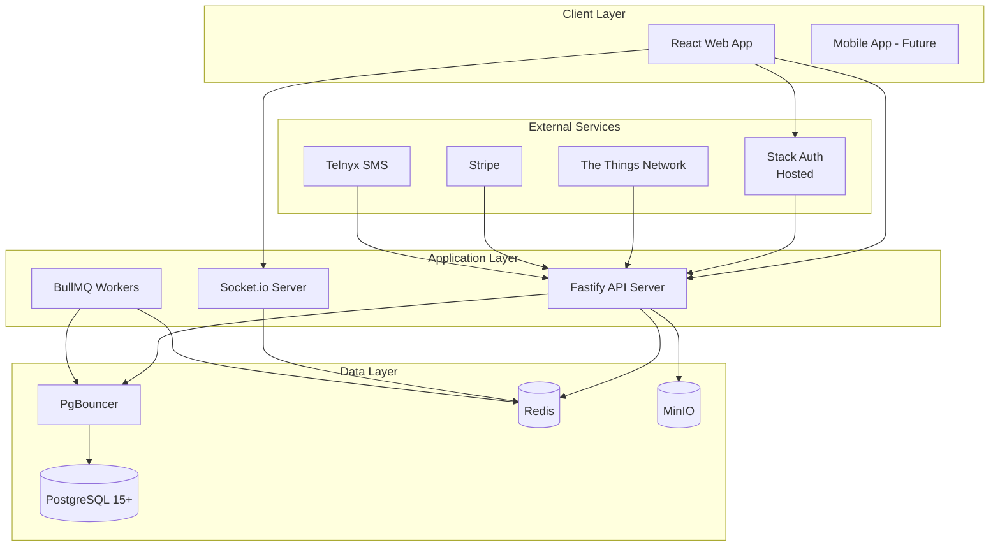
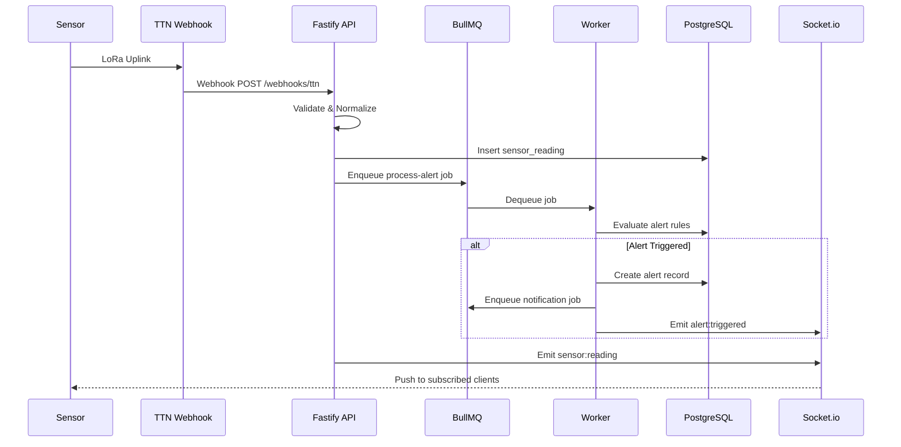
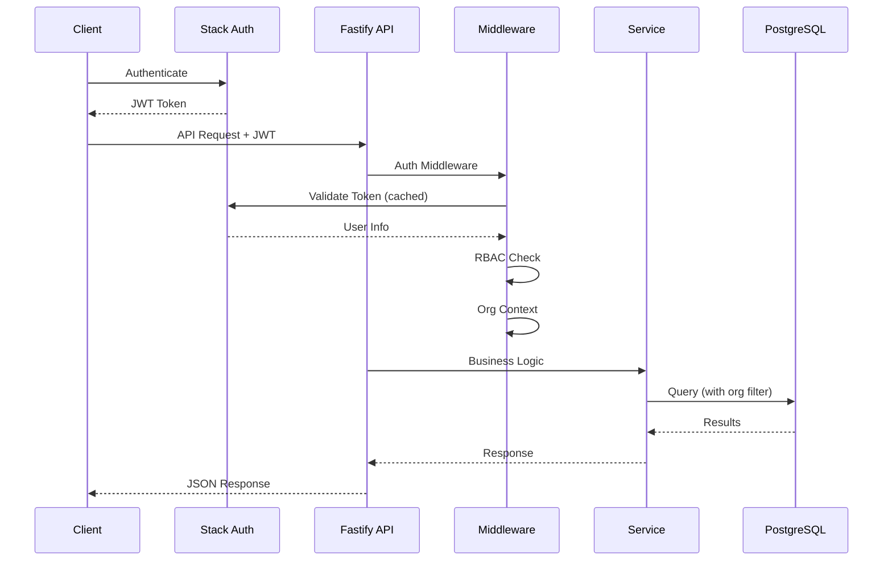
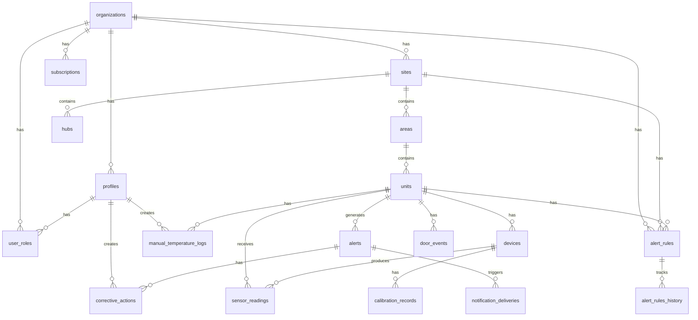

# Target Architecture

## Overview

This document describes the concrete target architecture for FrostGuard after migration from Supabase to a self-hosted stack.

---

## Technology Stack

| Component               | Technology     | Version | Purpose                         |
| ----------------------- | -------------- | ------- | ------------------------------- |
| Backend Framework       | Fastify        | 4.x     | High-performance Node.js server |
| ORM                     | Drizzle ORM    | Latest  | Type-safe database access       |
| Database                | PostgreSQL     | 15+     | Primary data store              |
| Connection Pooling      | PgBouncer      | 1.x     | Connection management           |
| Authentication          | Stack Auth     | Hosted  | User auth & multi-tenancy       |
| Real-time               | Socket.io      | 4.x     | WebSocket communications        |
| Object Storage          | MinIO          | Latest  | S3-compatible file storage      |
| Job Queue               | BullMQ         | 4.x     | Background job processing       |
| Cache/PubSub            | Redis          | 7.x     | Caching and job queue backend   |
| Container Orchestration | Docker Compose | 2.x     | Local dev & initial deployment  |

---

## Fastify Module Layout

```
backend/
├── src/
│   ├── config/
│   │   ├── env.ts              # Environment validation (Zod)
│   │   ├── database.ts         # Drizzle client configuration
│   │   ├── redis.ts            # Redis connection config
│   │   └── cors.ts             # CORS settings
│   │
│   ├── db/
│   │   ├── schema/
│   │   │   ├── index.ts        # Re-export all schemas
│   │   │   ├── enums.ts        # PostgreSQL enum definitions
│   │   │   ├── organizations.ts
│   │   │   ├── profiles.ts
│   │   │   ├── user-roles.ts
│   │   │   ├── sites.ts
│   │   │   ├── areas.ts
│   │   │   ├── units.ts
│   │   │   ├── devices.ts
│   │   │   ├── sensor-readings.ts
│   │   │   ├── alerts.ts
│   │   │   ├── alert-rules.ts
│   │   │   └── ... (17+ tables)
│   │   ├── migrations/         # Drizzle migration files
│   │   ├── client.ts           # Database client instance
│   │   └── relations.ts        # Table relationships
│   │
│   ├── middleware/
│   │   ├── auth.ts             # Stack Auth JWT validation
│   │   ├── rbac.ts             # Role-based access control
│   │   ├── org-context.ts      # Organization context injection
│   │   ├── validation.ts       # Request validation (Zod)
│   │   ├── rate-limit.ts       # Rate limiting configuration
│   │   └── api-key.ts          # API key authentication
│   │
│   ├── routes/
│   │   ├── index.ts            # Route registration
│   │   ├── auth.ts             # /auth/* endpoints
│   │   ├── organizations.ts    # /organizations/* endpoints
│   │   ├── sites.ts            # /sites/* endpoints
│   │   ├── areas.ts            # /areas/* endpoints
│   │   ├── units.ts            # /units/* endpoints
│   │   ├── readings.ts         # /readings/* endpoints
│   │   ├── alerts.ts           # /alerts/* endpoints
│   │   ├── alert-rules.ts      # /alert-rules/* endpoints
│   │   ├── devices.ts          # /devices/* endpoints
│   │   ├── users.ts            # /users/* endpoints
│   │   ├── storage.ts          # /storage/* endpoints
│   │   └── webhooks/
│   │       ├── ttn.ts          # TTN webhook handler
│   │       ├── stripe.ts       # Stripe webhook handler
│   │       └── telnyx.ts       # Telnyx webhook handler
│   │
│   ├── services/
│   │   ├── auth.service.ts
│   │   ├── organization.service.ts
│   │   ├── site.service.ts
│   │   ├── area.service.ts
│   │   ├── unit.service.ts
│   │   ├── reading.service.ts
│   │   ├── alert.service.ts
│   │   ├── alert-rule.service.ts
│   │   ├── notification.service.ts
│   │   └── storage.service.ts
│   │
│   ├── websocket/
│   │   ├── server.ts           # Socket.io setup
│   │   ├── auth.ts             # WebSocket authentication
│   │   ├── rooms.ts            # Room management
│   │   └── emitters.ts         # Event emission helpers
│   │
│   ├── jobs/
│   │   ├── queues.ts           # Queue definitions
│   │   ├── workers.ts          # Worker initialization
│   │   └── processors/
│   │       ├── process-alert.ts
│   │       ├── process-escalation.ts
│   │       ├── send-notification.ts
│   │       └── generate-report.ts
│   │
│   ├── utils/
│   │   ├── logger.ts           # Pino logger configuration
│   │   ├── errors.ts           # Custom error classes
│   │   ├── helpers.ts          # Utility functions
│   │   └── payload-normalizer.ts
│   │
│   └── index.ts                # Server entry point
│
├── drizzle.config.ts
├── package.json
├── tsconfig.json
└── .env.example
```

---

## Drizzle Schema Organization

### Schema Files Structure

Each table has its own file for maintainability:

```typescript
// src/db/schema/enums.ts
import { pgEnum } from 'drizzle-orm/pg-core';

export const unitTypeEnum = pgEnum('unit_type', [
  'fridge',
  'freezer',
  'display_case',
  'walk_in_cooler',
  'walk_in_freezer',
  'blast_chiller',
]);

export const unitStatusEnum = pgEnum('unit_status', [
  'ok',
  'excursion',
  'alarm_active',
  'monitoring_interrupted',
  'manual_required',
  'restoring',
  'offline',
]);

export const appRoleEnum = pgEnum('app_role', ['owner', 'admin', 'manager', 'staff', 'viewer']);

// ... additional enums
```

```typescript
// src/db/schema/organizations.ts
import { pgTable, uuid, text, timestamp, integer } from 'drizzle-orm/pg-core';
import { complianceModeEnum } from './enums';

export const organizations = pgTable('organizations', {
  id: uuid('id').primaryKey().defaultRandom(),
  name: text('name').notNull(),
  slug: text('slug').unique().notNull(),
  logoUrl: text('logo_url'),
  timezone: text('timezone').default('UTC').notNull(),
  complianceMode: complianceModeEnum('compliance_mode').default('standard'),
  sensorLimit: integer('sensor_limit').default(10),
  createdAt: timestamp('created_at').defaultNow().notNull(),
  updatedAt: timestamp('updated_at').defaultNow().notNull(),
});
```

### Migration Strategy

1. **Development:**

   ```bash
   # Generate migration from schema changes
   npx drizzle-kit generate:pg

   # Push schema directly (dev only)
   npx drizzle-kit push:pg
   ```

2. **Production:**

   ```bash
   # Apply migrations in order
   npx drizzle-kit migrate
   ```

3. **Migration files** stored in `src/db/migrations/` and version controlled

4. **Rollback:** Generate reverse migration or restore from backup

---

## Stack Auth Integration (Hosted)

### Configuration

```typescript
// Environment variables
STACK_AUTH_PROJECT_ID = proj_xxxxx;
STACK_AUTH_SECRET_KEY = sk_xxxxx;
STACK_AUTH_PUBLIC_KEY = pk_xxxxx;
```

### JWT Validation Flow

```
┌──────────┐     ┌──────────────┐     ┌─────────────┐
│  Client  │────>│ Fastify API  │────>│ Stack Auth  │
│          │ JWT │              │     │   (Hosted)  │
└──────────┘     └──────────────┘     └─────────────┘
                        │                    │
                        │ Validate Token     │
                        │<───────────────────┘
                        │
                        ▼
               ┌─────────────────┐
               │ request.user =  │
               │ { id, email,    │
               │   orgId, role } │
               └─────────────────┘
```

### Middleware Implementation

```typescript
// src/middleware/auth.ts
import { FastifyRequest, FastifyReply } from 'fastify';

interface StackAuthUser {
  id: string;
  email: string;
  orgId?: string;
  role?: string;
}

export async function authMiddleware(request: FastifyRequest, reply: FastifyReply) {
  const token = request.headers.authorization?.replace('Bearer ', '');

  if (!token) {
    return reply.status(401).send({
      ok: false,
      error: { code: 'AUTH_MISSING_TOKEN', message: 'No token provided' },
    });
  }

  // Validate with Stack Auth (with caching)
  const user = await validateStackAuthToken(token);

  if (!user) {
    return reply.status(401).send({
      ok: false,
      error: { code: 'AUTH_INVALID_TOKEN', message: 'Invalid or expired token' },
    });
  }

  // Fetch local profile and role
  const profile = await getOrCreateProfile(user);

  request.user = {
    id: profile.id,
    email: user.email,
    organizationId: profile.organizationId,
    role: profile.role,
    stackAuthUserId: user.id,
  };
}
```

### Multi-Tenant RBAC

Stack Auth provides organization context in JWT claims. Combined with local `user_roles` table:

```typescript
// Role hierarchy
const ROLE_HIERARCHY = {
  owner: 5,
  admin: 4,
  manager: 3,
  staff: 2,
  viewer: 1,
};

function requireRole(...allowedRoles: AppRole[]) {
  return async (request: FastifyRequest, reply: FastifyReply) => {
    const userRole = request.user?.role;
    const userLevel = ROLE_HIERARCHY[userRole] || 0;
    const minRequired = Math.min(...allowedRoles.map((r) => ROLE_HIERARCHY[r]));

    if (userLevel < minRequired) {
      return reply.status(403).send({
        ok: false,
        error: { code: 'FORBIDDEN_INSUFFICIENT_ROLE', message: 'Insufficient permissions' },
      });
    }
  };
}
```

---

## Socket.io Design

### Namespace Structure

```
io/
├── / (default)           # Connection lifecycle
├── /alerts               # Alert-specific events
└── /readings             # Sensor reading streams
```

### Room Naming Convention

```
org:{orgId}                    # Organization-wide events
org:{orgId}:site:{siteId}      # Site-specific events
org:{orgId}:unit:{unitId}      # Unit-specific events
user:{userId}                  # Personal notifications
```

### Authentication Handshake

```typescript
// src/websocket/server.ts
import { Server } from 'socket.io';
import { createAdapter } from '@socket.io/redis-adapter';

export function setupSocketIO(fastify: FastifyInstance) {
  const io = new Server(fastify.server, {
    cors: { origin: process.env.CORS_ORIGIN },
    adapter: createAdapter(pubClient, subClient),
  });

  // Authentication middleware
  io.use(async (socket, next) => {
    const token = socket.handshake.auth.token;

    try {
      const user = await validateStackAuthToken(token);
      socket.data.user = user;
      next();
    } catch (err) {
      next(new Error('Authentication failed'));
    }
  });

  io.on('connection', (socket) => {
    const user = socket.data.user;

    // Auto-join organization room
    if (user.orgId) {
      socket.join(`org:${user.orgId}`);
    }

    // Handle room subscriptions
    socket.on('subscribe', ({ room }) => {
      if (canAccessRoom(user, room)) {
        socket.join(room);
      }
    });

    socket.on('unsubscribe', ({ room }) => {
      socket.leave(room);
    });
  });

  return io;
}
```

### Event Emission

```typescript
// src/websocket/emitters.ts
export function emitSensorReading(io: Server, unitId: string, reading: Reading) {
  const unit = await getUnitWithOrg(unitId);
  io.to(`org:${unit.orgId}:unit:${unitId}`).emit('sensor:reading', {
    unitId,
    temperature: reading.temperature,
    humidity: reading.humidity,
    battery: reading.battery,
    timestamp: reading.recordedAt,
  });
}

export function emitAlertTriggered(io: Server, alert: Alert) {
  io.to(`org:${alert.orgId}`).emit('alert:triggered', {
    alertId: alert.id,
    unitId: alert.unitId,
    type: alert.type,
    severity: alert.severity,
  });
}
```

---

## MinIO Bucket Structure

### Bucket Layout

```
frostguard/                          # Single bucket for all data
├── avatars/
│   └── {userId}/
│       └── {filename}.{ext}
│
├── organizations/
│   └── {orgId}/
│       └── logo.{ext}
│
├── corrective-actions/
│   └── {orgId}/
│       └── {alertId}/
│           └── {filename}.{ext}
│
├── manual-logs/
│   └── {orgId}/
│       └── {logId}/
│           └── {filename}.{ext}
│
├── calibration/
│   └── {orgId}/
│       └── {deviceId}/
│           └── certificate.pdf
│
└── exports/
    └── {orgId}/
        └── {reportId}.{ext}
```

### Object Key Convention

```
{bucket}/{category}/{orgId}/{entityId}/{filename}
```

### Access Policy Model

```typescript
// src/services/storage.service.ts
import { S3Client, PutObjectCommand, GetObjectCommand } from '@aws-sdk/client-s3';
import { getSignedUrl } from '@aws-sdk/s3-request-presigner';

const s3Client = new S3Client({
  endpoint: process.env.S3_ENDPOINT,
  region: 'us-east-1',
  credentials: {
    accessKeyId: process.env.S3_ACCESS_KEY,
    secretAccessKey: process.env.S3_SECRET_KEY,
  },
  forcePathStyle: true, // Required for MinIO
});

export async function getUploadUrl(
  category: string,
  orgId: string,
  entityId: string,
  filename: string,
): Promise<string> {
  const key = `${category}/${orgId}/${entityId}/${filename}`;

  const command = new PutObjectCommand({
    Bucket: 'frostguard',
    Key: key,
    ContentType: 'application/octet-stream',
  });

  return getSignedUrl(s3Client, command, { expiresIn: 300 }); // 5 minutes
}

export async function getDownloadUrl(key: string): Promise<string> {
  const command = new GetObjectCommand({
    Bucket: 'frostguard',
    Key: key,
  });

  return getSignedUrl(s3Client, command, { expiresIn: 900 }); // 15 minutes
}
```

### Bucket Policy (MinIO)

```json
{
  "Version": "2012-10-17",
  "Statement": [
    {
      "Effect": "Allow",
      "Principal": { "AWS": ["arn:aws:iam:::user/frostguard-backend"] },
      "Action": ["s3:GetObject", "s3:PutObject", "s3:DeleteObject"],
      "Resource": ["arn:aws:s3:::frostguard/*"]
    }
  ]
}
```

---

## BullMQ Queue Definitions

### Queue Overview

| Queue Name      | Purpose                       | Concurrency |
| --------------- | ----------------------------- | ----------- |
| `alerts`        | Alert processing & escalation | 5           |
| `notifications` | SMS, email, push delivery     | 10          |
| `reports`       | Report generation             | 2           |
| `maintenance`   | Cleanup, archival             | 1           |

### Job Types

```typescript
// Alert Processing
interface ProcessAlertJob {
  unitId: string;
  readingId: string;
  temperature: number;
  timestamp: string;
}

// Notification
interface SendNotificationJob {
  alertId: string;
  channel: 'sms' | 'email' | 'push';
  recipientId: string;
  templateId: string;
}

// Report Generation
interface GenerateReportJob {
  orgId: string;
  reportType: 'temperature_log' | 'compliance_summary';
  dateRange: { start: string; end: string };
  format: 'csv' | 'pdf';
}
```

### Scheduled Jobs

```typescript
// Check for stale sensors (no readings in 15 minutes)
await alertQueue.add(
  'check-stale-sensors',
  {},
  {
    repeat: { every: 60000 }, // Every minute
  },
);

// Daily cleanup of old readings (90 days)
await maintenanceQueue.add(
  'cleanup-old-readings',
  {},
  {
    repeat: { cron: '0 2 * * *' }, // 2 AM daily
  },
);
```

---

## API Endpoint Summary

| Method            | Endpoint                          | Description                 | Auth      | Roles        |
| ----------------- | --------------------------------- | --------------------------- | --------- | ------------ |
| **Auth**          |
| POST              | /auth/callback                    | Stack Auth callback handler | No        | -            |
| POST              | /auth/logout                      | Logout user                 | Yes       | All          |
| GET               | /auth/me                          | Get current user            | Yes       | All          |
| **Organizations** |
| GET               | /organizations/:id                | Get organization            | Yes       | All          |
| PUT               | /organizations/:id                | Update organization         | Yes       | owner, admin |
| GET               | /organizations/:id/users          | List org users              | Yes       | admin+       |
| POST              | /organizations/:id/invite         | Invite user                 | Yes       | admin+       |
| **Sites**         |
| GET               | /organizations/:orgId/sites       | List sites                  | Yes       | All          |
| POST              | /organizations/:orgId/sites       | Create site                 | Yes       | admin+       |
| GET               | /sites/:id                        | Get site                    | Yes       | All          |
| PUT               | /sites/:id                        | Update site                 | Yes       | admin+       |
| DELETE            | /sites/:id                        | Delete site                 | Yes       | admin+       |
| **Areas**         |
| GET               | /sites/:siteId/areas              | List areas                  | Yes       | All          |
| POST              | /sites/:siteId/areas              | Create area                 | Yes       | admin+       |
| PUT               | /areas/:id                        | Update area                 | Yes       | admin+       |
| DELETE            | /areas/:id                        | Delete area                 | Yes       | admin+       |
| **Units**         |
| GET               | /areas/:areaId/units              | List units                  | Yes       | All          |
| POST              | /areas/:areaId/units              | Create unit                 | Yes       | admin+       |
| GET               | /units/:id                        | Get unit                    | Yes       | All          |
| PUT               | /units/:id                        | Update unit                 | Yes       | manager+     |
| DELETE            | /units/:id                        | Delete unit                 | Yes       | admin+       |
| **Readings**      |
| GET               | /units/:unitId/readings           | Get readings                | Yes       | All          |
| POST              | /readings/bulk                    | Bulk insert readings        | API Key   | -            |
| **Alerts**        |
| GET               | /units/:unitId/alerts             | List alerts                 | Yes       | All          |
| GET               | /alerts/:id                       | Get alert                   | Yes       | All          |
| PUT               | /alerts/:id/acknowledge           | Acknowledge alert           | Yes       | staff+       |
| PUT               | /alerts/:id/resolve               | Resolve alert               | Yes       | staff+       |
| **Alert Rules**   |
| GET               | /organizations/:orgId/alert-rules | List rules                  | Yes       | manager+     |
| GET               | /units/:unitId/effective-rules    | Get effective rules         | Yes       | All          |
| POST              | /alert-rules                      | Create rule                 | Yes       | admin+       |
| PUT               | /alert-rules/:id                  | Update rule                 | Yes       | admin+       |
| **Webhooks**      |
| POST              | /webhooks/ttn                     | TTN uplink                  | API Key   | -            |
| POST              | /webhooks/stripe                  | Stripe events               | Signature | -            |
| POST              | /webhooks/telnyx                  | Telnyx SMS                  | Signature | -            |
| **Health**        |
| GET               | /health                           | Health check                | No        | -            |
| GET               | /health/ready                     | Readiness probe             | No        | -            |
| GET               | /health/live                      | Liveness probe              | No        | -            |
| GET               | /metrics                          | Prometheus metrics          | No        | -            |

---

## Error Handling

### Error Response Format

```typescript
interface ErrorResponse {
  ok: false;
  error: {
    code: string;
    message: string;
    details?: Record<string, unknown>;
    requestId: string;
  };
}

interface SuccessResponse<T> {
  ok: true;
  data: T;
  requestId: string;
}
```

### Error Codes

| Code                          | HTTP Status | Description                      |
| ----------------------------- | ----------- | -------------------------------- |
| `AUTH_INVALID_TOKEN`          | 401         | Invalid or expired JWT           |
| `AUTH_MISSING_TOKEN`          | 401         | No authorization header          |
| `FORBIDDEN_NO_ROLE`           | 403         | User has no role in organization |
| `FORBIDDEN_INSUFFICIENT_ROLE` | 403         | Role lacks required permissions  |
| `FORBIDDEN_ORG_ACCESS`        | 403         | User not member of organization  |
| `NOT_FOUND`                   | 404         | Resource not found               |
| `VALIDATION_ERROR`            | 400         | Request validation failed        |
| `CONFLICT`                    | 409         | Resource already exists          |
| `RATE_LIMITED`                | 429         | Too many requests                |
| `INTERNAL_ERROR`              | 500         | Unexpected server error          |

---

## Observability

### Structured Logging (Pino)

```typescript
// src/utils/logger.ts
import pino from 'pino';

export const logger = pino({
  level: process.env.LOG_LEVEL || 'info',
  formatters: {
    level: (label) => ({ level: label }),
  },
  timestamp: pino.stdTimeFunctions.isoTime,
  redact: ['req.headers.authorization', 'password'],
});

// Usage
logger.info({ userId, orgId, action: 'unit.created', unitId }, 'Unit created');
logger.error({ err, requestId }, 'Failed to process reading');
```

### Prometheus Metrics

```typescript
// src/utils/metrics.ts
import { register, Counter, Histogram, Gauge } from 'prom-client';

// HTTP metrics
export const httpRequestDuration = new Histogram({
  name: 'http_request_duration_seconds',
  help: 'Duration of HTTP requests',
  labelNames: ['method', 'route', 'status'],
  buckets: [0.01, 0.05, 0.1, 0.5, 1, 5],
});

export const httpRequestTotal = new Counter({
  name: 'http_requests_total',
  help: 'Total HTTP requests',
  labelNames: ['method', 'route', 'status'],
});

// Business metrics
export const alertsTriggered = new Counter({
  name: 'alerts_triggered_total',
  help: 'Total alerts triggered',
  labelNames: ['org_id', 'severity'],
});

export const readingsIngested = new Counter({
  name: 'readings_ingested_total',
  help: 'Total sensor readings ingested',
  labelNames: ['source'],
});

export const activeConnections = new Gauge({
  name: 'websocket_connections_active',
  help: 'Active WebSocket connections',
});

// Expose /metrics endpoint
app.get('/metrics', async (req, reply) => {
  reply.header('Content-Type', register.contentType);
  return register.metrics();
});
```

### Health Check Endpoints

```typescript
// src/routes/health.ts
app.get('/health', async () => ({
  status: 'ok',
  timestamp: new Date().toISOString(),
  version: process.env.APP_VERSION || '1.0.0',
}));

app.get('/health/ready', async () => {
  const checks = {
    database: await checkDatabase(),
    redis: await checkRedis(),
    minio: await checkMinio(),
  };

  const healthy = Object.values(checks).every((c) => c.status === 'ok');

  return {
    ready: healthy,
    checks,
  };
});

app.get('/health/live', async () => ({
  live: true,
}));

async function checkDatabase(): Promise<HealthCheck> {
  try {
    await db.execute(sql`SELECT 1`);
    return { status: 'ok' };
  } catch (err) {
    return { status: 'error', message: err.message };
  }
}
```

### Runbook Structure

```
docs/runbooks/
├── deployment.md           # How to deploy new versions
├── rollback.md             # How to rollback deployments
├── database-backup.md      # Backup and restore procedures
├── alert-processing.md     # Troubleshoot alert issues
├── webhook-debugging.md    # Debug webhook failures
└── scaling.md              # Horizontal scaling guide
```

### Recommended Monitoring Stack

```
┌─────────────┐     ┌─────────────┐     ┌─────────────┐
│   Fastify   │────>│ Prometheus  │────>│   Grafana   │
│   /metrics  │     │             │     │ Dashboards  │
└─────────────┘     └─────────────┘     └─────────────┘

┌─────────────┐     ┌─────────────┐     ┌─────────────┐
│   Fastify   │────>│    Loki     │────>│   Grafana   │
│   (Pino)    │     │             │     │   Explore   │
└─────────────┘     └─────────────┘     └─────────────┘

┌─────────────┐     ┌─────────────────────────────────┐
│   Grafana   │────>│   PagerDuty / Slack / Email     │
│  Alerting   │     │                                 │
└─────────────┘     └─────────────────────────────────┘
```

---

## Architecture Diagrams

### High-Level Architecture



### Data Flow: Sensor Reading to Alert



### Request Flow



### Entity Relationship Diagram



---

## Technology Choice Rationale

### Fastify vs Express vs NestJS

| Criteria         | Fastify      | Express   | NestJS    |
| ---------------- | ------------ | --------- | --------- |
| Performance      | Excellent    | Good      | Good      |
| TypeScript       | Excellent    | Manual    | Excellent |
| Learning Curve   | Medium       | Low       | High      |
| Plugin Ecosystem | Good         | Excellent | Good      |
| Validation       | Built-in     | Manual    | Built-in  |
| **Decision**     | **Selected** | -         | -         |

**Rationale:** Fastify offers the best balance of performance and developer experience for this scale. NestJS adds unnecessary complexity for a small team.

### Drizzle vs Prisma vs TypeORM

| Criteria      | Drizzle      | Prisma    | TypeORM |
| ------------- | ------------ | --------- | ------- |
| Type Safety   | Excellent    | Excellent | Good    |
| Performance   | Excellent    | Good      | Good    |
| SQL Proximity | High         | Low       | Medium  |
| Bundle Size   | Small        | Large     | Medium  |
| Migration UX  | Good         | Excellent | Good    |
| **Decision**  | **Selected** | -         | -       |

**Rationale:** Drizzle provides SQL-like syntax with full type safety and minimal overhead. Better for team familiar with SQL.

### Stack Auth vs Keycloak vs Custom JWT

| Criteria     | Stack Auth    | Keycloak         | Custom JWT |
| ------------ | ------------- | ---------------- | ---------- |
| Setup Time   | Minutes       | Hours            | Days       |
| Multi-tenant | Built-in      | Plugin           | Manual     |
| Maintenance  | None (hosted) | High             | Medium     |
| Cost         | Usage-based   | Free (self-host) | Free       |
| **Decision** | **Selected**  | -                | -          |

**Rationale:** Stack Auth provides enterprise features with zero maintenance. Hosted service aligns with reducing operational burden.

### Socket.io vs Raw WebSocket vs SSE

| Criteria         | Socket.io    | Raw WebSocket | SSE    |
| ---------------- | ------------ | ------------- | ------ |
| Room Abstraction | Built-in     | Manual        | N/A    |
| Reconnection     | Automatic    | Manual        | Manual |
| Redis Adapter    | Official     | Third-party   | N/A    |
| Bidirectional    | Yes          | Yes           | No     |
| **Decision**     | **Selected** | -             | -      |

**Rationale:** Socket.io's built-in room management is perfect for multi-tenant isolation, and the Redis adapter enables horizontal scaling.

---

_Architecture Document Version: 1.1_
_Created: January 2026_
_Last Updated: January 2026_
