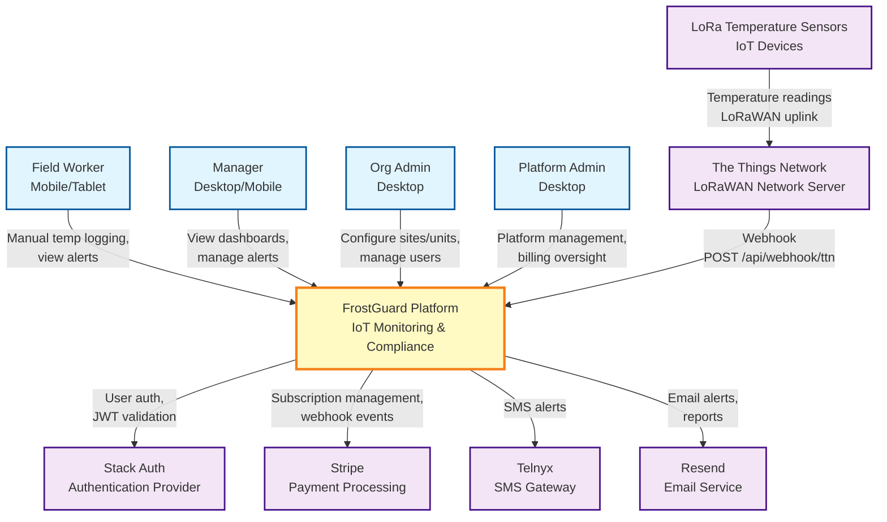
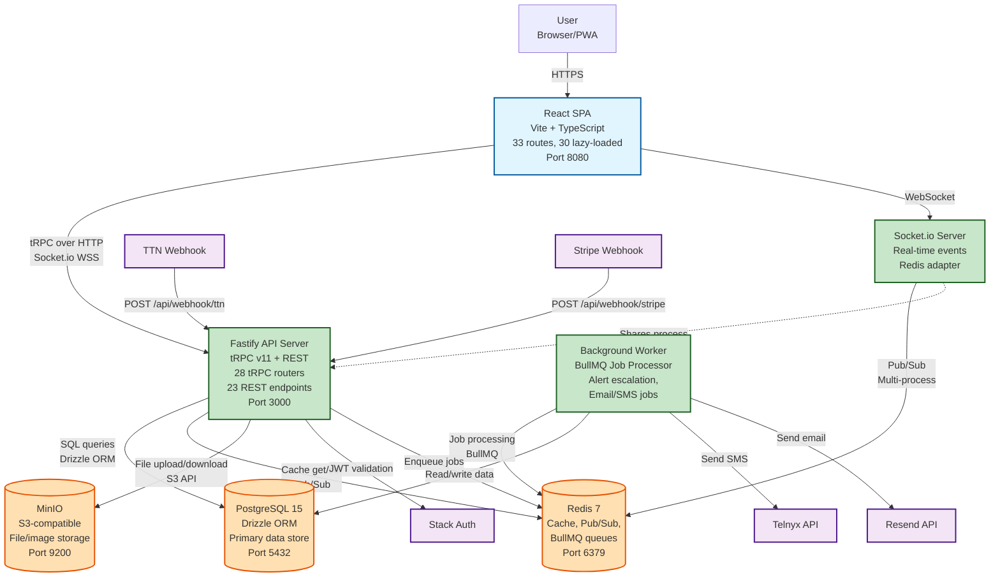
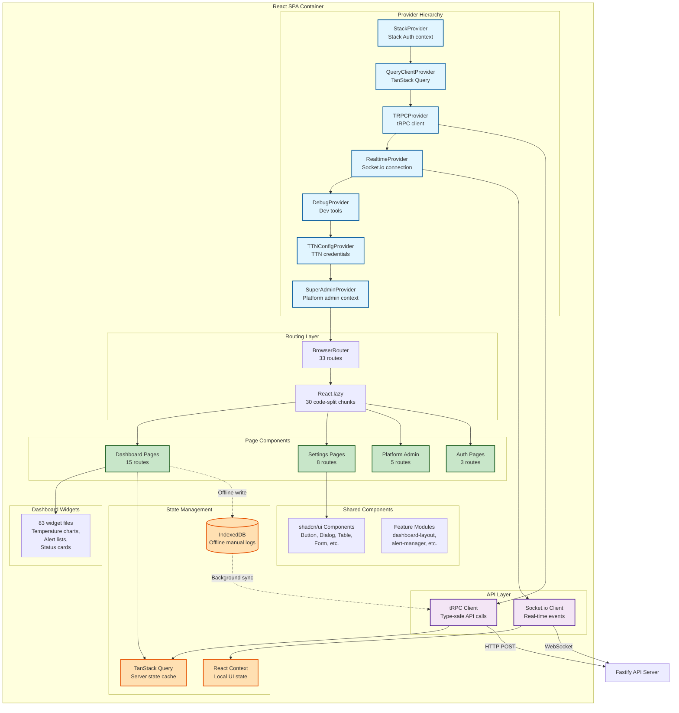
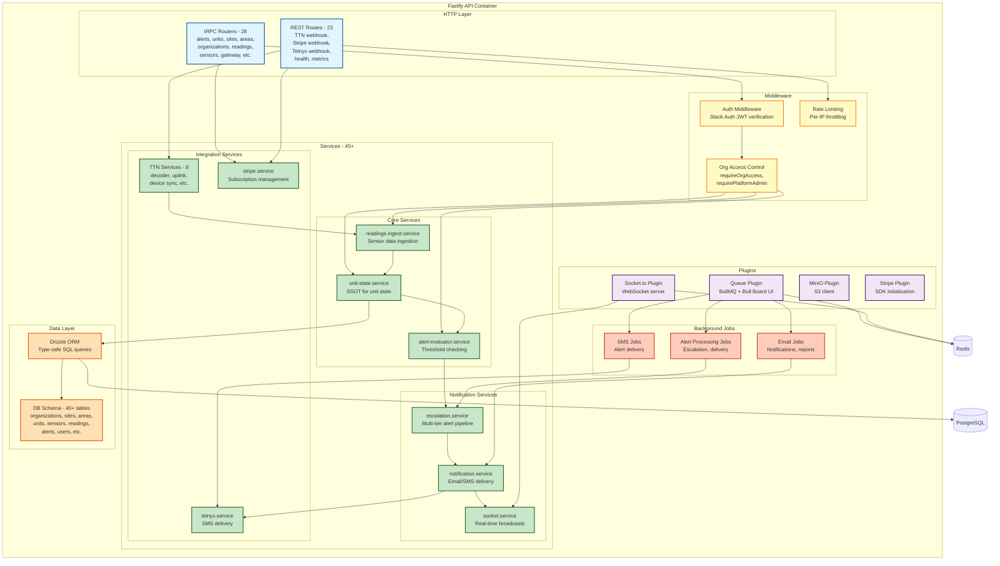
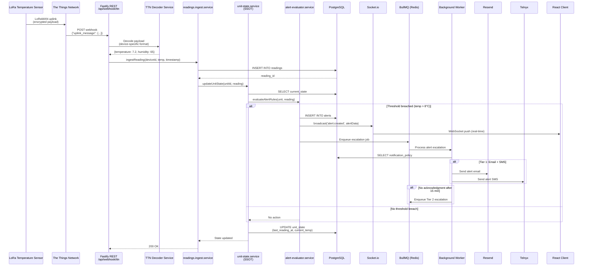
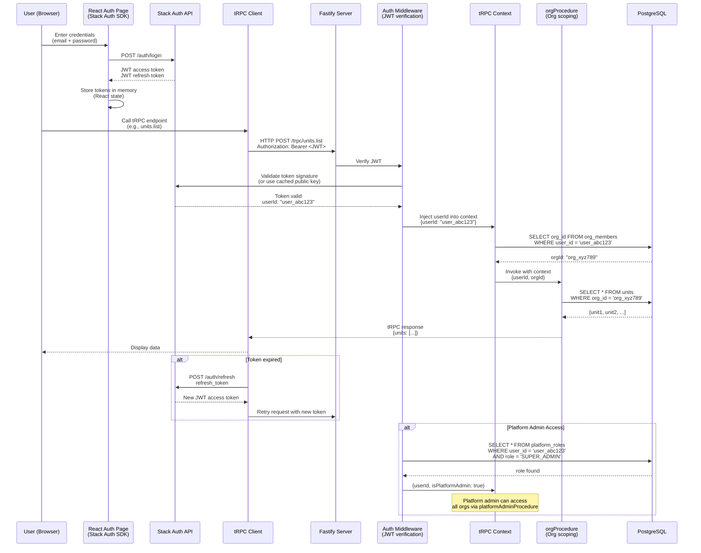
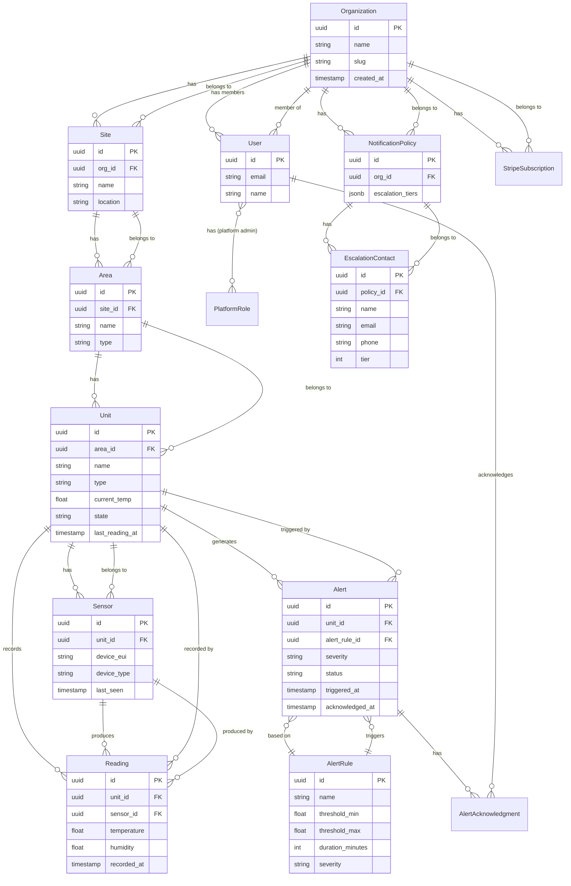

# FrostGuard Architecture Documentation

This document provides a comprehensive architectural overview of the FrostGuard IoT refrigeration monitoring and food safety compliance platform.

## Table of Contents

1. [System Overview](#system-overview)
2. [System Context Diagram](#1-system-context-diagram-c4-level-1)
3. [Container Diagram](#2-container-diagram-c4-level-2)
4. [Component Diagram - Frontend](#3-component-diagram---frontend)
5. [Component Diagram - Backend](#4-component-diagram---backend)
6. [Data Flow - Temperature Reading Ingestion](#5-data-flow---temperature-reading-ingestion)
7. [Data Flow - User Authentication](#6-data-flow---user-authentication)
8. [Domain Entity Relationship](#7-domain-entity-relationship)
9. [Deployment Diagram](#8-deployment-diagram)
10. [Architectural Decisions](#architectural-decisions)

## System Overview

FrostGuard is an enterprise IoT platform for real-time refrigeration monitoring and HACCP compliance. The system provides:

- **Real-time monitoring**: LoRaWAN sensor integration via The Things Network
- **Multi-tier alerting**: Threshold-based alerts with escalation pipelines
- **Offline-first manual logging**: IndexedDB with background sync
- **Multi-tenancy**: Organization-scoped data with role-based access control
- **Compliance**: HACCP-compliant temperature logging and reporting

### Tech Stack Summary

| Layer            | Technology                                                |
| ---------------- | --------------------------------------------------------- |
| Frontend         | React 18, TypeScript 5, Vite 5, Tailwind CSS 3, shadcn/ui |
| State Management | TanStack Query v5, React Context                          |
| API              | tRPC v11 (end-to-end type-safe)                           |
| Backend          | Fastify 5, Node.js ESM                                    |
| Database         | PostgreSQL 15, Drizzle ORM                                |
| Auth             | Stack Auth (migrating from Supabase)                      |
| Real-time        | Socket.io v4 + Redis adapter                              |
| Jobs             | BullMQ + Redis                                            |
| Storage          | MinIO (S3-compatible)                                     |
| IoT              | The Things Network (TTN), LoRaWAN                         |
| Payments         | Stripe                                                    |
| Notifications    | Telnyx (SMS), Resend (Email)                              |
| PWA              | Workbox via vite-plugin-pwa                               |

---

## 1. System Context Diagram (C4 Level 1)

This diagram shows the high-level system context: external actors and systems that FrostGuard interacts with.



**Key External Dependencies:**

- **The Things Network (TTN)**: Receives LoRaWAN sensor data, forwards via webhook
- **Stack Auth**: Manages user authentication and JWT token issuance
- **Stripe**: Handles subscription billing and payment processing
- **Telnyx**: Delivers SMS alert notifications
- **Resend**: Sends email notifications and reports

---

## 2. Container Diagram (C4 Level 2)

This diagram shows the main runtime containers (applications and data stores) that make up FrostGuard.



**Container Responsibilities:**

- **React SPA**: User interface, client-side routing, offline manual logging (IndexedDB)
- **Fastify API**: Business logic, tRPC endpoints, REST webhooks, authentication
- **Socket.io Server**: Real-time sensor data push, alert notifications (shares process with Fastify)
- **Background Worker**: Asynchronous alert escalation, email/SMS delivery, scheduled reports
- **PostgreSQL**: Primary data store for all domain entities
- **Redis**: Cache, Socket.io pub/sub, BullMQ job queues
- **MinIO**: File storage for images, reports, exports

---

## 3. Component Diagram - Frontend

This diagram shows the internal structure of the React SPA container.



**Frontend Architecture Notes:**

- **Provider hierarchy**: 7 layers of context providers wrap the app root
- **Code splitting**: 30 routes use `React.lazy()` for optimized bundle size
- **State management**: TanStack Query for server state, React Context for local UI state
- **Offline-first**: Manual temperature logs saved to IndexedDB, sync when online
- **Type safety**: tRPC client provides full type inference from backend to frontend

---

## 4. Component Diagram - Backend

This diagram shows the internal structure of the Fastify API container.



**Backend Architecture Notes:**

- **Single Source of Truth**: `unit-state.service` is the SSOT for all unit state and alert processing
- **tRPC v11**: 28 type-safe routers provide end-to-end type safety with the frontend
- **REST webhooks**: External integrations (TTN, Stripe, Telnyx) use REST endpoints
- **Job queues**: BullMQ processes asynchronous tasks (alert escalation, notifications)
- **Multi-tenancy**: All queries scoped by `orgId` via `orgProcedure` middleware
- **Real-time**: Socket.io shares the Fastify process, uses Redis adapter for multi-process support

---

## 5. Data Flow - Temperature Reading Ingestion

This sequence diagram shows the complete flow from sensor reading to user notification.



**Key Flow Characteristics:**

- **Webhook ingestion**: TTN posts to `/api/webhook/ttn` with encrypted sensor payload
- **Device-specific decoding**: Each sensor type has a decoder function (battery, temperature, etc.)
- **SSOT pattern**: `unit-state.service` is the single point that triggers alert evaluation
- **Real-time push**: Socket.io broadcasts alerts immediately to connected clients
- **Asynchronous escalation**: BullMQ handles multi-tier alert delivery without blocking ingestion
- **Multi-channel notifications**: Email (Resend) and SMS (Telnyx) delivered in parallel

---

## 6. Data Flow - User Authentication

This sequence diagram shows the authentication flow using Stack Auth.



**Authentication Flow Notes:**

- **JWT-based**: Stack Auth issues JWTs, Fastify validates them on every request
- **Org scoping**: After authentication, user's `orgId` is resolved and injected into context
- **Automatic filtering**: `orgProcedure` middleware ensures all queries are scoped by `orgId`
- **Platform admin**: Special role (`SUPER_ADMIN`) bypasses org scoping for cross-org management
- **Token refresh**: Stack Auth SDK handles automatic token refresh on expiration

---

## 7. Domain Entity Relationship

This ER diagram shows the core domain model and relationships.



**Domain Model Notes:**

- **Hierarchical structure**: Organization → Site → Area → Unit → Sensor (5 levels)
- **Multi-tenancy**: All entities scoped by `org_id` (directly or via parent relationships)
- **Alert SSOT**: Unit has `current_temp` and `state` fields that drive alert evaluation
- **Sensor flexibility**: Units can have multiple sensors (primary + backup)
- **Escalation**: NotificationPolicy defines multi-tier escalation (email → SMS → phone call)
- **Platform roles**: Separate `platform_roles` table for cross-org admin access

---

## 8. Deployment Diagram

This diagram shows the Docker Compose infrastructure and port mappings.

```mermaid
graph TB
    subgraph "Development Environment (docker-compose.yml)"
        subgraph "Core Services"
            Postgres[PostgreSQL 15<br/>Port 5432<br/>Database: frostguard<br/>Volume: postgres-data]
            Redis[Redis 7<br/>Port 6379<br/>Cache, Pub/Sub, Queues<br/>Volume: redis-data]
            MinIO[MinIO<br/>API: Port 9200<br/>Console: Port 9201<br/>Volume: minio-data]
        end

        subgraph "Admin Tools (profile: admin)"
            PgAdmin[pgAdmin 4<br/>Port 5050<br/>Web UI for PostgreSQL]
            RedisCommander[Redis Commander<br/>Port 8081<br/>Web UI for Redis]
        end
    end

    subgraph "Application Containers (local dev)"
        Vite[Vite Dev Server<br/>Port 8080<br/>React SPA with HMR]
        FastifyDev[Fastify API (tsx watch)<br/>Port 3000<br/>tRPC + REST + Socket.io]
    end

    subgraph "Production Deployment (docker/compose.prod.yaml)"
        subgraph "Load Balancer"
            Caddy[Caddy 2<br/>Ports 80, 443<br/>Reverse proxy + TLS]
        end

        subgraph "Application"
            NginxStatic[Nginx<br/>Port 8080<br/>Serve static React build]
            FastifyProd[Fastify API<br/>Port 3000<br/>Production build]
            WorkerProd[Background Worker<br/>BullMQ processor]
        end

        subgraph "Data Layer"
            PgBouncer[PgBouncer<br/>Port 6432<br/>Connection pooling]
            PostgresProd[PostgreSQL 15<br/>Port 5432]
            RedisProd[Redis 7<br/>Port 6379]
            MinioProd[MinIO<br/>Ports 9200, 9201]
        end
    end

    Internet[Internet]

    Internet -->|HTTPS| Caddy
    Caddy -->|Proxy /api/*| FastifyProd
    Caddy -->|Proxy /*| NginxStatic

    FastifyProd --> PgBouncer
    PgBouncer --> PostgresProd
    FastifyProd --> RedisProd
    FastifyProd --> MinioProd

    WorkerProd --> RedisProd
    WorkerProd --> PostgresProd
    WorkerProd --> MinioProd

    Vite -.->|Dev proxy /api/*| FastifyDev
    FastifyDev --> Postgres
    FastifyDev --> Redis
    FastifyDev --> MinIO

    PgAdmin --> Postgres
    RedisCommander --> Redis

    classDef dev fill:#E1F5FF,stroke:#01579B,stroke-width:2px
    classDef prod fill:#C8E6C9,stroke:#1B5E20,stroke-width:2px
    classDef data fill:#FFE0B2,stroke:#E65100,stroke-width:2px
    classDef admin fill:#F3E5F5,stroke:#4A148C,stroke-width:2px

    class Vite,FastifyDev dev
    class Caddy,NginxStatic,FastifyProd,WorkerProd,PgBouncer prod
    class Postgres,Redis,MinIO,PostgresProd,RedisProd,MinioProd data
    class PgAdmin,RedisCommander admin
```

**Deployment Notes:**

### Development (`docker-compose.yml`)

- **Core services**: PostgreSQL, Redis, MinIO run in containers
- **Admin tools**: pgAdmin (port 5050) and Redis Commander (port 8081) with `--profile admin`
- **Application**: Run locally via `npm run dev` (Vite + tsx watch)

### Production (`docker/compose.prod.yaml`)

- **Caddy**: Automatic TLS via Let's Encrypt, reverse proxy to Nginx + Fastify
- **Nginx**: Serves static React build with gzip compression
- **Fastify**: Production build (`node dist/index.js`)
- **Worker**: Separate container for BullMQ job processing
- **PgBouncer**: Connection pooling for PostgreSQL (max 100 connections)
- **Persistent volumes**: All data stores use Docker volumes for persistence

### Port Mappings

| Service          | Port    | Purpose                     |
| ---------------- | ------- | --------------------------- |
| React SPA (Vite) | 8080    | Frontend dev server         |
| Fastify API      | 3000    | Backend API (tRPC + REST)   |
| PostgreSQL       | 5432    | Database                    |
| Redis            | 6379    | Cache, pub/sub, queues      |
| MinIO API        | 9200    | S3-compatible storage       |
| MinIO Console    | 9201    | MinIO web UI                |
| pgAdmin          | 5050    | PostgreSQL admin (dev only) |
| Redis Commander  | 8081    | Redis admin (dev only)      |
| Caddy            | 80, 443 | HTTP/HTTPS (prod only)      |

---

## Architectural Decisions

### 1. tRPC for API Layer

**Decision**: Use tRPC v11 for all client-server communication instead of traditional REST.

**Rationale**:

- End-to-end type safety: Frontend gets full TypeScript types for all API calls
- No manual API type definitions or code generation
- Excellent developer experience with autocomplete and inline errors
- Reduces bugs from API contract mismatches

**Trade-offs**:

- Learning curve for developers unfamiliar with tRPC
- External integrations (TTN, Stripe) still require REST webhooks

### 2. Single Source of Truth for Unit State

**Decision**: `unit-state.service` is the SSOT for all unit state updates and alert evaluation.

**Rationale**:

- Prevents race conditions in alert processing
- Ensures consistent alert evaluation logic
- Single code path for all state changes (sensor ingestion, manual logging, etc.)

**Implementation**:

- All reading ingestion flows through `unit-state.service.updateUnitState()`
- Alert evaluation always triggered from this service
- No direct writes to `unit_state` table outside this service

### 3. Multi-Tier Alert Escalation

**Decision**: Implement configurable escalation tiers with time-based progression.

**Rationale**:

- HACCP compliance requires timely alert acknowledgment
- Different severity levels need different response protocols
- Reduces alert fatigue by progressive escalation

**Implementation**:

- Tier 1: Email + SMS to on-duty contacts (immediate)
- Tier 2: Email + SMS to managers (after 15 minutes)
- Tier 3: Phone call to emergency contacts (after 30 minutes)
- BullMQ delayed jobs handle tier progression

### 4. Offline-First Manual Logging

**Decision**: Use IndexedDB for offline manual temperature logging with background sync.

**Rationale**:

- Field workers often in areas with poor connectivity
- Cannot lose manual temperature logs
- Service workers enable background sync when connection restored

**Implementation**:

- Manual logs saved to IndexedDB immediately
- Background sync job posts to tRPC endpoint when online
- UI shows sync status (pending/synced)

### 5. Socket.io for Real-Time Updates

**Decision**: Use Socket.io with Redis adapter for real-time sensor data and alerts.

**Rationale**:

- Low latency for critical temperature alerts
- Better UX than polling (dashboard updates immediately)
- Redis adapter enables multi-process deployment

**Trade-offs**:

- Additional infrastructure (Redis for pub/sub)
- More complex connection management (reconnection logic)

### 6. Drizzle ORM over Prisma

**Decision**: Use Drizzle ORM instead of Prisma for database access.

**Rationale**:

- Lighter weight (no codegen, faster installs)
- Better TypeScript inference (no separate client generation)
- More control over SQL (closer to raw queries)

**Trade-offs**:

- Smaller ecosystem than Prisma
- Less mature migration tooling

### 7. Stack Auth Migration

**Decision**: Migrate from Supabase Auth to Stack Auth.

**Rationale**:

- Stack Auth has better multi-tenancy support
- More flexible role-based access control (RBAC)
- Reduces vendor lock-in (Supabase-specific features)

**Migration Status**:

- Stack Auth implemented for new users
- Legacy Supabase Auth users being migrated
- Both systems coexist during transition

### 8. Monorepo Structure

**Decision**: Keep frontend and backend in a single monorepo.

**Rationale**:

- Shared TypeScript types via tRPC (no separate package needed)
- Simplified deployment (single Docker build)
- Easier atomic changes across frontend/backend

**Trade-offs**:

- Larger repository size
- Requires careful build orchestration

### 9. BullMQ for Background Jobs

**Decision**: Use BullMQ (Redis-backed) for all asynchronous jobs.

**Rationale**:

- Reliable job processing with retries and backoff
- Bull Board provides excellent admin UI
- Redis already required for Socket.io

**Use Cases**:

- Alert escalation tier progression
- Email/SMS delivery (decoupled from request handling)
- Scheduled reports
- Data exports

### 10. MinIO for File Storage

**Decision**: Use MinIO (self-hosted S3-compatible) instead of cloud storage.

**Rationale**:

- Data sovereignty (customer data stays on-premises)
- Cost predictability (no per-GB egress charges)
- S3-compatible API (easy migration if needed)

**Trade-offs**:

- Need to manage storage infrastructure
- No global CDN (need to implement caching separately)

---

## Future Architecture Considerations

### Planned Improvements

1. **Edge Functions**: Evaluate Cloudflare Workers for TTN webhook processing (reduce latency)
2. **Read Replicas**: Add PostgreSQL read replicas for analytics queries
3. **GraphQL Subscriptions**: Consider GraphQL subscriptions as Socket.io alternative
4. **Event Sourcing**: Implement event sourcing for audit trail and replay capabilities
5. **Multi-Region**: Add support for multi-region deployments with data residency compliance

### Scalability Concerns

- **Socket.io connections**: Current Redis adapter scales to ~10K connections per instance
- **Database queries**: Add indexes on `org_id` + `created_at` for common filters
- **Job queue**: Monitor BullMQ queue depth (alert if >1000 pending jobs)
- **Sensor ingestion**: Consider batching TTN webhook calls (currently 1 POST per uplink)

---

**Document Version**: 1.0
**Last Updated**: 2026-01-30
**Maintained By**: FrostGuard Architecture Team
