# StayFrosty - Process Modeling Document

**Version:** 1.0  
**Date:** January 24, 2026  
**Author:** Matrix Agent  
**Status:** Draft for Review

---

## Table of Contents

1. [Executive Overview](#1-executive-overview)
2. [User Personas Summary](#2-user-personas-summary)
3. [User Journey Maps](#3-user-journey-maps)
4. [Core User Flows](#4-core-user-flows)
5. [Information Architecture](#5-information-architecture)
6. [Key Experience Analysis](#6-key-experience-analysis)
7. [Main Path vs Branch Paths](#7-main-path-vs-branch-paths)
8. [UI/UX Recommendations](#8-uiux-recommendations)

---

## 1. Executive Overview

### 1.1 Purpose

This document defines the user interaction flows, process models, and experience design for **StayFrosty** - an intelligent frost monitoring and prevention platform. It translates validated market requirements into actionable user journeys and technical specifications for development teams.

### 1.2 Product Vision

StayFrosty bridges the gap between enterprise-grade predictive analytics and consumer-friendly user experience, making advanced frost protection accessible to growers of all technical abilities at competitive pricing.

### 1.3 Market Context

| Metric                | Value                                                                      |
| --------------------- | -------------------------------------------------------------------------- |
| Market Size (2024)    | $1.8B                                                                      |
| Projected Size (2030) | $2.9B                                                                      |
| CAGR                  | 8.2%                                                                       |
| Key Gap               | No solution combines predictive analytics + simple UX + accessible pricing |

### 1.4 Core Capabilities

1. **Real-time Environmental Monitoring** - Temperature, humidity, soil moisture
2. **Custom Threshold Alerts** - SMS, email, webhook notifications
3. **Historical Data & Trend Visualization** - Long-term pattern analysis
4. **Predictive Frost Forecasting** - 6-24 hour advance warnings
5. **Device/Sensor Management** - Provisioning, health monitoring, calibration
6. **Multi-tenant RBAC** - Role-based access for teams and consultants
7. **API/Webhook Integrations** - Connect to existing farm management systems

---

## 2. User Personas Summary

### 2.1 Persona Overview Matrix

| Persona    | Role                    | Tech Level  | Primary Need               | Usage Pattern                  |
| ---------- | ----------------------- | ----------- | -------------------------- | ------------------------------ |
| **Alex**   | Vineyard Owner          | Low         | Overnight frost alerts     | Mobile-first, reactive         |
| **Jordan** | Agricultural Consultant | Medium      | Multi-site monitoring      | Desktop dashboard, analytical  |
| **Sam**    | Facility Operator       | Medium-High | Equipment protection       | Integration-focused, automated |
| **Morgan** | IoT Integrator          | High        | Sensor network reliability | Technical configuration        |

### 2.2 Detailed Persona Profiles

#### Alex - Vineyard Owner (Primary Persona)

```
Profile:
- Age: 52
- Location: Napa Valley, CA
- Property: 50-acre vineyard
- Technical Comfort: Basic smartphone use
- Critical Season: March-May (spring frost risk)

Goals:
- Protect grape harvest from frost damage (potential $500K+ loss)
- Sleep peacefully knowing alerts will wake them if needed
- Understand data without technical expertise

Frustrations:
- Current weather apps are generic, not field-specific
- Has lost crops before due to microclimate frost events
- Complex systems feel overwhelming

Devices:
- iPhone 14 (primary)
- Older laptop for occasional use
```

#### Jordan - Agricultural Consultant

```
Profile:
- Age: 38
- Location: Central Valley, CA
- Clients: 15 farms, various crops
- Technical Comfort: Proficient with farm software

Goals:
- Monitor multiple client sites from one dashboard
- Generate professional reports for clients
- Provide data-driven recommendations

Frustrations:
- Managing multiple logins for different farms
- Manually compiling data for reports
- Clients blame them for missed warnings

Devices:
- MacBook Pro (primary)
- iPad for field visits
- iPhone for alerts
```

#### Sam - Facility Operator

```
Profile:
- Age: 45
- Location: Phoenix, AZ
- Facility: Outdoor HVAC/irrigation infrastructure
- Technical Comfort: Comfortable with industrial systems

Goals:
- Prevent freeze damage to pipes and equipment
- Integrate alerts with existing SCADA/BMS systems
- Minimize downtime and emergency repairs

Frustrations:
- Manual temperature checks are time-consuming
- False alarms from generic weather services
- Lack of integration with existing systems

Devices:
- Windows workstation (primary)
- Android phone
- Industrial tablet
```

#### Morgan - IoT Integrator

```
Profile:
- Age: 29
- Location: Sacramento, CA
- Role: Deploys sensors for agricultural clients
- Technical Comfort: Advanced (developer background)

Goals:
- Reliable sensor deployment and maintenance
- Quick troubleshooting of connectivity issues
- Batch configuration for large deployments

Frustrations:
- Poor documentation for sensor APIs
- Difficult to diagnose intermittent failures
- Manual calibration is tedious

Devices:
- Linux laptop (primary)
- Android phone with debugging tools
- Raspberry Pi for testing
```

---

## 3. User Journey Maps

### 3.1 Alex - Vineyard Owner Journey

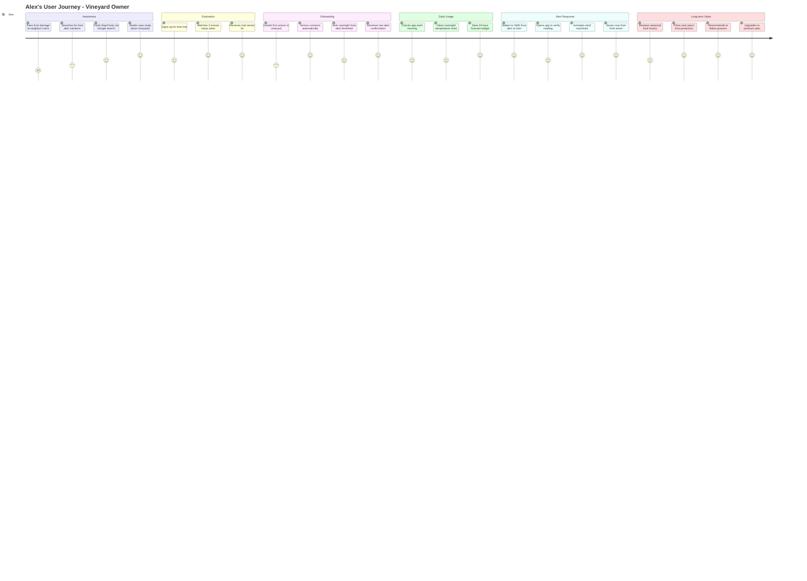

#### Alex Journey - Detailed Breakdown

| Phase               | Duration  | Key Actions                         | Emotions                  | Touchpoints               |
| ------------------- | --------- | ----------------------------------- | ------------------------- | ------------------------- |
| **Awareness**       | 1-2 weeks | Research solutions, compare options | Anxious, hopeful          | Google, ads, case studies |
| **Evaluation**      | 3-5 days  | Free trial signup, watch videos     | Curious, cautious         | Website, email, YouTube   |
| **Onboarding**      | 1-2 hours | Install sensor, configure alerts    | Excited, slightly nervous | Mobile app, hardware      |
| **Daily Usage**     | Ongoing   | Morning check, view forecasts       | Reassured, confident      | Mobile app (primary)      |
| **Alert Response**  | Minutes   | Receive alert, take action          | Alert, focused            | SMS, phone call, app      |
| **Long-term Value** | Seasonal  | Review data, plan ahead             | Satisfied, loyal          | Dashboard, reports        |

---

### 3.2 Jordan - Agricultural Consultant Journey

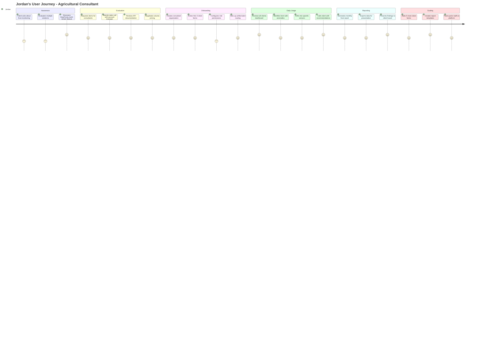

#### Jordan Journey - Key Moments

| Moment                     | Description                                     | Design Implication           |
| -------------------------- | ----------------------------------------------- | ---------------------------- |
| **Multi-tenant Discovery** | Realizes one login can manage all clients       | Highlight this in marketing  |
| **Permission Setup**       | Needs to limit client access to their data only | Clear RBAC UI is critical    |
| **Cross-farm Comparison**  | Wants to compare trends across clients          | Build comparison views       |
| **Report Generation**      | Needs professional output for client meetings   | Invest in export/PDF quality |

---

### 3.3 Sam - Facility Operator Journey

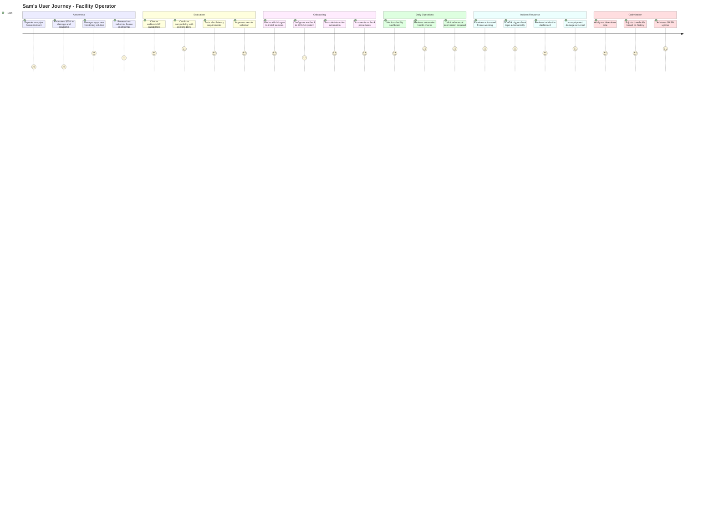

#### Sam Journey - Integration Focus

| Integration Point | Protocol   | Latency Requirement | Notes              |
| ----------------- | ---------- | ------------------- | ------------------ |
| Alert Webhook     | HTTPS POST | < 30 seconds        | Critical path      |
| Data Export       | REST API   | < 5 minutes         | Batch acceptable   |
| SCADA Bridge      | MQTT       | < 5 seconds         | Real-time required |
| Dashboard Embed   | iframe/SSO | N/A                 | Optional           |

---

### 3.4 Morgan - IoT Integrator Journey

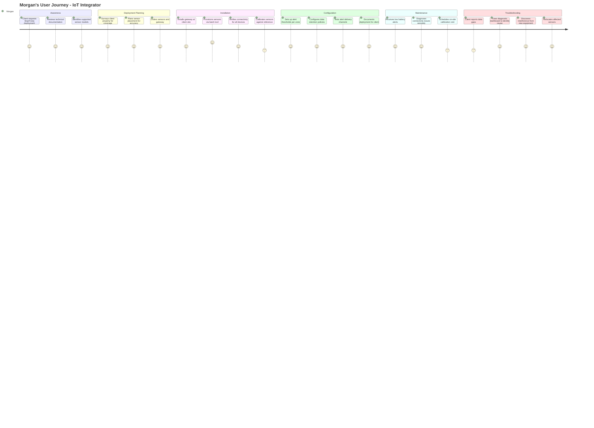

#### Morgan Journey - Technical Requirements

| Capability           | Requirement                           | Priority |
| -------------------- | ------------------------------------- | -------- |
| Batch Provisioning   | Add 50+ sensors in single operation   | P0       |
| Diagnostic Dashboard | Signal strength, packet loss, latency | P0       |
| Calibration Workflow | Compare against reference sensor      | P1       |
| Firmware Updates     | OTA updates with rollback             | P1       |
| API Documentation    | OpenAPI 3.0 spec with examples        | P0       |

---

## 4. Core User Flows

### 4.1 Flow 1: New User Onboarding

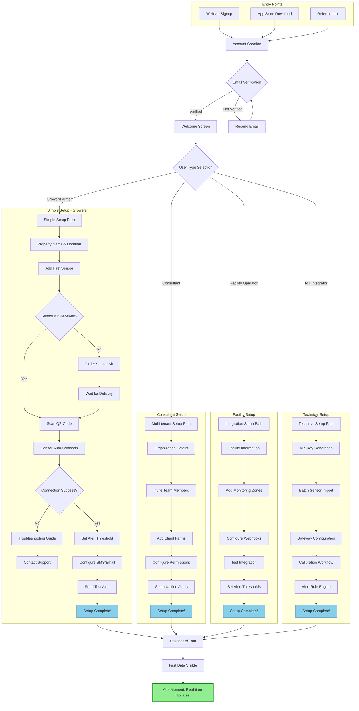

#### Flow 1 - Step Details

| Step                | Alex (Grower)     | Jordan (Consultant) | Sam (Facility) | Morgan (Integrator) |
| ------------------- | ----------------- | ------------------- | -------------- | ------------------- |
| Time to First Value | 15 minutes        | 30 minutes          | 45 minutes     | 60 minutes          |
| Key Friction Point  | Sensor connection | Permission setup    | Webhook config | Batch import        |
| Mitigation          | Auto-discovery    | Templates           | Test endpoint  | CSV upload          |

---

### 4.2 Flow 2: Real-Time Monitoring

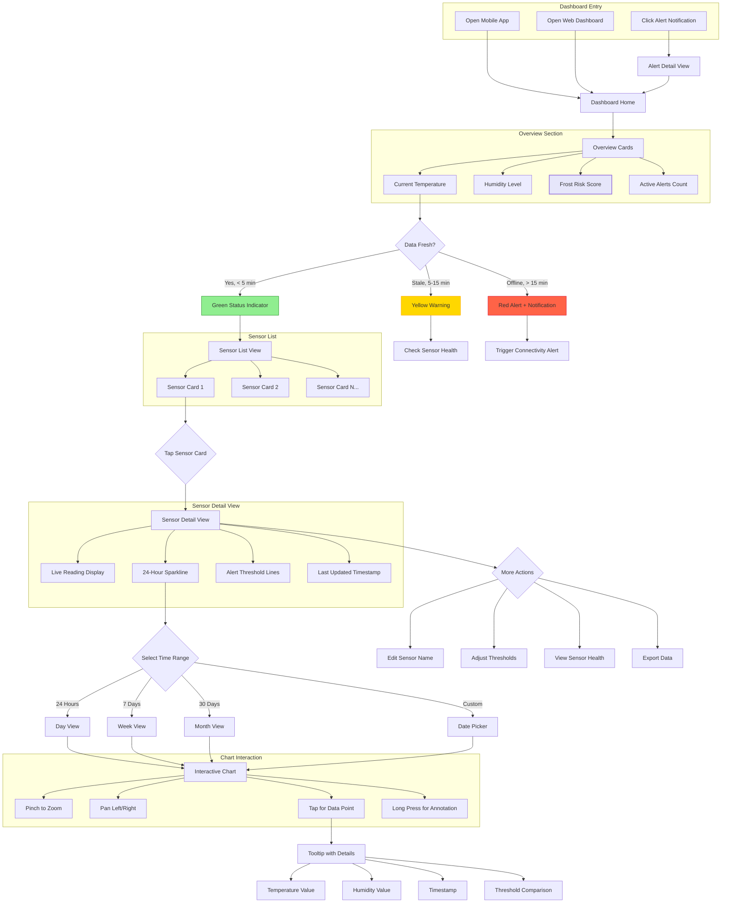

#### Flow 2 - Data Freshness Logic

| Status      | Condition             | Visual Indicator            | Action                    |
| ----------- | --------------------- | --------------------------- | ------------------------- |
| **Live**    | Data < 5 minutes old  | Green dot, "Live" badge     | None                      |
| **Delayed** | Data 5-15 minutes old | Yellow dot, timestamp shown | Check connectivity        |
| **Offline** | Data > 15 minutes old | Red dot, "Offline" badge    | Push notification + email |

---

### 4.3 Flow 3: Alert Management

```mermaid
flowchart TD
    subgraph AlertSetup["Alert Configuration Entry"]
        A[Settings Menu] --> B[Alert Rules]
        B --> C{Create or Edit}
        C -->|New Rule| D[Create Alert Rule]
        C -->|Edit Existing| E[Select Rule to Edit]
        E --> D
    end

    D --> F[Rule Configuration Form]

    subgraph RuleConfig["Rule Configuration"]
        F --> F1[Rule Name]
        F1 --> F2[Select Sensors]
        F2 --> F3{Sensor Selection}
        F3 -->|Individual| F3a[Pick Specific Sensors]
        F3 -->|Group| F3b[Select Sensor Group]
        F3 -->|All| F3c[Apply to All Sensors]

        F3a --> G[Threshold Configuration]
        F3b --> G
        F3c --> G
    end

    subgraph ThresholdConfig["Threshold Settings"]
        G --> G1[Metric Selection]
        G1 -->|Temperature| G1a[Temp Threshold]
        G1 -->|Humidity| G1b[Humidity Threshold]
        G1 -->|Soil Moisture| G1c[Moisture Threshold]

        G1a --> H[Condition Type]
        G1b --> H
        G1c --> H

        H -->|Below| H1[Set Lower Limit]
        H -->|Above| H2[Set Upper Limit]
        H -->|Range| H3[Set Min and Max]
        H -->|Rate of Change| H4[Set Change Rate]
    end

    H1 --> I[Notification Channels]
    H2 --> I
    H3 --> I
    H4 --> I

    subgraph Notifications["Notification Setup"]
        I --> I1{SMS?}
        I1 -->|Yes| I1a[Enter Phone Numbers]
        I1 -->|No| I2

        I1a --> I2{Email?}
        I2 -->|Yes| I2a[Enter Email Addresses]
        I2 -->|No| I3

        I2a --> I3{Webhook?}
        I3 -->|Yes| I3a[Configure Webhook URL]
        I3 -->|No| I4

        I3a --> I4{Push Notification?}
        I4 -->|Yes| I4a[Confirm App Permissions]
        I4 -->|No| J

        I4a --> J[Schedule Configuration]
    end

    subgraph Schedule["Alert Schedule"]
        J --> J1{Always Active?}
        J1 -->|Yes| K[Save Rule]
        J1 -->|No| J2[Set Active Hours]
        J2 --> J3[Select Days of Week]
        J3 --> J4[Set Date Range - Optional]
        J4 --> K
    end

    K --> L{Test Alert?}
    L -->|Yes| M[Send Test Notification]
    M --> M1{Received?}
    M1 -->|Yes| N[Rule Activated]
    M1 -->|No| M2[Troubleshoot Delivery]
    M2 --> I

    L -->|No| N

    N --> O[Rule List Updated]
    O --> P[Real-time Monitoring Active]

    style N fill:#90EE90,stroke:#228B22,stroke-width:2px
    style M1 fill:#FFD700,stroke:#FFA500
    style M2 fill:#FF6347,stroke:#DC143C
```

#### Flow 3 - Alert Rule Types

| Alert Type           | Use Case                | Example Configuration            |
| -------------------- | ----------------------- | -------------------------------- |
| **Simple Threshold** | Basic frost warning     | Temp < 32°F                      |
| **Rate of Change**   | Rapid cooling detection | Temp dropping > 5°F/hour         |
| **Duration-based**   | Sustained cold          | Temp < 35°F for > 30 min         |
| **Compound**         | Multi-factor risk       | Temp < 36°F AND Humidity > 90%   |
| **Predictive**       | Forecast-based          | Frost risk > 70% in next 6 hours |

---

### 4.4 Flow 4: FrostEvent Response

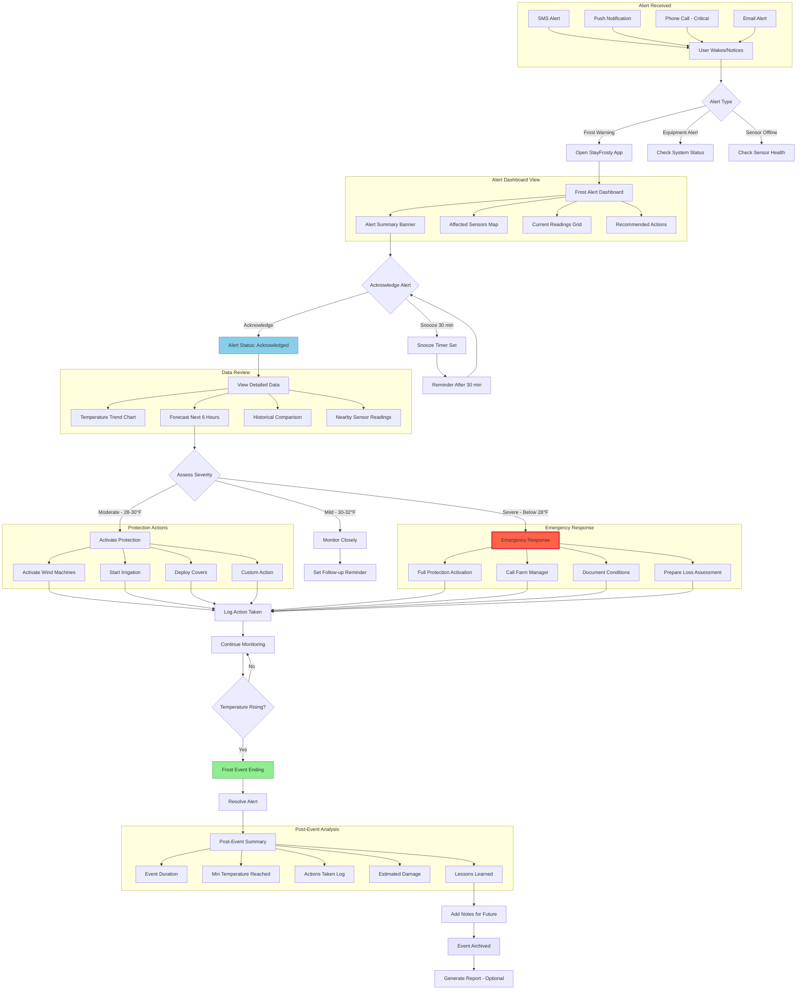

#### Flow 4 - Response Time Targets

| Severity     | Target Acknowledgment | Target Action | Escalation             |
| ------------ | --------------------- | ------------- | ---------------------- |
| **Low**      | 15 minutes            | 30 minutes    | None                   |
| **Medium**   | 5 minutes             | 15 minutes    | SMS if no ack          |
| **High**     | 2 minutes             | 5 minutes     | Phone call if no ack   |
| **Critical** | Immediate             | Immediate     | Auto-dial + team alert |

---

### 4.5 Flow 5: Predictive Forecasting

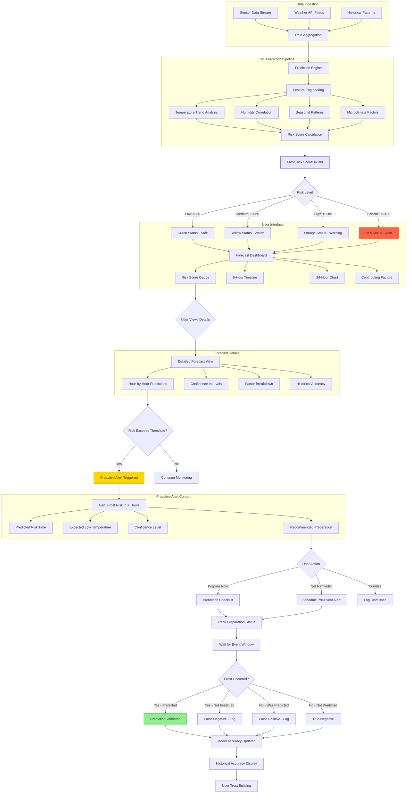

#### Flow 5 - Prediction Accuracy Metrics

| Metric                     | Target     | Measurement                                |
| -------------------------- | ---------- | ------------------------------------------ |
| **Precision**              | > 85%      | True positives / All positive predictions  |
| **Recall**                 | > 90%      | True positives / All actual frost events   |
| **Lead Time**              | 6-24 hours | Time between alert and event               |
| **Confidence Calibration** | < 5% error | Predicted probability vs actual occurrence |

---

### 4.6 Flow 6: Device Management

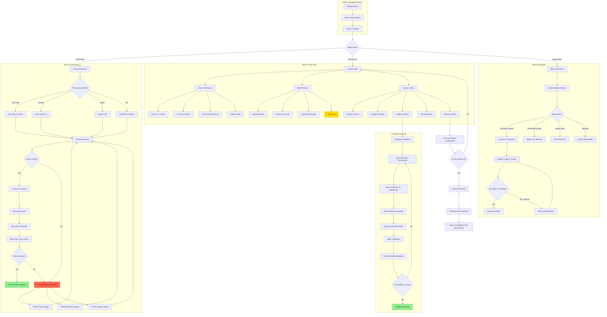

#### Flow 6 - Device Health Indicators

| Indicator       | Healthy   | Warning        | Critical  |
| --------------- | --------- | -------------- | --------- |
| **Battery**     | > 50%     | 20-50%         | < 20%     |
| **Signal**      | > -70 dBm | -70 to -85 dBm | < -85 dBm |
| **Packet Loss** | < 1%      | 1-5%           | > 5%      |
| **Last Seen**   | < 5 min   | 5-15 min       | > 15 min  |

---

## 5. Information Architecture

### 5.1 Sitemap Overview

```mermaid
flowchart TD
    subgraph PublicPages["Public Pages"]
        P1[Landing Page]
        P2[Pricing]
        P3[Features]
        P4[Case Studies]
        P5[Blog]
        P6[Contact/Demo Request]
        P7[Login]
        P8[Sign Up]
    end

    subgraph AuthApp["Authenticated Application"]
        A[Dashboard Home]

        A --> B[Monitoring]
        A --> C[Alerts]
        A --> D[Forecasting]
        A --> E[Devices]
        A --> F[Reports]
        A --> G[Settings]
    end

    subgraph Monitoring["Monitoring Section"]
        B --> B1[Overview Dashboard]
        B --> B2[Sensor List]
        B --> B3[Map View]
        B --> B4[Live Feed]
        B2 --> B2a[Sensor Detail]
        B2a --> B2b[Historical Data]
        B2a --> B2c[Sensor Settings]
    end

    subgraph Alerts["Alerts Section"]
        C --> C1[Active Alerts]
        C --> C2[Alert History]
        C --> C3[Alert Rules]
        C3 --> C3a[Create Rule]
        C3 --> C3b[Edit Rule]
        C1 --> C1a[Alert Detail]
    end

    subgraph Forecasting["Forecasting Section"]
        D --> D1[Forecast Dashboard]
        D --> D2[Risk Timeline]
        D --> D3[Model Accuracy]
        D --> D4[Alert Settings]
    end

    subgraph Devices["Devices Section"]
        E --> E1[Device List]
        E --> E2[Add Device]
        E --> E3[Gateways]
        E --> E4[Firmware Updates]
        E1 --> E1a[Device Detail]
        E1a --> E1b[Calibration]
        E1a --> E1c[Diagnostics]
    end

    subgraph Reports["Reports Section"]
        F --> F1[Generate Report]
        F --> F2[Saved Reports]
        F --> F3[Scheduled Reports]
        F --> F4[Export Data]
    end

    subgraph Settings["Settings Section"]
        G --> G1[Profile]
        G --> G2[Organization]
        G --> G3[Team Members]
        G --> G4[Notifications]
        G --> G5[Integrations]
        G --> G6[API Keys]
        G --> G7[Billing]
    end

    P7 --> A
    P8 --> A

    style A fill:#87CEEB,stroke:#4682B4,stroke-width:3px
    style B1 fill:#90EE90,stroke:#228B22
    style C1 fill:#FFD700,stroke:#FFA500
    style D1 fill:#E6E6FA,stroke:#9370DB
```

### 5.2 Role-Based Access Matrix

| Page/Feature           | Grower (Alex)    | Consultant (Jordan)     | Facility Operator (Sam) | IoT Integrator (Morgan) | Admin |
| ---------------------- | ---------------- | ----------------------- | ----------------------- | ----------------------- | ----- |
| **Dashboard Home**     | Own data         | All clients             | Own facility            | Assigned devices        | All   |
| **Sensor List**        | View/Edit own    | View all, Edit assigned | View/Edit own           | Full access             | Full  |
| **Alert Rules**        | Create/Edit own  | Create for clients      | Create/Edit own         | View only               | Full  |
| **Forecast Dashboard** | View own         | View all clients        | View own                | View only               | Full  |
| **Device Management**  | View/Basic       | View assigned           | View/Edit own           | Full access             | Full  |
| **Reports**            | Own reports      | Client reports          | Own reports             | Device reports          | Full  |
| **Team Members**       | View only        | Manage own team         | Manage own team         | View only               | Full  |
| **API Keys**           | Limited          | Full                    | Full                    | Full                    | Full  |
| **Billing**            | Own subscription | Organization            | Organization            | View only               | Full  |
| **Integrations**       | Limited          | Full                    | Full                    | Full                    | Full  |

### 5.3 Navigation Structure

#### Primary Navigation (Top/Side Bar)

```
[Logo] StayFrosty
|
+-- Dashboard (Home icon)
|
+-- Monitoring
|   +-- Overview
|   +-- Sensors
|   +-- Map View
|
+-- Alerts
|   +-- Active (badge with count)
|   +-- History
|   +-- Rules
|
+-- Forecast
|   +-- Today's Risk
|   +-- 7-Day Outlook
|   +-- Accuracy Stats
|
+-- Devices
|   +-- Sensors
|   +-- Gateways
|   +-- Add New
|
+-- Reports
|
+-- Settings (gear icon)
```

#### Mobile Navigation (Bottom Tab Bar)

```
[ Home ] [ Alerts ] [ Forecast ] [ Sensors ] [ More ]
```

---

## 6. Key Experience Analysis

### 6.1 First Value Moments (Aha!)

| Persona    | Aha Moment                                        | Time to Achieve | Design Priority |
| ---------- | ------------------------------------------------- | --------------- | --------------- |
| **Alex**   | Sees real-time temperature from vineyard on phone | < 15 minutes    | P0              |
| **Jordan** | Views all client farms in single dashboard        | < 30 minutes    | P0              |
| **Sam**    | Receives first webhook notification in SCADA      | < 60 minutes    | P1              |
| **Morgan** | Successfully batch provisions 10+ sensors         | < 45 minutes    | P1              |

### 6.2 Critical Experience Nodes

```mermaid
flowchart LR
    subgraph Onboarding["Onboarding Phase"]
        A1[Account Creation]
        A2[First Sensor Connected]
        A3[First Data Visible]
        A4[First Alert Configured]
    end

    subgraph DailyUse["Daily Usage Phase"]
        B1[Morning Dashboard Check]
        B2[Forecast Review]
        B3[Historical Trend Analysis]
    end

    subgraph AlertPhase["Alert Phase"]
        C1[Alert Received]
        C2[Alert Acknowledged]
        C3[Action Taken]
        C4[Event Resolved]
    end

    subgraph ValuePhase["Value Realization"]
        D1[Frost Event Survived]
        D2[Report Generated]
        D3[ROI Demonstrated]
        D4[Recommendation Given]
    end

    A1 -->|2 min| A2
    A2 -->|10 min| A3
    A3 -->|5 min| A4

    A4 --> B1
    B1 --> B2
    B2 --> B3

    B1 --> C1
    C1 --> C2
    C2 --> C3
    C3 --> C4

    C4 --> D1
    D1 --> D2
    D2 --> D3
    D3 --> D4

    style A3 fill:#90EE90,stroke:#228B22,stroke-width:3px
    style D1 fill:#FFD700,stroke:#FFA500,stroke-width:3px
    style C1 fill:#FF6347,stroke:#DC143C
```

### 6.3 Points of Friction

| Friction Point                       | Persona Affected | Severity | Mitigation                             |
| ------------------------------------ | ---------------- | -------- | -------------------------------------- |
| **Sensor won't connect**             | All              | High     | Auto-discovery, troubleshooting wizard |
| **Too many alerts (alert fatigue)**  | Alex, Sam        | Medium   | Smart alert grouping, severity tiers   |
| **Webhook configuration complexity** | Sam              | Medium   | Pre-built templates, test endpoint     |
| **Permission confusion**             | Jordan           | Low      | Clear role descriptions, templates     |
| **Calibration tedious**              | Morgan           | Medium   | Batch calibration mode                 |
| **Data export limitations**          | Jordan           | Low      | Custom report builder                  |

### 6.4 Delight Opportunities

| Opportunity                     | Description                                                   | Impact               |
| ------------------------------- | ------------------------------------------------------------- | -------------------- |
| **Personalized greetings**      | "Good morning, Alex. Your vineyard is safe today."            | Emotional connection |
| **Saved the day notifications** | "Alert last night prevented estimated $15K damage"            | Value demonstration  |
| **Seasonal insights**           | "You had 12 frost events this spring, 8 fewer than last year" | Pattern recognition  |
| **Achievement badges**          | "First Season Complete", "100 Alerts Handled"                 | Gamification         |
| **Weather trivia**              | "Did you know? This is the coldest April night in 10 years"   | Engagement           |

---

## 7. Main Path vs Branch Paths

### 7.1 Main Path Definition (Happy Path)

The **Main Path** represents the shortest route for a user to achieve their core goal without encountering errors or edge cases.

#### Alex's Main Path (Grower)

```
1. Sign up (2 min)
2. Install sensor (10 min)
3. Configure frost alert for 32°F (3 min)
4. Receive overnight frost alert (passive - overnight)
5. Check temperature on app (1 min)
6. Activate wind machines (5 min)
7. Crop saved!
```

**Total Time to Value: 15-20 minutes active, overnight for first alert**

### 7.2 Branch Paths

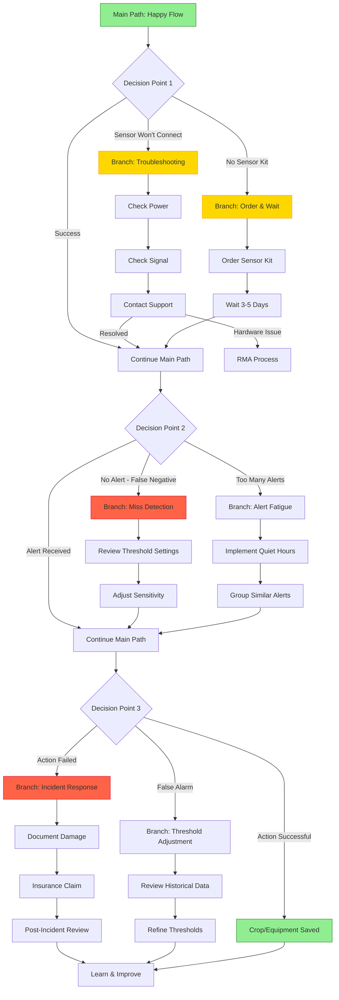

### 7.3 Error States and Recovery

| Error State               | User Impact       | Recovery Path             | Design Consideration                 |
| ------------------------- | ----------------- | ------------------------- | ------------------------------------ |
| **Sensor offline**        | No data           | Auto-retry + notification | Show last known value with timestamp |
| **Alert delivery failed** | Missed warning    | Retry with backup channel | Always have secondary notification   |
| **Gateway offline**       | All sensors down  | Push notification + email | Prioritize gateway health            |
| **API rate limit**        | Integration fails | Queue and retry           | Show clear error message             |
| **Subscription expired**  | Limited access    | Grace period + prompt     | Preserve data access for renewal     |

---

## 8. UI/UX Recommendations

### 8.1 Design Principles

1. **Glanceability First**
   - Critical information visible within 2 seconds
   - Color-coded status indicators (green/yellow/red)
   - Large, touch-friendly targets for mobile

2. **Progressive Disclosure**
   - Simple overview for casual users
   - Drill-down details for power users
   - Advanced settings hidden but accessible

3. **Anxiety Reduction**
   - Always show "last updated" timestamps
   - Confirmation for critical actions
   - Clear status indicators even when "nothing wrong"

4. **Mobile-First, Desktop-Enhanced**
   - Core monitoring works fully on mobile
   - Advanced configuration optimized for desktop
   - Responsive layouts, not separate apps

### 8.2 Component Recommendations

#### Dashboard Cards

```
+----------------------------------+
|  [Icon]  TEMPERATURE             |
|                                  |
|        34.2°F                    |
|       [Sparkline Graph]          |
|                                  |
|  [Green Dot] Live  |  Low: 32°F  |
+----------------------------------+
```

#### Alert Banner

```
+--------------------------------------------------+
| [!] FROST WARNING - Vineyard North Sensor        |
|     Temperature: 33°F (below 35°F threshold)     |
|     Time: 3:42 AM  |  [View] [Acknowledge]       |
+--------------------------------------------------+
```

#### Risk Score Gauge

```
        FROST RISK
    +---------------+
    |   [Gauge]     |
    |     72%       |
    |   HIGH RISK   |
    +---------------+
    Next 6 Hours
```

### 8.3 Mobile vs Desktop Considerations

| Feature    | Mobile                      | Desktop                  |
| ---------- | --------------------------- | ------------------------ |
| Dashboard  | Card stack, vertical scroll | Grid layout, widgets     |
| Charts     | Simplified, touch gestures  | Full detail, mouse hover |
| Alerts     | Full-screen takeover        | Sidebar notification     |
| Settings   | Bottom sheet                | Multi-column form        |
| Navigation | Bottom tab bar              | Side navigation          |
| Data Entry | Simplified forms            | Full forms with keyboard |

### 8.4 Accessibility Requirements

- **Color Contrast:** WCAG 2.1 AA minimum (4.5:1 for text)
- **Touch Targets:** Minimum 44x44 pixels
- **Screen Reader:** Full ARIA labels on interactive elements
- **Color Blindness:** Never use color alone for status (add icons/text)
- **Text Size:** Support system font scaling up to 200%

### 8.5 Performance Targets

| Metric                     | Target          | Measurement            |
| -------------------------- | --------------- | ---------------------- |
| **First Contentful Paint** | < 1.5s          | Mobile 4G              |
| **Time to Interactive**    | < 3.0s          | Mobile 4G              |
| **Dashboard Refresh**      | < 500ms         | After initial load     |
| **Alert Notification**     | < 30s           | From trigger to device |
| **Offline Support**        | Last 24h cached | Service worker         |

---

## Appendix A: Glossary

| Term             | Definition                                                   |
| ---------------- | ------------------------------------------------------------ |
| **Frost Event**  | Period when temperature drops below critical threshold       |
| **Gateway**      | Hub device that connects multiple sensors to the cloud       |
| **RBAC**         | Role-Based Access Control                                    |
| **OTA**          | Over-the-Air (firmware updates)                              |
| **LoRa**         | Long Range low-power wireless protocol                       |
| **Microclimate** | Local atmospheric conditions different from surrounding area |
| **Dew Point**    | Temperature at which water vapor condenses                   |
| **Wind Machine** | Equipment that circulates air to prevent frost formation     |

---

## Appendix B: Related Documents

- StayFrosty Background Research Report (v1.0)
- StayFrosty PRD (forthcoming)
- StayFrosty Technical Architecture (forthcoming)
- StayFrosty API Specification (forthcoming)

---

## Appendix C: Version History

| Version | Date       | Author       | Changes                           |
| ------- | ---------- | ------------ | --------------------------------- |
| 1.0     | 2026-01-24 | Matrix Agent | Initial process modeling document |

---

_End of Document_
