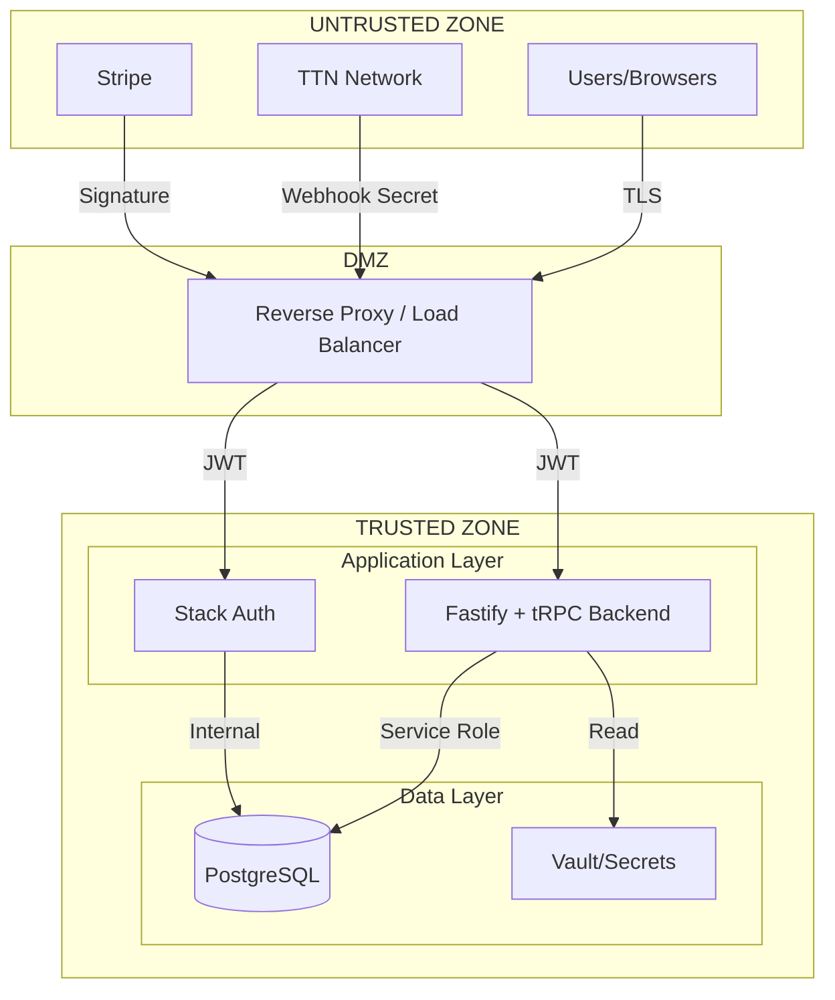

# Security Overview

> FreshTrack Pro Security Architecture and Principles

---

## Executive Summary

FrostGuard is a multi-tenant SaaS platform for refrigeration monitoring. Security is architected around **tenant isolation**, **defense in depth**, and **least privilege access**. The platform handles sensitive operational data and integrates with external IoT infrastructure (The Things Network) and payment processing (Stripe).

### Security Classification

| Data Type            | Classification     | Handling                            |
| -------------------- | ------------------ | ----------------------------------- |
| Temperature readings | Business Sensitive | Encrypted in transit, RLS protected |
| TTN API keys         | Secret             | Encrypted at rest, never logged     |
| User credentials     | Secret             | Managed by Stack Auth               |
| Organization data    | Business Sensitive | Tenant-isolated via RLS             |
| Payment information  | PCI Sensitive      | Handled by Stripe (not stored)      |

---

## Security Principles

### 1. Defense in Depth

Multiple security layers protect each transaction:

```
┌─────────────────────────────────────────────────────────────┐
│                     PERIMETER LAYER                          │
│  TLS 1.3 • CDN WAF • Rate Limiting                          │
├─────────────────────────────────────────────────────────────┤
│                   APPLICATION LAYER                          │
│  JWT Validation • tRPC Middleware • CORS • Input Validation │
├─────────────────────────────────────────────────────────────┤
│                   AUTHORIZATION LAYER                        │
│  RBAC • RLS Policies • Org Scope Verification               │
├─────────────────────────────────────────────────────────────┤
│                      DATA LAYER                              │
│  Encryption at Rest • Column Encryption • Audit Logging     │
└─────────────────────────────────────────────────────────────┘
```

### 2. Tenant Isolation (Zero Trust Between Tenants)

Every database query is scoped to the authenticated user's organization:

- **Row Level Security (RLS)**: PostgreSQL policies enforce org boundaries
- **Foreign Key Constraints**: Data relationships maintain org scope
- **Unique Constraints**: Scoped to organization (e.g., DevEUI per org)
- **Function-Level Checks**: tRPC middleware (orgProcedure) verifies org membership

### 3. Least Privilege Access

| Principal           | Access Level              | Justification     |
| ------------------- | ------------------------- | ----------------- |
| Anonymous users     | Public pages only         | No data access    |
| Authenticated users | Own organization only     | RLS enforced      |
| Staff role          | Read + limited write      | Operational needs |
| Admin role          | Full org access           | Management needs  |
| Service role        | Cross-org (internal only) | Scheduled jobs    |

### 4. Secure by Default

- All database tables have RLS **enabled by default**
- All edge functions require JWT verification unless explicitly disabled
- All external webhooks require signature/secret verification
- Sensitive fields are encrypted before storage

---

## Trust Boundaries



### Boundary Definitions

| Boundary | From            | To              | Validation                             |
| -------- | --------------- | --------------- | -------------------------------------- |
| **B1**   | Browser         | Load Balancer   | TLS, CORS                              |
| **B2**   | Load Balancer   | Fastify Backend | JWT + tRPC middleware                  |
| **B3**   | TTN             | Webhook         | Per-org secret (constant-time compare) |
| **B4**   | Stripe          | Webhook         | HMAC signature                         |
| **B5**   | Fastify Backend | Database        | Drizzle ORM + parameterized queries    |
| **B6**   | Fastify Backend | Secrets         | Environment variables + Docker secrets |

---

## High-Level Security Controls

### Authentication Controls

| Control                 | Implementation                      | Status  |
| ----------------------- | ----------------------------------- | ------- |
| Password authentication | Stack Auth                          | Active  |
| Session management      | JWT with refresh tokens             | Active  |
| Password strength       | 8+ chars, complexity rules          | Active  |
| Account lockout         | Stack Auth rate limiting            | Active  |
| Email verification      | Stack Auth email confirmation       | Active  |
| MFA/2FA                 | **TBD** - Not currently implemented | Planned |

### Authorization Controls

| Control                    | Implementation                        | Status |
| -------------------------- | ------------------------------------- | ------ |
| Role-Based Access Control  | 6 roles (owner → inspector)           | Active |
| Row-Level Security         | PostgreSQL RLS policies               | Active |
| Organization isolation     | `organization_id` on all tables       | Active |
| Permission functions       | `has_role()`, `user_belongs_to_org()` | Active |
| API endpoint protection    | JWT verification per function         | Active |
| Platform admin enforcement | `platformAdminProcedure` middleware   | Active |

### Data Protection Controls

| Control                    | Implementation                     | Status |
| -------------------------- | ---------------------------------- | ------ |
| Transport encryption       | TLS 1.3                            | Active |
| Database encryption        | PostgreSQL encryption at rest      | Active |
| Sensitive field encryption | Application-level field encryption | Active |
| Secret storage             | Environment variables / Vault      | Active |
| Audit logging              | `event_logs` table with hash chain | Active |

### Network Controls

| Control            | Implementation               | Status |
| ------------------ | ---------------------------- | ------ |
| CORS               | Configured per function      | Active |
| Rate limiting      | Supabase platform level      | Active |
| DDoS protection    | Supabase/Cloudflare          | Active |
| Webhook validation | Per-integration verification | Active |

---

## Security Architecture by Layer

### Frontend (Browser)

- Single-page React application
- JWT stored in localStorage (with refresh mechanism)
- No sensitive data stored client-side (except session token)
- CSP headers managed by hosting platform
- Input validation with Zod schemas

### API Layer (Fastify + tRPC Backend)

- Fastify 5 + tRPC v11 on Node.js
- tRPC middleware chain (protected → org → platformAdmin)
- Parameterized SQL queries (Drizzle ORM) — SQL injection fixed
- Constant-time secret comparison for webhooks
- Request validation before processing

### Database Layer (PostgreSQL)

- Row Level Security on all tables
- `SECURITY DEFINER` functions for privileged operations
- Encrypted columns for API keys
- Audit tables for compliance
- Cascading deletes preserve referential integrity
- Parameterized queries enforced (no sql.raw with interpolation)

### External Integrations

| Integration        | Auth Method            | Data Flow     |
| ------------------ | ---------------------- | ------------- |
| The Things Network | Per-org webhook secret | Inbound only  |
| Stripe             | HMAC signature         | Bidirectional |
| Resend (Email)     | API key                | Outbound only |
| Telnyx (SMS)       | API key                | Outbound only |

---

## Compliance Considerations

### Data Residency

- Primary database: Supabase cloud (region configurable)
- CDN: Global edge locations
- TTN data: EU1 cluster enforced for European deployments

### Regulatory Alignment

| Requirement        | Status  | Notes                                       |
| ------------------ | ------- | ------------------------------------------- |
| GDPR               | Partial | Data deletion, audit logs implemented       |
| HACCP              | Active  | Temperature logging, tamper-evident records |
| FDA 21 CFR Part 11 | Partial | Audit trail, electronic signatures TBD      |
| SOC 2              | TBD     | Supabase platform certified                 |
| PCI DSS            | N/A     | No card data stored (Stripe handles)        |

### Audit Capabilities

- **Event logs**: All significant actions logged with actor, timestamp, IP
- **Hash chaining**: Events include `previous_hash` for tamper detection
- **Immutable design**: Append-only logging tables
- **Retention**: Configurable per compliance requirements

---

## Security Responsibilities

### Platform (Stack Auth + Infrastructure)

- Infrastructure security
- Database encryption at rest
- Network security and DDoS protection
- Auth service security
- Patching and updates

### Application (FrostGuard)

- RLS policy correctness
- Input validation
- Secret management
- Secure coding practices
- Vulnerability remediation

### Customer

- Strong passwords
- User access management
- Device physical security
- Timely security updates
- Incident reporting

---

## Known Security Considerations

### Acknowledged Risks

| Risk                    | Mitigation                                                      | Status             |
| ----------------------- | --------------------------------------------------------------- | ------------------ |
| CORS wildcard (\*)      | Protected by JWT/API key auth                                   | Documented         |
| localStorage JWT        | Refresh token rotation                                          | Active             |
| API key in logs (last4) | Log access controls required                                    | TBD                |
| Debug encryption mode   | Temporary, requires reversion                                   | In Progress        |
| SQL injection (FIXED)   | Migrated from sql.raw() to sql.join() with parameterized arrays | Resolved (f65fcd4) |

### Security Debt

1. **MFA not implemented** - Planned for future release
2. **API key rotation UI** - Manual process currently
3. **Rate limiting visibility** - Platform-level, not application-configurable
4. **Webhook secret rotation** - No automated rotation
5. **Admin routes used protectedProcedure** - Fixed: platformAdminProcedure now enforces SUPER_ADMIN role (f65fcd4)
6. **Tracked .env files in git** - Partially fixed: .gitignore hardened, user must run `git rm --cached` (f65fcd4)

---

## Security Contacts

| Role             | Responsibility                          |
| ---------------- | --------------------------------------- |
| Security Lead    | Architecture, policy, incident response |
| Platform Team    | Infrastructure, Supabase configuration  |
| Development Team | Secure coding, vulnerability fixes      |
| Operations       | Monitoring, log analysis                |

---

## Related Documents

- [AUTH_MODEL.md](./AUTH_MODEL.md) — Authentication and authorization details
- [DATA_PROTECTION.md](./DATA_PROTECTION.md) — Encryption and secrets management
- [THREAT_MODEL.md](./THREAT_MODEL.md) — Threats, attack surfaces, mitigations
- [INCIDENT_RESPONSE.md](./INCIDENT_RESPONSE.md) — Security incident procedures
